# Cours Angular — construit pas à pas sur le carnet de contacts

Ce document raconte Angular **dans l'ordre où on l'apprend**, et non dans l'ordre où on le classe. Chaque étape part d'un problème concret que l'application ne sait pas encore résoudre, introduit la notion qui le résout, montre le code réel du carnet de contacts à ce moment précis de son histoire, puis prépare le problème suivant.

## À qui il s'adresse

À quelqu'un qui **n'a jamais fait d'Angular**, et qui n'est pas nécessairement à l'aise avec le développement web en général.

Aucun prérequis n'est supposé. Chaque terme technique est défini la première fois qu'il apparaît — y compris ceux que les tutoriels considèrent comme acquis : ce qu'est une classe, un décorateur, une interface, une dépendance, un Observable, ce que veut dire « asynchrone ». Quand un mot est employé pour la première fois, il est en **gras** et expliqué dans la phrase qui suit ou juste après.

Le document est donc volontairement long et bavard. C'est assumé : il vaut mieux relire un paragraphe qu'on connaît déjà que buter sur un mot que personne n'a pris la peine d'expliquer.

## Comment lire ce document

Il existe deux supports pour ce projet, et ils ne servent pas à la même chose :

| Document | Usage |
|---|---|
| **Ce cours** | Se lit **en avançant**. Une notion à la fois, dans l'ordre où elle est devenue nécessaire. |
| [`support-apprentissage-angular-spring.md`](support-apprentissage-angular-spring.md) | Se consulte **par notion**. Quand `finalize` ou `computed()` redevient flou, on y va directement. |

Chaque étape renvoie à la section correspondante du support pour le détail exhaustif. Le cours explique *pourquoi et quand*, le support explique *tout le reste*.

### Les schémas

Beaucoup d'étapes sont accompagnées d'un schéma : l'ordre dans lequel des fichiers s'appellent, le trajet d'une requête, ce qui se passe quand deux réponses se croisent. Un schéma ne remplace jamais le paragraphe qui l'entoure — il montre d'un coup d'œil ce que le texte explique pas à pas. Lis le texte d'abord, puis vérifie sur le schéma que tu as bien la même image en tête.

Les schémas sont écrits en **Mermaid**, un langage qui décrit un diagramme sous forme de texte. GitHub les affiche directement. Dans VS Code, l'aperçu Markdown a besoin de l'extension « Markdown Preview Mermaid Support » ; sans elle, tu verras le texte du schéma, qui reste lisible.

Deux formes reviennent souvent :

| Forme | Se lit |
|---|---|
| **Organigramme** (boîtes et flèches) | Qui appelle qui, ou qui contient qui |
| **Diagramme de séquence** (colonnes verticales) | Qui parle à qui, **dans quel ordre** : le temps s'écoule de haut en bas |

## Un parti pris : montrer aussi le code qui a disparu

C'est le point le plus important de ce document, et ce qui le distingue d'un tutoriel ordinaire.

Le carnet de contacts, tel qu'il est aujourd'hui, ne ressemble pas à ce qu'il était à l'étape 10. Des lignes ont été écrites, ont servi à comprendre quelque chose, puis ont été **supprimées** parce qu'une meilleure solution est arrivée. Un `window.location.reload()`, par exemple. Ou un signal d'erreur dans le service, plus tard déplacé dans un intercepteur.

Lire seulement le code final donnerait une fausse impression : celle d'une application qui serait née comme ça, d'un coup, avec ses intercepteurs et ses signaux bien rangés. Ce n'est jamais ainsi qu'on apprend, et ce n'est jamais ainsi qu'on écrit du logiciel. **On comprend pourquoi un intercepteur existe seulement après avoir écrit trois fois la même ligne dans trois méthodes différentes.**

Ce cours montre donc les deux : l'état intermédiaire tel qu'il était réellement, et ce qu'il est devenu. Les blocs de code portent l'un de ces marqueurs :

| Marqueur | Signification |
|---|---|
| **[ÉTAPE]** | Le code tel qu'il était à ce moment-là. Il a disparu depuis — c'était un palier, pas une destination. |
| **[DÉFINITIF]** | Le code est encore là aujourd'hui, éventuellement enrichi. |
| **[REMPLACÉ]** | Le code a été remplacé par une autre approche, expliquée plus loin. |

Le code des étapes intermédiaires n'est pas inventé : il est extrait de l'historique Git du projet. Chaque bloc précise le commit d'où il vient, pour que tu puisses le retrouver :

```bash
# Voir un fichier tel qu'il etait a un commit donne
git show 85aae2e:carnet-contact_frontend/src/app/services/contact.ts

# Voir ce qu'un commit a change
git show 41b9bcf --stat
```

## La carte du parcours

| Partie | Étapes | Ce qu'on y apprend |
|---|---|---|
| I — Les fondations | 1 à 8 | Angular seul, sans serveur : composant, signal, service, formulaire |
| II — Parler à un serveur | 9 à 10 | HttpClient, Observables, et la source de vérité partagée |
| III — Une vraie application | 11 à 15 | Routing, modification, erreurs, chargement, intercepteurs |
| IV — Sécuriser et monter en charge | 16 à 21 | Authentification, pagination, jetons, temps réel |
| V — Fiabiliser et finir | 22 à 26 | Tests, notifications, rôles, bibliothèque de composants, thème sombre |
| VI — Ouvrir l'application aux autres | 27 | Fil d'actualité : données publiques, pagination par curseur, formulaire partagé |

---

## Sommaire

**Partie I — Les fondations d'Angular**

1. [Le projet et ses fichiers](#étape-1--le-projet-et-ses-fichiers)
2. [Le composant, brique de base](#étape-2--le-composant-brique-de-base)
3. [Le modèle de données](#étape-3--le-modèle-de-données)
4. [Le signal : une valeur que l'interface surveille](#étape-4--le-signal--une-valeur-que-linterface-surveille)
5. [Le service et l'injection de dépendances](#étape-5--le-service-et-linjection-de-dépendances)
6. [Afficher une liste : `@for` et `@if`](#étape-6--afficher-une-liste--for-et-if)
7. [Le formulaire réactif](#étape-7--les-bindings-et-le-formulaire-réactif)
8. [Faire remonter l'information : `output()`](#étape-8--faire-remonter-linformation--output)

**Partie II — Parler à un serveur**

9. [HttpClient et les Observables](#étape-9--httpclient-et-les-observables)
10. [Le signal partagé alimenté par HttpClient](#étape-10--le-signal-partagé-alimenté-par-httpclient)

**Partie III — Une vraie application**

11. [Le routing](#étape-11--le-routing)
12. [Modifier une ressource : `PUT` et `effect()`](#étape-12--modifier-une-ressource--put-et-effect)
13. [Quand le serveur ne répond pas : `catchError`](#étape-13--quand-le-serveur-ne-répond-pas--catcherror)
14. [L'indicateur de chargement : `finalize`](#étape-14--lindicateur-de-chargement--finalize)
15. [Les intercepteurs : dégraisser le service](#étape-15--les-intercepteurs--dégraisser-le-service)

**Partie IV — Sécuriser et monter en charge**

16. [L'authentification côté Angular](#étape-16--lauthentification-côté-angular)
17. [Un composant réutilisable : `input()`](#étape-17--un-composant-réutilisable--input)
18. [La mise en forme : les variables CSS](#étape-18--la-mise-en-forme--les-variables-css)
19. [Pagination et recherche : quand une hypothèse s'écroule](#étape-19--pagination-et-recherche--quand-une-hypothèse-sécroule)
20. [Renouveler le jeton sans déconnecter personne](#étape-20--renouveler-le-jeton-sans-déconnecter-personne)
21. [Le temps réel par sondage](#étape-21--le-temps-réel-par-sondage)

**Partie V — Fiabiliser et finir**

22. [Les tests automatisés](#étape-22--les-tests-automatisés)
23. [Mot de passe solide et notifications](#étape-23--mot-de-passe-solide-et-notifications)
24. [Rôles, administration et chargement différé](#étape-24--rôles-administration-et-chargement-différé)
25. [PrimeNG, les couches CSS et le mode sombre](#étape-25--primeng-les-couches-css-et-le-mode-sombre)
26. [Réactions et accusés de lecture](#étape-26--réactions-et-accusés-de-lecture)

**Partie VI — Ouvrir l'application aux autres**

27. [Le fil d'actualité : curseur, formulaire partagé et données publiques](#étape-27--le-fil-dactualité--curseur-formulaire-partagé-et-données-publiques)

---

## Avant de commencer : le vocabulaire minimum

Cette section n'est pas une étape du cours. C'est un socle : cinq notions qui ne sont pas propres à Angular, mais sans lesquelles la suite serait incompréhensible. Si tu connais déjà tout ça, passe directement à l'étape 1.

### Ce qui tourne où : navigateur et serveur

Une application web vit à **deux** endroits en même temps, et c'est la première source de confusion.

Le **navigateur** (Chrome, Firefox, Edge) exécute le code qui dessine l'écran et réagit aux clics. Ce code est téléchargé depuis Internet et tourne sur *ta* machine. C'est ce qu'on appelle le **frontend**, ou le « côté client ».

Le **serveur** est un programme qui tourne sur une autre machine, quelque part, et qui garde les données. Lui seul a accès à la base de données. C'est le **backend**, ou le « côté serveur ».

Les deux ne se parlent qu'en s'envoyant des messages par le réseau. Le navigateur demande (« donne-moi la liste des contacts »), le serveur répond. Cette conversation est le sujet de toute la Partie II de ce cours.

Dans ce projet : Angular est le frontend, Spring Boot est le backend. Ils tournent sur deux ports différents de ta machine — `4200` pour Angular, `8080` pour Spring Boot — ce qui est une façon de simuler deux machines distinctes sur un seul ordinateur.

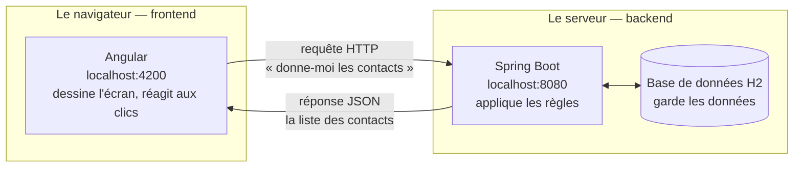

Le point à retenir du schéma : **le navigateur ne touche jamais la base de données.** Tout passe par le serveur, qui décide de ce qu'il accepte et de ce qu'il renvoie.

### JavaScript et TypeScript

Le navigateur ne comprend qu'un seul langage de programmation : **JavaScript**. Tout ce qui s'exécute dans une page web finit en JavaScript, quoi qu'on ait écrit au départ.

JavaScript a un défaut connu : il ne vérifie **pas les types**. Rien ne l'empêche d'écrire `"bonjour" + 5`, ou de lire une propriété qui n'existe pas sur un objet. L'erreur ne se manifeste qu'à l'exécution, parfois très loin de sa cause, parfois seulement chez l'utilisateur.

**TypeScript** est du JavaScript auquel on a ajouté les types. On écrit :

```typescript
let age: number = 30;     // age contiendra un NOMBRE, et rien d'autre
age = "trente";           // ERREUR signalee immediatement, avant meme d'executer
```

TypeScript ne s'exécute pas directement : il est **transpilé**, c'est-à-dire traduit automatiquement en JavaScript, avant d'être envoyé au navigateur. Ce qu'on y gagne : les erreurs de type apparaissent pendant qu'on écrit, dans l'éditeur, et non chez l'utilisateur.

Angular est écrit en TypeScript et impose de l'utiliser. Tous les fichiers `.ts` de ce projet sont du TypeScript.

### Une classe, et pourquoi Angular en est rempli

Une **classe** est un plan de fabrication : elle décrit ce qu'un objet contient (ses **propriétés**) et ce qu'il sait faire (ses **méthodes**).

```typescript
class Voiture {
  // Une PROPRIETE : une donnee que chaque voiture possede.
  marque: string = 'Renault';

  // Une METHODE : une action que chaque voiture sait faire.
  // Le mot-cle `this` designe « la voiture sur laquelle on agit ».
  klaxonner(): void {
    console.log(this.marque + ' fait pouet');
  }
}

// On FABRIQUE un objet a partir du plan : c'est une « instance ».
const maVoiture = new Voiture();
maVoiture.klaxonner();   // affiche « Renault fait pouet »
```

En Angular, presque tout est une classe : un composant est une classe, un service est une classe. Tu écriras donc beaucoup de classes, mais — et c'est une particularité importante d'Angular — **tu ne feras presque jamais `new` toi-même**. C'est le framework qui fabrique les objets pour toi. L'étape 5 explique pourquoi.

### Un décorateur

Un **décorateur** est une annotation qu'on place juste au-dessus d'une classe, précédée d'un `@`. Il ne change pas ce que la classe fait : il ajoute des informations *à propos* de la classe, à destination du framework.

```typescript
@Component({ selector: 'app-truc' })   // <- le decorateur
export class Truc { }
```

L'analogie la plus proche est l'étiquette sur un colis. Le contenu du colis est la classe ; l'étiquette dit au transporteur quoi en faire. Sans `@Component`, la classe `Truc` ne serait qu'une classe TypeScript ordinaire, qu'Angular ignorerait complètement. C'est le décorateur qui la déclare comme composant.

Les deux décorateurs de ce cours sont `@Component` (« ceci est un morceau d'interface ») et `@Injectable` (« ceci est un service »).

### Synchrone et asynchrone

Un code **synchrone** s'exécute ligne par ligne : la ligne 2 attend que la ligne 1 soit finie.

```typescript
const a = 2 + 2;          // fini instantanement
console.log(a);           // s'execute juste apres, a vaut 4
```

Certaines opérations, en revanche, prennent du temps sans qu'on sache combien : demander des données à un serveur, par exemple. Ça peut durer 20 millisecondes, ou trois secondes, ou échouer. Si le programme *attendait* la réponse, la page entière serait figée pendant ce temps — plus rien ne réagirait, ni les clics ni le défilement.

D'où l'**asynchrone** : on lance l'opération, on continue immédiatement à autre chose, et on fournit à l'avance un morceau de code à exécuter *quand* la réponse arrivera.

```typescript
console.log('1 : je demande les contacts');
demanderAuServeur(reponse => {
  // Ce bloc s'executera PLUS TARD, quand la reponse arrivera.
  console.log('3 : les voici', reponse);
});
console.log('2 : je continue sans attendre');

// Ordre reel d'affichage : 1, puis 2, puis 3.
```

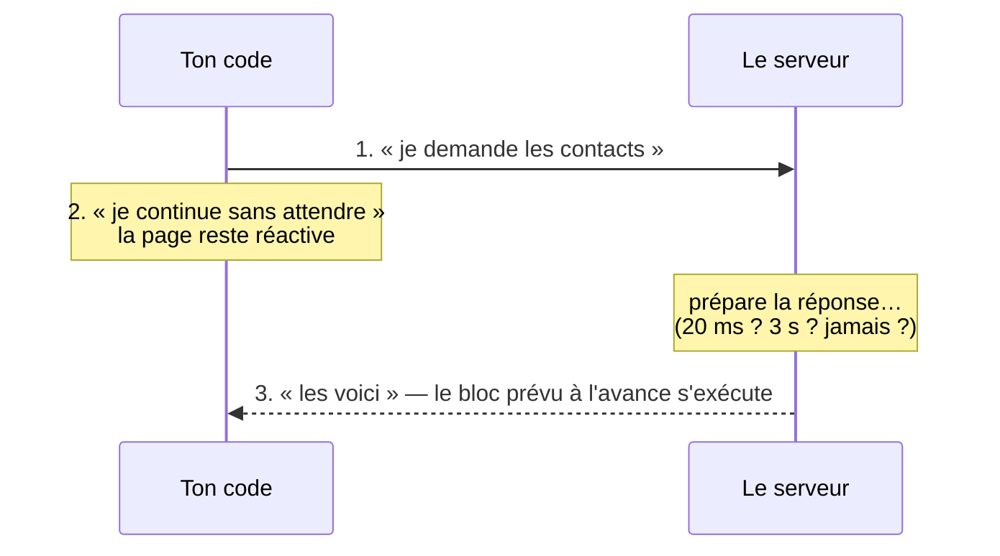

Ce décalage — « 2 » s'affiche avant « 3 » alors qu'il est écrit après — est le point qui surprend le plus au début. Il explique aussi une grande partie de ce cours : à l'étape 9, une liste s'affichera vide pendant un instant avant de se remplir, et il faudra que l'interface sache gérer ça.

---

# Partie I — Les fondations d'Angular

Cette première partie construit une application qui **ne parle à aucun serveur**. Les contacts vivent en mémoire, dans le navigateur, et disparaissent au moindre rafraîchissement de la page.

C'est volontaire, et c'est un choix pédagogique qu'il faut comprendre. Ajouter un serveur dès le départ introduirait d'un coup le réseau, l'asynchrone, la gestion des pannes et le format des échanges — quatre difficultés qui n'ont rien à voir avec Angular lui-même. En les remettant à la Partie II, on peut apprendre les vraies briques d'Angular (composant, signal, service, formulaire) sur des données qu'on maîtrise entièrement.

> **Note sur le code de cette partie.** L'état « tout en mémoire » n'a jamais été enregistré dans Git : le premier commit du projet contenait déjà le backend. Les blocs de code de cette partie sont donc **reconstitués** à partir du parcours réellement suivi, tel que [`progression-pedagogique.md`](progression-pedagogique.md) le décrit (Partie 1, étapes 1 à 9). À partir de l'étape 9, tout le code présenté est extrait de l'historique Git et vérifiable.

---

## Étape 1 — Le projet et ses fichiers

### Le problème

Une application Angular, ce n'est pas un fichier HTML qu'on ouvre dans un navigateur. C'est une arborescence d'une centaine de fichiers, dont la plupart sont de la configuration. Avant d'écrire une seule ligne utile, il faut savoir **lesquels comptent** et par où le programme démarre.

### Les outils : Node, npm, et le CLI

Trois noms reviennent constamment.

**Node.js** est un programme qui sait exécuter du JavaScript *en dehors* d'un navigateur. On ne s'en sert pas pour l'application elle-même — celle-ci tourne dans le navigateur — mais pour tous les outils de développement : transpiler le TypeScript, lancer un serveur local, exécuter les tests.

**npm** (*Node Package Manager*) est installé avec Node. C'est le gestionnaire de **dépendances** : les bibliothèques de code écrites par d'autres dont ton projet a besoin. Angular lui-même est une dépendance. Elles sont listées dans un fichier `package.json`, et `npm install` les télécharge toutes dans un dossier `node_modules/` — dossier qu'on ne versionne jamais dans Git, puisqu'il se reconstruit à la commande.

**Le CLI Angular** (`ng`) est l'outil en ligne de commande d'Angular. Son rôle est d'éviter d'écrire à la main la plomberie répétitive. Créer un composant demanderait sinon d'écrire soi-même le décorateur, les trois fichiers, et de les relier correctement ; `ng generate` fait tout en une commande, et surtout **de la même façon à chaque fois**. C'est autant un gain de temps qu'une garantie de cohérence.

```bash
# Creer un projet (a faire une seule fois)
ng new mon-projet

# Installer les dependances listees dans package.json
npm install

# Lancer le serveur de developpement : il recompile a chaque sauvegarde
ng serve

# Fabriquer la version optimisee, prete a etre mise en ligne
ng build

# Generer un composant, un service (voir les etapes suivantes)
ng generate component components/mon-composant
ng generate service services/mon-service
```

Quand `ng serve` a fini de démarrer, il affiche une ligne de ce genre :

```
➜  Local:   http://localhost:4200/
Watch mode enabled. Watching for file changes...
```

`localhost` désigne ta propre machine, et `4200` est le **port** — un numéro qui permet à plusieurs programmes de cohabiter sur la même machine sans se gêner. « Watch mode » signifie que l'outil surveille tes fichiers : à chaque sauvegarde, il recompile et le navigateur se met à jour tout seul.

### Les fichiers qui comptent

```
carnet-contact_frontend/
├── package.json          <- la liste des dependances
├── angular.json          <- la configuration de compilation
└── src/
    ├── index.html        <- LA page HTML, unique
    ├── main.ts           <- le point de depart du programme
    ├── styles.css        <- les styles GLOBAUX
    └── app/
        ├── app.config.ts <- la configuration de l'application
        ├── app.routes.ts <- la correspondance URL -> page
        ├── app.ts        <- le composant racine
        ├── app.html
        └── app.css
```

### Comment le programme démarre, dans l'ordre

C'est une chaîne de quatre maillons, et la comprendre évite beaucoup de perplexité par la suite.

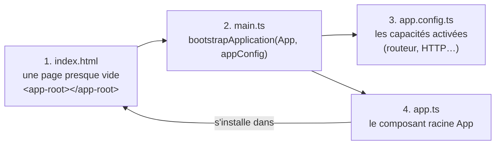

**1. `index.html`** est la seule page HTML de toute l'application. Son corps est presque vide :

```html
<body>
  <app-root></app-root>
</body>
```

`<app-root>` n'est pas une balise HTML standard — elle n'existe dans aucune spécification. C'est un **emplacement** : Angular va y injecter toute l'interface. Cette idée d'une page unique dans laquelle tout est construit par du code porte un nom, **SPA** (*Single Page Application*) : la page n'est jamais rechargée, c'est son contenu qui change.

**2. `main.ts`** est le premier fichier exécuté :

```typescript
import { bootstrapApplication } from '@angular/platform-browser';
import { appConfig } from './app/app.config';
import { App } from './app/app';

// « bootstrap » : demarrer. On dit a Angular « lance l'application, en
// partant du composant App, avec cette configuration ».
bootstrapApplication(App, appConfig)
  .catch((err) => console.error(err));
```

**3. `app.config.ts`** liste ce dont l'application a besoin pour fonctionner. Chaque entrée du tableau `providers` active une capacité :

```typescript
export const appConfig: ApplicationConfig = {
  providers: [
    provideRouter(routes),      // active la navigation par URL (etape 11)
    provideHttpClient()         // active les appels reseau (etape 9)
  ]
};
```

Ce tableau est un fil rouge du cours : il va s'allonger à presque chaque partie. À la fin, il contiendra aussi les intercepteurs, le thème de la bibliothèque de composants, et l'hydratation côté serveur.

**4. `app.ts`** est le **composant racine**, le sommet de l'arbre. Tout le reste de l'interface sera contenu dedans, directement ou indirectement.

### Ce que cette étape a introduit

| Notion | Rôle |
|---|---|
| `npm install` | Télécharger les dépendances listées dans `package.json` |
| `ng serve` | Serveur de développement, recompilation automatique |
| `ng build` | Version optimisée pour la mise en ligne |
| `ng generate` | Créer un composant ou un service sans écrire la plomberie |
| `index.html` + `<app-root>` | L'unique page, et l'emplacement où Angular s'installe |
| `main.ts` | Le point de départ : `bootstrapApplication` |
| `app.config.ts` | Ce que l'application active (`providers`) |

> Pour le détail des commandes et de leurs options : section 1 du [support](support-apprentissage-angular-spring.md#1-outils-en-ligne-de-commande).

---

## Étape 2 — Le composant, brique de base

### Le problème

Une interface complète — barre de navigation, formulaire, liste, fiche de détail — écrite dans un seul fichier devient très vite illisible. Et si deux endroits de l'application doivent afficher la même chose, il faudrait dupliquer le code, avec la certitude qu'une des deux copies finira par diverger de l'autre.

### La notion

Un **composant** est une portion d'écran autonome, avec son affichage, sa logique et son style réunis. Une application Angular n'est au fond rien d'autre qu'un **arbre de composants** imbriqués : le composant racine en contient d'autres, qui en contiennent d'autres à leur tour.

Chaque composant sépare toujours trois responsabilités dans trois fichiers :

```
mon-composant.ts     -> la logique : que faire quand on clique, ou chercher les donnees
mon-composant.html   -> l'affichage : le « template », a quoi ca ressemble
mon-composant.css    -> le style, ISOLE a ce composant
```

L'isolation du CSS mérite qu'on s'y arrête, parce qu'elle résout un problème réel. En CSS ordinaire, une règle `.titre { color: red }` s'applique à *tous* les éléments de classe `titre` de toute la page. Deux développeurs qui choisissent le même nom de classe dans deux parties différentes du site se marchent dessus. Angular évite ça : le CSS écrit dans `mon-composant.css` ne peut toucher que les éléments de `mon-composant.html`, jamais ceux d'un autre composant. Le mécanisme exact est expliqué à l'étape 25.

### La syntaxe

```typescript
import { Component } from '@angular/core';

@Component({
  // Le nom de la balise HTML que ce composant cree.
  selector: 'app-mon-composant',

  // Ce dont SON PROPRE template a besoin (voir plus bas).
  imports: [],

  templateUrl: './mon-composant.html',
  styleUrl: './mon-composant.css'
})
export class MonComposant {
  // La logique vient ici : proprietes et methodes.
}
```

Le `selector` définit une balise personnalisée. Une fois déclarée, on l'utilise dans n'importe quel autre template exactement comme une balise HTML native :

```html
<app-mon-composant></app-mon-composant>
```

Le tableau `imports` demande une explication, parce qu'il est la cause de l'erreur la plus fréquente en début d'apprentissage. Chaque composant Angular moderne — dit **standalone**, « autonome » — déclare lui-même, dans ce tableau, tout ce dont *son propre template* a besoin : les autres composants qu'il affiche, les directives qu'il utilise.

C'était différent avant : tout se déclarait une fois pour toutes dans un fichier central appelé `NgModule`. L'approche autonome rend chaque composant compréhensible isolément — en lisant ses `imports`, on sait immédiatement de quoi il dépend, sans remonter dans une configuration globale.

**Utiliser un composant dans un autre demande donc trois gestes indissociables :**

```typescript
// 1. L'importer (au sens TypeScript : rendre le nom disponible dans ce fichier)
import { ContactList } from './components/contact-list/contact-list';

@Component({
  // 2. Le declarer dans imports (au sens Angular : autoriser le template a l'employer)
  imports: [ContactList],
  templateUrl: './accueil.html'
})
export class Accueil { }
```

```html
<!-- 3. Utiliser la balise -->
<app-contact-list></app-contact-list>
```

Oublier le geste 2 est extrêmement courant, d'autant que l'éditeur ajoute souvent le geste 1 automatiquement. Angular refuse alors de compiler : il ne « connaît » pas cette balise. Le message d'erreur mentionne le nom de la balise inconnue — c'est le réflexe à avoir : vérifier les `imports`.

### Afficher une valeur : l'interpolation

Pour afficher dans le template une valeur venue de la classe, on l'entoure de doubles accolades. Ça s'appelle l'**interpolation**.

```typescript
export class MonComposant {
  titre = 'Mon carnet';
}
```

```html
<h1>{{ titre }}</h1>
```

Angular lit la propriété `titre` de la classe et la place dans le HTML. Et surtout : si sa valeur change plus tard, l'affichage se met à jour tout seul. Comment Angular sait-il qu'elle a changé ? C'est exactement le sujet de l'étape 4.

### Dans le projet

L'arbre des composants du carnet, à la fin du parcours : `App` (la coquille : en-tête, navigation) → `Accueil` (la page) → `ContactForm` + `ContactList` (les briques).

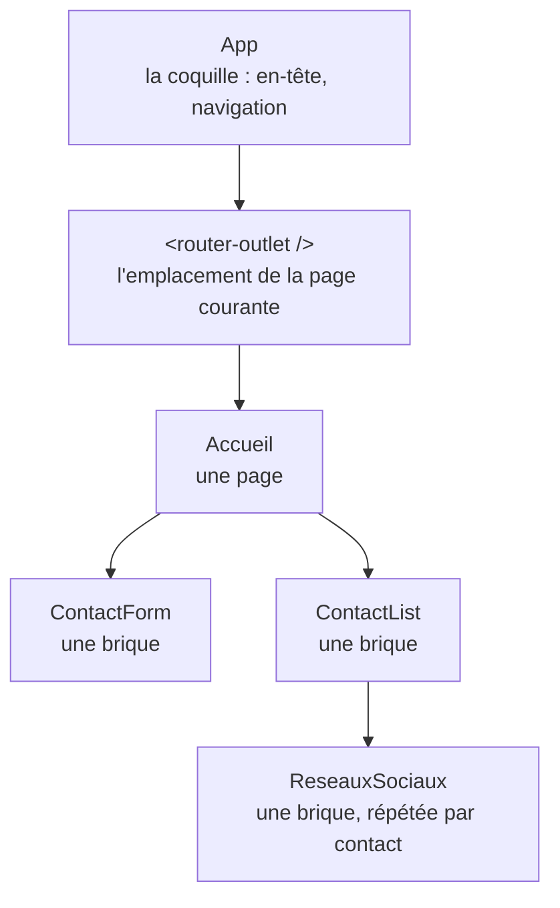

Chaque boîte est un composant, avec ses trois fichiers. Chaque flèche veut dire « le gabarit du haut contient la balise du bas » — et donc que le composant du haut déclare celui du bas dans ses `imports`. Le `<router-outlet />` est un cas à part, expliqué à l'étape 11 : la page qu'il affiche change avec l'URL.

**[DÉFINITIF]** — [`components/contact-list/contact-list.ts`](../carnet-contact_frontend/src/app/components/contact-list/contact-list.ts)

```typescript
@Component({
  selector: 'app-contact-list',
  imports: [RouterLink, ReactiveFormsModule, ReseauxSociaux, /* ... */],
  templateUrl: './contact-list.html',
  styleUrl: './contact-list.css'
})
export class ContactList implements OnInit { /* ... */ }
```

Les trois gestes se lisent côte à côte dans [`pages/accueil/accueil.ts`](../carnet-contact_frontend/src/app/pages/accueil/accueil.ts) et [`accueil.html`](../carnet-contact_frontend/src/app/pages/accueil/accueil.html) :

```typescript
// accueil.ts
imports: [ContactList, ContactForm],
```

```html
<!-- accueil.html -->
<app-contact-form (contactAjoute)="ajouterContact($event)"></app-contact-form>
<app-contact-list></app-contact-list>
```

> Le `(contactAjoute)` de cette dernière ligne est une notion de l'étape 8. Pour l'instant, retenir seulement que le formulaire et la liste sont deux composants distincts, posés l'un sous l'autre.

### Une convention de nommage à connaître

Le projet range ses composants dans deux dossiers, et la distinction est utile :

| Dossier | Contenu | Exemple |
|---|---|---|
| `pages/` | Un composant associé à une **URL** | `pages/accueil`, `pages/contact-detail` |
| `components/` | Une brique **réutilisable**, sans URL propre | `components/contact-list` |

Rien dans Angular n'impose cette séparation. C'est une convention de projet, et elle aide : en voyant un dossier, on sait si le composant est une destination de navigation ou un morceau assemblable.

### Ce que cette étape a introduit

| Notion | Rôle |
|---|---|
| `@Component` | Décorateur qui déclare une classe comme composant |
| `selector` | Le nom de la balise HTML créée |
| `imports` | Ce que le template du composant est autorisé à employer |
| `templateUrl` / `styleUrl` | Les fichiers HTML et CSS associés |
| `{{ valeur }}` | Interpolation : afficher une donnée de la classe |
| CSS isolé | Le style d'un composant ne fuit pas vers les autres |

> Détail complet : section 2 du [support](support-apprentissage-angular-spring.md#2-composants-angular).

---

## Étape 3 — Le modèle de données

### Le problème

Un contact, dans le code, c'est un objet avec un nom, un prénom, un email. Rien n'empêche d'écrire :

```typescript
const contact = { nom: 'Dupont', prenom: 'Jean', emial: 'jean@exemple.fr' };
//                                                ^^^^^ faute de frappe
```

En JavaScript, ce code fonctionne. L'objet aura une propriété `emial`, et le jour où l'affichage cherchera `contact.email`, il trouvera `undefined` — une valeur vide. Aucune erreur, aucun avertissement : juste un champ vide à l'écran, et une demi-heure à chercher pourquoi.

### La notion

Une **interface** TypeScript est un contrat : elle décrit la forme qu'un objet doit avoir. Elle ne contient aucun code exécutable et disparaît complètement à la transpilation — elle n'existe que pour le compilateur, qui s'en sert pour vérifier ton travail pendant que tu écris.

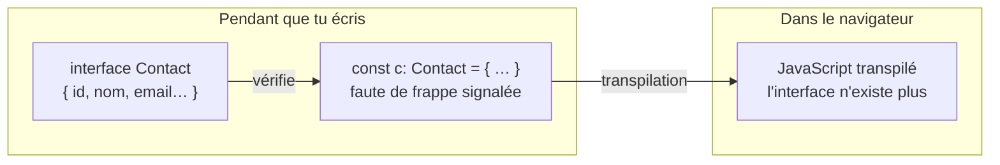

Conséquence directe du schéma : une interface ne peut **rien** vérifier à l'exécution. Si le serveur renvoie un objet d'une autre forme, TypeScript ne le saura pas — il a fait confiance à ce qu'on lui a déclaré.

```typescript
export interface Contact {
  id: number;         // obligatoire, doit etre un nombre
  nom: string;        // obligatoire, doit etre une chaine
  telephone?: string; // le ? signifie FACULTATIF : peut etre absent
}
```

Avec cette interface, la faute de frappe précédente est signalée immédiatement dans l'éditeur, avant même d'enregistrer le fichier :

```typescript
const contact: Contact = { nom: 'Dupont', emial: '...' };
// Erreur : la propriete 'emial' n'existe pas sur le type 'Contact'.
// Erreur : la propriete 'id' est manquante.
```

Le mot-clé `export` mérite un mot : il rend l'interface utilisable depuis d'autres fichiers. Sans lui, elle resterait privée à son fichier. C'est le pendant de l'`import` vu à l'étape 2 — l'un expose, l'autre consomme.

### Le `?` et ce qu'il implique

Marquer une propriété facultative avec `?` a une conséquence qu'on oublie souvent : TypeScript t'obligera désormais à envisager son absence.

```typescript
interface Contact {
  nom: string;
  telephone?: string;
}

function afficher(c: Contact) {
  console.log(c.telephone.length);   // ERREUR : c.telephone peut etre undefined
  console.log(c.telephone?.length);  // OK : le ?. renvoie undefined au lieu de planter
}
```

Le `?.` s'appelle le **chaînage optionnel**. Il signifie « si ce qui précède existe, continue ; sinon, donne `undefined` et arrête-toi là ». C'est un outil qu'on retrouvera partout dans ce projet, notamment dans les templates : `auth.utilisateur()?.nomAffichage`.

### Dans le projet

**[ÉTAPE]** — le modèle initial, au premier commit (`b66a87a`). Cinq champs, tous obligatoires.

```typescript
// contact.model.ts
export interface Contact {
  id: number;
  nom: string;
  prenom: string;
  email: string;
  telephone: string;
}
```

**[DÉFINITIF]** — [`contact.model.ts`](../carnet-contact_frontend/src/app/contact.model.ts) aujourd'hui. Le modèle a grossi : email professionnel, photo, six réseaux sociaux — et presque tout est devenu facultatif, parce qu'exiger six réseaux sociaux pour enregistrer un contact n'aurait aucun sens.

Ce grossissement illustre une règle utile : **un modèle de données n'est jamais figé**. Il suit les besoins de l'application, et TypeScript est là précisément pour que chaque ajout de champ signale tous les endroits du code qui doivent en tenir compte. On en verra une démonstration spectaculaire à l'étape 22, quand deux champs ajoutés casseront quatre fichiers de test d'un coup.

### Où ranger ces fichiers

Le projet place ses interfaces à la racine de `src/app/`, dans des fichiers `*.model.ts` :

```
src/app/
├── contact.model.ts
├── utilisateur.model.ts
└── message.model.ts
```

C'est une convention, pas une obligation. Son intérêt : un modèle est partagé par les composants, les services et les tests — le mettre à la racine évite de le faire appartenir à l'un d'eux en particulier.

### Ce que cette étape a introduit

| Notion | Rôle |
|---|---|
| `interface` | Décrire la forme d'un objet ; vérifiée à la compilation, absente à l'exécution |
| `export` | Rendre une déclaration utilisable depuis un autre fichier |
| `?` sur une propriété | La rendre facultative — et forcer à envisager son absence |
| `?.` | Chaînage optionnel : lire sans planter si l'objet est absent |

---

## Étape 4 — Le signal : une valeur que l'interface surveille

### Le problème

L'étape 2 affichait une valeur avec `{{ titre }}`. Mais que se passe-t-il quand cette valeur **change** ?

```typescript
export class MonComposant {
  titre = 'Mon carnet';

  renommer(): void {
    this.titre = 'Autre titre';   // le HTML se met-il a jour ?
  }
}
```

La question paraît triviale, elle ne l'est pas. Pour rafraîchir l'écran, le framework doit *savoir* que quelque chose a changé. Or une affectation ordinaire (`this.titre = ...`) ne prévient personne : c'est une écriture en mémoire, silencieuse.

Historiquement, Angular résolvait ça en **re-vérifiant tout**. À chaque clic, chaque réponse réseau, chaque minuteur, il reparcourait l'ensemble des valeurs affichées pour voir lesquelles avaient bougé. Ça fonctionne, mais c'est du travail proportionnel à la taille de l'application entière, même quand une seule ligne a changé.

### La notion

Un **signal** est une valeur qui **prévient quand elle change**. Au lieu de stocker la donnée dans une propriété muette, on la range dans un petit conteneur qui tient la liste de ceux qui la lisent.

C'est un renversement complet : ce n'est plus Angular qui part à la recherche des changements, c'est la donnée qui signale le sien. Le travail devient proportionnel à ce qui a réellement bougé.

L'analogie la plus juste est celle d'un abonnement. Une variable ordinaire est un tableau noir : si personne ne regarde au bon moment, le changement passe inaperçu. Un signal est une liste de diffusion : quiconque l'a lu est prévenu automatiquement.

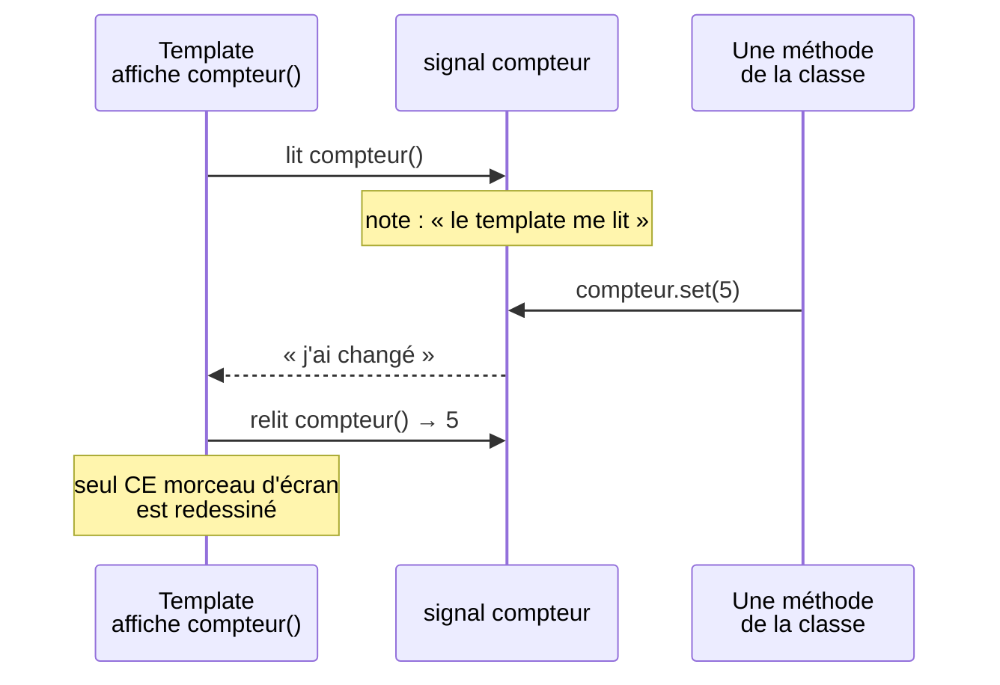

Le signal tient la liste de ceux qui l'ont lu. Quand il change, il ne prévient **qu'eux** : le reste de l'écran n'est ni relu ni redessiné.

### La syntaxe

```typescript
import { signal } from '@angular/core';

// CREER un signal, avec sa valeur de depart.
compteur = signal(0);

// LIRE : on APPELLE le signal comme une fonction. Les parentheses sont
// obligatoires — sans elles, on recupere le conteneur, pas son contenu.
console.log(this.compteur());        // 0

// ECRIRE, deux facons :
this.compteur.set(5);                // remplacer par une valeur connue
this.compteur.update(n => n + 1);    // calculer a partir de l'ancienne
```

Dans un template, on lit un signal exactement pareil, avec ses parenthèses :

```html
<p>{{ compteur() }}</p>
```

C'est la source d'erreur numéro un avec les signals. Écrire `{{ compteur }}` sans parenthèses n'affiche pas d'erreur : ça affiche quelque chose comme `function computed()`, ou `[object Object]`. Le réflexe à prendre : **un signal se lit toujours avec `()`**.

### `set` ou `update` : lequel choisir

```typescript
// set : la nouvelle valeur ne depend pas de l'ancienne.
this.contacts.set(listeVenueDuServeur);

// update : la nouvelle valeur est CALCULEE depuis l'ancienne.
this.contacts.update(liste => [...liste, nouveauContact]);
```

`update` n'est pas qu'un raccourci. Il garantit qu'on part de la valeur réellement en place au moment de l'exécution. Avec `set`, on écrirait :

```typescript
this.contacts.set([...this.contacts(), nouveau]);   // lire PUIS ecrire
```

et on introduit un intervalle — court, mais réel — entre la lecture et l'écriture, pendant lequel la valeur pourrait avoir changé. `update` supprime cet intervalle.

### La règle d'immutabilité

Voici un piège qui coûte cher, et qu'il faut comprendre une fois pour toutes.

```typescript
// CE QUI NE MARCHE PAS
this.contacts.update(liste => {
  liste.push(nouveau);   // on modifie le tableau EXISTANT
  return liste;          // ... et on renvoie le meme tableau
});
```

Ce code ajoute bien l'élément, mais **l'écran ne se met pas à jour**. La raison : pour décider s'il doit rafraîchir, Angular compare l'ancienne valeur et la nouvelle. Pour un tableau, cette comparaison porte sur la **référence** — l'adresse en mémoire — et non sur le contenu. Le tableau modifié sur place a la même adresse qu'avant : Angular conclut que rien n'a changé.

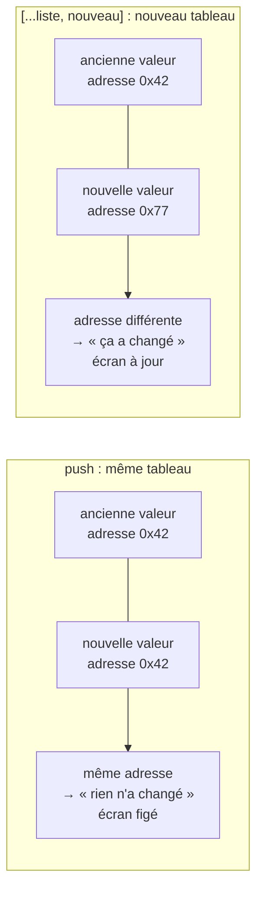

Il faut donc renvoyer un **nouveau** tableau :

```typescript
// CE QUI MARCHE
this.contacts.update(liste => [...liste, nouveau]);            // ajout
this.contacts.update(liste => liste.filter(c => c.id !== id)); // suppression
this.contacts.update(liste => liste.map(c => c.id === maj.id ? maj : c)); // remplacement
```

Le `...` s'appelle l'**étalement** (*spread*) : `[...liste, nouveau]` crée un tableau neuf contenant tous les éléments de `liste`, puis `nouveau`. Et `filter` comme `map` renvoient d'eux-mêmes des tableaux neufs — ce sont les bons outils ici, là où `push`, `splice` ou `sort` modifient sur place.

Cette règle vaut aussi pour les objets :

```typescript
// Nouvel objet, avec une propriete changee.
this.utilisateur.update(u => ({ ...u, nomAffichage: 'Nouveau nom' }));
```

> Les parenthèses autour de `{ ... }` ne sont pas décoratives : sans elles, JavaScript lirait l'accolade comme le début d'un bloc de code et non comme un objet.

### `asReadonly()` : donner à lire sans donner à écrire

```typescript
// Le signal modifiable reste PRIVE : seule cette classe peut l'ecrire.
private contactsSignal = signal<Contact[]>([]);

// La version exposee : lisible par tous, modifiable par personne d'autre.
readonly contacts = this.contactsSignal.asReadonly();
```

Ce couple de deux lignes revient partout dans le projet, et son intérêt est architectural. Si n'importe quel composant pouvait écrire dans la liste des contacts, une incohérence à l'écran deviendrait très difficile à diagnostiquer : il faudrait inspecter tous les composants pour trouver le coupable. Avec cette discipline, **il n'existe qu'un seul endroit au monde qui puisse modifier cette donnée**. Le bug est forcément là.

### La valeur dérivée : `computed()`

Certaines valeurs ne sont pas des données mais des **conséquences**. « Combien de contacts ? » n'est pas une information à stocker : c'est la longueur de la liste. La stocker séparément créerait deux sources qu'il faudrait penser à synchroniser — et qu'on oubliera.

```typescript
import { computed, signal } from '@angular/core';

contacts = signal<Contact[]>([]);

// computed() calcule une valeur DERIVEE. Il se recalcule tout seul des qu'un
// des signaux qu'il lit change, et JAMAIS autrement.
nombre = computed(() => this.contacts().length);
connecte = computed(() => this.jeton() !== null);
```

Un `computed` se lit comme un signal (`nombre()`), mais **ne s'écrit pas** : il n'a ni `set` ni `update`. C'est voulu — sa valeur n'appartient pas à celui qui la lit, elle découle de ses sources.

| | `signal()` | `computed()` |
|---|---|---|
| Contient | Une valeur qu'on fixe soi-même | Une valeur déduite d'autres signaux |
| Se modifie | `.set()`, `.update()` | Jamais directement — recalcul automatique |
| Rôle | Source de vérité | Vue dérivée d'une ou plusieurs sources |

La règle de décision : **si tu peux la calculer, ne la stocke pas.** Deux sources qui pourraient se désynchroniser valent toujours moins qu'une seule dont on dérive.

### L'effet de bord : `effect()`

Troisième et dernier outil de la famille. `computed()` *calcule* une valeur ; `effect()` *fait* quelque chose.

```typescript
import { effect } from '@angular/core';

constructor() {
  // Ce bloc s'execute une premiere fois, puis A CHAQUE FOIS qu'un signal
  // qu'il lit change.
  effect(() => {
    console.log('Le theme est maintenant', this.theme());
  });
}
```

Un `effect` sert quand il faut agir **hors d'Angular** en réaction à un changement : écrire dans le navigateur, démarrer un minuteur, poser un attribut sur la page. On le verra à l'étape 12 (pré-remplir un formulaire à l'arrivée des données) et à l'étape 25 (appliquer le thème sombre).

Deux précautions valables dès maintenant :

- un `effect()` doit être créé dans un **contexte d'injection** — en pratique, dans le `constructor` de la classe, ou comme propriété de classe ;
- il est **différé** : il ne s'exécute pas à la ligne où on l'écrit, mais un peu après. C'est ce qui piégera les tests à l'étape 22.

Les trois outils forment une chaîne, et chacun a sa place bien délimitée :

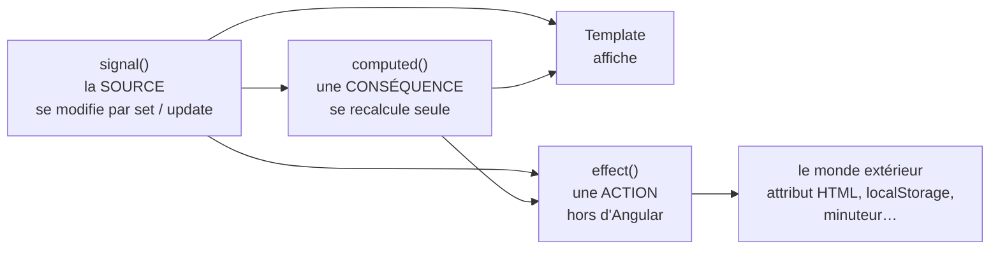

Les flèches ne vont que dans un sens : de la source vers ce qui en dépend. Un `computed` ne modifie jamais sa source, et un template ne modifie jamais un signal en le lisant.

### Dans le projet

**[ÉTAPE]** — au tout début, le titre de l'application était un signal, dans [`app.ts`](../carnet-contact_frontend/src/app/app.ts) :

```typescript
export class App {
  protected readonly title = signal('carnet-contact');
}
```

```html
<h1>{{ title() }}</h1>
```

Ce signal a disparu depuis (l'en-tête affiche un titre fixe), mais il illustre bien le point de départ : **la première chose qu'on met dans un signal, c'est la plus simple possible.**

**[DÉFINITIF]** — le couple privé/lecture seule de [`services/contact.ts`](../carnet-contact_frontend/src/app/services/contact.ts) :

```typescript
private contactsSignal = signal<Contact[]>([]);
readonly contacts = this.contactsSignal.asReadonly();
```

Et un `computed` de [`services/session.ts`](../carnet-contact_frontend/src/app/services/session.ts), qui dit bien « ceci est une conséquence, pas une donnée » :

```typescript
// « Connecte » n'est pas une donnee a stocker, c'est une consequence de la
// presence d'un jeton.
readonly connecte = computed(() => this.jetonSignal() !== null);
```

### Ce que cette étape a introduit

| Notion | Rôle |
|---|---|
| `signal(valeur)` | Créer une valeur qui prévient de ses changements |
| `monSignal()` | Lire — les parenthèses sont obligatoires |
| `.set(v)` | Remplacer par une valeur connue |
| `.update(f)` | Calculer la nouvelle valeur depuis l'ancienne |
| `[...liste, x]` | Renvoyer un **nouveau** tableau : sans ça, pas de rafraîchissement |
| `.asReadonly()` | Exposer en lecture seule, garder l'écriture privée |
| `computed(f)` | Valeur dérivée, recalculée automatiquement |
| `effect(f)` | Effet de bord déclenché par un changement |

> Détail complet : section 3 du [support](support-apprentissage-angular-spring.md#3-signals).

---

## Étape 5 — Le service et l'injection de dépendances

### Le problème

La liste des contacts doit être visible par le composant qui l'affiche, et modifiable par celui qui ajoute un contact. Si chacun garde sa propre copie, les deux divergent immédiatement : le formulaire ajoute à sa liste, la liste affiche la sienne, et rien ne bouge à l'écran.

Il faut donc que la donnée vive **ailleurs** que dans les composants — à un endroit unique auquel tous accèdent.

### La notion

Un **service** est une classe qui ne dessine rien. Elle détient des données et de la logique, et les met à disposition de qui en a besoin.

L'analogie qui marche bien : le service est l'**entrepôt**, les composants sont les **rayons du magasin**. Plusieurs rayons peuvent présenter le même produit ; il n'y a qu'un seul stock. Quand le stock bouge, tous les rayons le reflètent.

```typescript
import { Injectable, signal } from '@angular/core';

@Injectable({
  // « providedIn: root » : Angular cree UNE SEULE instance de ce service pour
  // toute l'application, et la donne a tous ceux qui la demandent. C'est ce
  // qu'on appelle un « singleton » — un seul exemplaire.
  providedIn: 'root'
})
export class ContactService {
  private contactsSignal = signal<Contact[]>([]);
  readonly contacts = this.contactsSignal.asReadonly();

  ajouter(contact: Contact): void {
    this.contactsSignal.update(liste => [...liste, contact]);
  }
}
```

`providedIn: 'root'` est le point clé. Sans lui, chaque composant recevrait sa *propre* instance du service — et on retomberait exactement sur le problème qu'on voulait résoudre.

### L'injection de dépendances

Une **dépendance** est simplement quelque chose dont ton code a besoin pour fonctionner. Un composant qui affiche des contacts dépend de `ContactService`.

La façon naïve de se la procurer serait de la fabriquer soi-même :

```typescript
export class ContactList {
  private contactService = new ContactService();   // NE JAMAIS FAIRE CA
}
```

Ce code compile et paraît raisonnable. Il est pourtant faux, et pour une raison qui va au cœur de l'architecture Angular : `new` crée un **nouvel** objet. Chaque composant aurait le sien, avec sa propre liste vide. Le singleton serait anéanti.

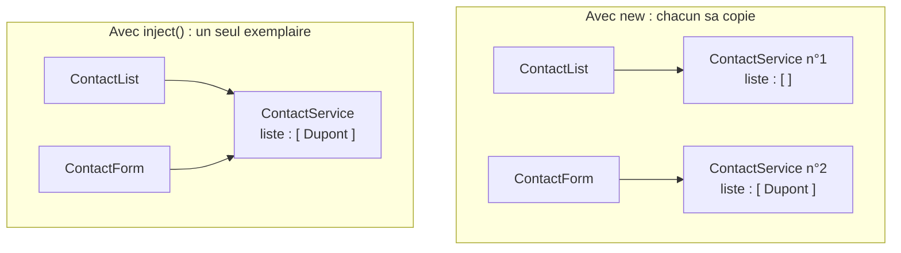

À gauche, le formulaire ajoute dans **sa** copie ; la liste regarde la **sienne**, et reste vide. À droite, il n'y a qu'un entrepôt : ce que l'un range, l'autre le voit.

Angular fonctionne autrement. On ne fabrique pas ses dépendances : on les **demande**, et le framework les fournit. C'est l'**injection de dépendances**.

```typescript
import { inject } from '@angular/core';

export class ContactList {
  // « Donne-moi le ContactService de l'application. » Angular le fabrique s'il
  // n'existe pas encore, et renvoie l'exemplaire existant dans le cas contraire.
  private contactService = inject(ContactService);
}
```

Trois bénéfices, dont le dernier n'apparaîtra qu'à l'étape 22 :

1. **Le singleton est respecté** : tous reçoivent le même exemplaire, donc la même donnée.
2. **Le composant ne sait pas comment construire son service.** Si `ContactService` gagne demain une dépendance supplémentaire, aucun composant n'a à changer.
3. **On peut remplacer une dépendance.** Dans un test, on fournira un faux service, et le composant testé ne s'en apercevra pas.

`inject()` ne s'appelle pas n'importe où : il lui faut un **contexte d'injection**. En pratique, ça veut dire comme propriété de classe (le cas courant) ou dans le `constructor`. L'appeler dans une méthode ordinaire lève une erreur.

### Dans le projet

**[ÉTAPE — reconstitué]** — la toute première version du service, avant tout serveur. La liste vit en mémoire et rien de plus.

```typescript
@Injectable({ providedIn: 'root' })
export class ContactService {
  private contactsSignal = signal<Contact[]>([
    { id: 1, nom: 'Dupont', prenom: 'Jean', email: 'jean@exemple.fr', telephone: '0601020304' }
  ]);
  readonly contacts = this.contactsSignal.asReadonly();

  addContact(contact: Contact): void {
    this.contactsSignal.update(liste => [...liste, contact]);
  }

  deleteContact(id: number): void {
    this.contactsSignal.update(liste => liste.filter(c => c.id !== id));
  }
}
```

Cette version est **simple et fausse** — fausse parce que tout disparaît au rafraîchissement de la page. Mais elle est pédagogiquement précieuse : elle isole la notion de service et de signal partagé, sans le bruit du réseau.

Et voici ce qui va être instructif pour la suite : à l'étape 9, cette architecture propre va être **cassée** par l'arrivée du serveur, avant d'être reconstruite à l'étape 10.

**[DÉFINITIF]** — [`services/contact.ts`](../carnet-contact_frontend/src/app/services/contact.ts) et [`components/contact-list/contact-list.ts`](../carnet-contact_frontend/src/app/components/contact-list/contact-list.ts) :

```typescript
export class ContactList implements OnInit {
  private contactService = inject(ContactService);

  // Une REFERENCE vers le signal du service, pas une copie.
  contacts = this.contactService.contacts;
}
```

Cette ligne mérite d'être lue lentement. `contacts` n'est pas une copie de la liste : c'est le même objet signal. Quand le service l'écrit, le composant lit la nouvelle valeur — sans une ligne de synchronisation.

### Ce que cette étape a introduit

| Notion | Rôle |
|---|---|
| `@Injectable({ providedIn: 'root' })` | Déclarer un service, en un seul exemplaire pour l'application |
| `inject(MonService)` | Demander une dépendance au framework |
| Singleton | Un exemplaire unique, donc une seule source de vérité |
| Ne jamais faire `new` sur un service | `new` casse le singleton |

> Détail complet : section 4 du [support](support-apprentissage-angular-spring.md#4-services-et-injection-de-dépendances).

---

## Étape 6 — Afficher une liste : `@for` et `@if`

### Le problème

On a une liste de contacts dans un signal. Il faut en afficher un bloc HTML par contact — sans savoir combien il y en aura, ni s'il y en aura.

Le HTML ne sait pas faire de boucle. C'est un langage de description, pas de programmation : il n'a ni `for` ni `if`.

### La notion

Angular étend le HTML avec des **blocs de contrôle**, reconnaissables à leur `@`. Ils s'écrivent directement dans le template et pilotent ce qui est affiché.

```html
<!-- Afficher un bloc PAR ELEMENT d'une liste -->
@for (element of maListe(); track element.id) {
  <p>{{ element.nom }}</p>
}

<!-- Afficher conditionnellement -->
@if (condition) {
  <p>Vrai</p>
} @else {
  <p>Faux</p>
}
```

> Cette syntaxe est récente. Beaucoup de tutoriels et de réponses trouvées en ligne utilisent encore l'ancienne forme, `*ngFor` et `*ngIf`, écrite comme un attribut de balise. Les deux font la même chose ; la forme `@` est celle à employer aujourd'hui. Si tu tombes sur `*ngIf`, tu sais que la source est antérieure à Angular 17.

### `track` : la partie qui compte vraiment

`track` est obligatoire dans un `@for`, et ce n'est pas une formalité. Il indique à Angular **comment reconnaître un élément** d'un affichage au suivant.

Sans cette information, Angular ne pourrait pas savoir ce qui s'est passé entre deux versions de la liste. Supposons qu'on supprime le premier de trois contacts. Angular reçoit une ancienne liste de trois éléments et une nouvelle de deux. A-t-on supprimé le premier ? Modifié les deux premiers et supprimé le dernier ? Sans repère, il ne peut que tout détruire et tout reconstruire.

Avec `track contact.id`, il compare des identités : « l'élément 1 a disparu, les éléments 2 et 3 sont inchangés ». Il retire une seule ligne du document et ne touche pas aux autres.

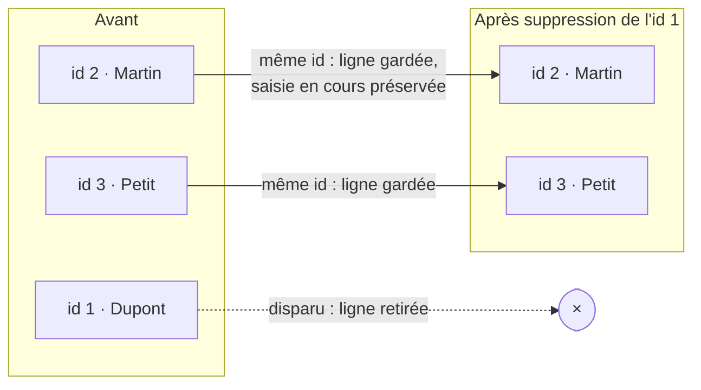

C'est `track` qui rend ces flèches possibles : sans identifiant, Angular ne peut relier aucune ligne d'avant à une ligne d'après.

Les conséquences sont très concrètes :

- **Les performances** : reconstruire mille lignes à chaque changement est perceptible.
- **L'état perdu** : si une ligne contient un champ de saisie à demi rempli, ou une case cochée, la reconstruction l'efface. Avec un `track` correct, la ligne n'est pas touchée et l'état survit.

```html
<!-- BIEN : un identifiant unique et stable -->
@for (contact of contacts(); track contact.id) { }

<!-- ACCEPTABLE en dernier recours : la position dans la liste -->
@for (contact of contacts(); track $index) { }
```

`$index` est un repli médiocre : la position d'un élément change dès qu'on trie ou insère. On l'utilise seulement quand les éléments n'ont aucun identifiant — une liste de chaînes de caractères, par exemple.

### Les variables utiles d'un `@for`

```html
@for (contact of contacts(); track contact.id) {
  <p>{{ $index }} — {{ contact.nom }}</p>
}
```

| Variable | Contenu |
|---|---|
| `$index` | La position, à partir de 0 |
| `$first` / `$last` | `true` pour le premier / le dernier |
| `$even` / `$odd` | Position paire / impaire — pratique pour alterner les couleurs |
| `$count` | Le nombre total d'éléments |

### `@if` avec `as` : éviter de tester deux fois

Cette forme est très employée dans le projet et vaut la peine d'être comprise :

```html
@if (contact(); as c) {
  <h2>{{ c.prenom }} {{ c.nom }}</h2>
  <p>{{ c.email }}</p>
}
```

On lit : « si `contact()` a une valeur, range-la dans `c` et affiche ce bloc ». Sans le `as`, il faudrait écrire `contact()!.prenom`, `contact()!.email`... en appelant le signal à chaque ligne, et en ajoutant un `!` pour promettre à TypeScript que la valeur n'est pas vide — une promesse que le compilateur ne peut pas vérifier.

Avec `as`, TypeScript **sait** que `c` existe dans ce bloc. Le code est plus court et mieux vérifié.

### Le bloc `@empty`

```html
@for (contact of contacts(); track contact.id) {
  <li>{{ contact.nom }}</li>
} @empty {
  <p>Aucun contact enregistré.</p>
}
```

`@empty` s'affiche quand la liste est vide. Il remplace avantageusement un `@if (liste().length === 0)` écrit à côté : la condition et son contraire restent dans la même structure, donc impossible de modifier l'un en oubliant l'autre.

### Dans le projet

**[ÉTAPE]** — le premier template de la liste, au commit `b66a87a`. Volontairement sans mise en forme : à ce stade, seule la mécanique d'affichage était en jeu.

```html
<!-- contact-list.html, version initiale -->
<h2>Mes contacts</h2>

@if (contacts().length === 0) {
  <p>Aucun contact enregistré.</p>
} @else {
  <ul>
    @for (contact of contacts(); track contact.id) {
      <li>
        {{ contact.prenom }} {{ contact.nom }} — {{ contact.email }} — {{ contact.telephone }}
        <button (click)="supprimer(contact.id)">Supprimer</button>
      </li>
    }
  </ul>
}
```

Noter le `@if ... @else` autour du `@for` : c'est ce qu'on écrit spontanément avant de connaître `@empty`.

**[DÉFINITIF]** — [`contact-list.html`](../carnet-contact_frontend/src/app/components/contact-list/contact-list.html) aujourd'hui. Le même `@for`, avec un affichage bien plus riche : photo ou initiale, coordonnées, liens vers les réseaux sociaux, et un lien vers la fiche de détail.

**[DÉFINITIF]** — un `@if ... as` typique, dans [`pages/contact-detail/contact-detail.html`](../carnet-contact_frontend/src/app/pages/contact-detail/contact-detail.html) :

```html
@if (contact(); as c) {
  <h2>{{ c.prenom }} {{ c.nom }}</h2>
} @else {
  <p>Contact introuvable (ou en cours de chargement).</p>
}
```

Le « ou en cours de chargement » de ce message est révélateur : à ce stade du projet, on ne savait pas distinguer « le contact n'existe pas » de « la réponse du serveur n'est pas encore arrivée ». C'est le genre d'imprécision qui se résoudra plus tard, aux étapes 13 et 14.

### Ce que cette étape a introduit

| Notion | Rôle |
|---|---|
| `@for (x of liste(); track x.id)` | Répéter un bloc par élément |
| `track` | Comment reconnaître un élément — performances **et** état préservé |
| `@empty` | Le cas de la liste vide, dans la même structure |
| `@if` / `@else` | Affichage conditionnel |
| `@if (x(); as y)` | Tester et nommer en une fois, avec le type garanti |
| `$index`, `$first`, `$last`… | Les variables implicites d'une boucle |

> Détail complet : section 5 du [support](support-apprentissage-angular-spring.md#5-syntaxe-de-template-if--for).

---

## Étape 7 — Les bindings et le formulaire réactif

Cette étape est double, parce que les deux notions sont indissociables en pratique : un formulaire n'est qu'un assemblage de bindings. On commence donc par la mécanique générale, puis on l'applique.

### 7.1 — Les bindings : faire circuler l'information

#### Le problème

Jusqu'ici, l'information ne circulait que dans un sens et d'une seule façon : `{{ valeur }}` prend une donnée de la classe et l'affiche comme **texte**.

Ça ne suffit pas. Il faut aussi pouvoir :

- donner une valeur à un **attribut** HTML (l'adresse d'une image, l'état désactivé d'un bouton) ;
- réagir à ce que fait l'utilisateur (un clic, une saisie).

#### La notion

Un **binding** (« liaison ») est un pont entre la classe TypeScript et le template. Angular en propose trois formes, et chacune a une syntaxe distincte qu'on reconnaît d'un coup d'œil.

```html
<!-- 1. INTERPOLATION : la classe -> le template, comme texte -->
<h1>{{ titre }}</h1>

<!-- 2. PROPERTY BINDING : la classe -> le template, comme VALEUR -->

<button [disabled]="formulaireInvalide">Envoyer</button>

<!-- 3. EVENT BINDING : le template -> la classe -->
<button (click)="supprimer(contact.id)">Supprimer</button>
<form (ngSubmit)="onSubmit()">
```

Les crochets et les parenthèses ne sont pas décoratifs, et on peut les mémoriser par leur forme : les **crochets `[ ]` pointent vers l'intérieur** de l'élément — la donnée y entre ; les **parenthèses `( )` sont ouvertes vers l'extérieur** — l'événement en sort.

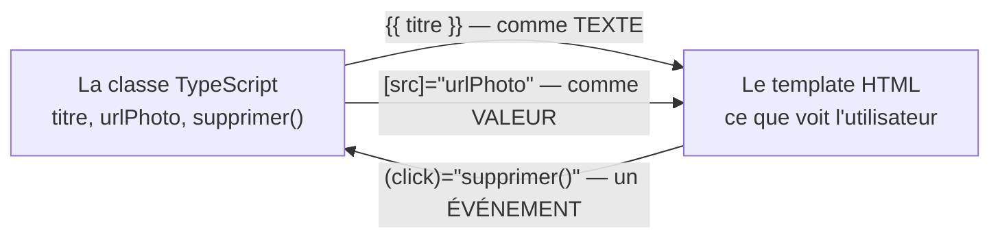

#### Pourquoi `[src]` et pas `src="{{ ... }}"`

La question se pose légitimement : les deux semblent marcher.

```html
    <!-- fonctionne, mais... -->
        <!-- a preferer -->
```

La différence est que l'interpolation produit toujours une **chaîne de caractères**. Pour une URL, ça passe. Mais pour une valeur qui n'est pas du texte, ça casse :

```html
<!-- CE QUI NE MARCHE PAS -->
<button disabled="{{ false }}">    <!-- l'attribut vaut la chaine "false"... -->
<!-- ...et en HTML, la simple PRESENCE de l'attribut disabled desactive le
     bouton, quelle que soit sa valeur. Le bouton reste donc desactive. -->

<!-- CE QUI MARCHE -->
<button [disabled]="false">        <!-- la PROPRIETE recoit le booleen false -->
```

Le fond de l'affaire : un **attribut** HTML est du texte écrit dans le document, alors qu'une **propriété** est une valeur de l'objet que le navigateur construit à partir du document. `[x]` écrit la propriété, avec son vrai type. C'est presque toujours ce qu'on veut.

#### Le cas particulier des attributs `aria-*`

Il existe une exception, et on la rencontre dès qu'on soigne l'accessibilité :

```html
<!-- Les attributs aria-* n'ont PAS de propriete correspondante sur l'objet
     DOM. [attr.] force l'ecriture de l'attribut lui-meme. -->
<button [attr.aria-pressed]="motDePasseVisible()">Afficher</button>
```

#### `$event` : récupérer ce qui s'est passé

```html
<app-contact-form (contactAjoute)="ajouterContact($event)"></app-contact-form>
```

`$event` est une variable fournie par Angular qui contient **la donnée transportée par l'événement**. Pour un `(click)`, c'est l'événement de souris du navigateur. Pour un événement personnalisé — c'est le cas ici, on le verra à l'étape 8 — c'est la valeur qu'on a choisi d'émettre.

### 7.2 — Le formulaire réactif

#### Le problème

Un formulaire n'est pas seulement un ensemble de champs. Il faut, pour chacun d'eux, savoir : quelle est sa valeur à cet instant ? est-elle valide ? l'utilisateur l'a-t-il seulement touché ? Et pour le formulaire entier : peut-on l'envoyer ?

Écrire ça à la main, champ par champ, produit énormément de code répétitif et facile à désynchroniser.

#### La notion

Angular propose deux approches des formulaires. Ce projet emploie exclusivement les **formulaires réactifs**, et c'est le bon choix par défaut.

L'idée : le formulaire est décrit **dans la classe TypeScript**, pas dans le HTML. Le template ne fait que se brancher sur cette description. Ainsi, la structure, les règles de validation et les valeurs vivent à un seul endroit — et sont testables sans même afficher le formulaire.

```typescript
import { FormBuilder, ReactiveFormsModule, Validators } from '@angular/forms';

@Component({
  // ReactiveFormsModule doit figurer dans les imports, sinon [formGroup] et
  // formControlName ne sont pas reconnus dans le template.
  imports: [ReactiveFormsModule],
  // ...
})
export class MonFormulaire {
  // FormBuilder est un service : il se demande par inject(), comme tout service.
  private fb = inject(FormBuilder);

  contactForm = this.fb.group({
    // Pour chaque champ : [valeur de depart, regles de validation]
    nom: ['', Validators.required],
    email: ['', [Validators.required, Validators.email]],
    telephone: ['']                  // aucune regle : facultatif
  });
}
```

Côté template, trois branchements suffisent :

```html
<!-- [formGroup] relie le <form> a l'objet decrit dans la classe -->
<form [formGroup]="contactForm" (ngSubmit)="onSubmit()">

  <!-- formControlName relie CE champ a CETTE cle du groupe -->
  <input formControlName="nom" placeholder="Nom" />
  <input formControlName="email" placeholder="Email" />

  <!-- Le bouton se desactive tout seul tant que le formulaire est invalide -->
  <button type="submit" [disabled]="contactForm.invalid">Ajouter</button>
</form>
```

> `(ngSubmit)` plutôt que `(click)` sur le bouton : `ngSubmit` se déclenche aussi quand l'utilisateur appuie sur Entrée dans un champ. C'est le comportement attendu d'un formulaire, et l'obtenir gratuitement évite d'y penser.

#### Les états d'un champ

Chaque champ — et le formulaire entier — porte en permanence plusieurs drapeaux :

| Propriété | Signification |
|---|---|
| `valid` / `invalid` | Les règles de validation sont-elles satisfaites ? |
| `touched` / `untouched` | L'utilisateur a-t-il visité puis quitté le champ ? |
| `dirty` / `pristine` | La valeur a-t-elle été modifiée ? |
| `value` | La valeur actuelle |

`touched` a un usage précis et important pour la qualité de l'interface :

```html
@if (contactForm.get('email')?.invalid && contactForm.get('email')?.touched) {
  <p class="erreur-champ">Format d'adresse invalide.</p>
}
```

Sans la condition `touched`, le message « format invalide » s'afficherait **dès la première lettre tapée** — ce qui est agressif et faux : l'utilisateur est en train d'écrire, il n'a pas encore terminé. En attendant qu'il ait *quitté* le champ, on ne signale l'erreur qu'au moment où elle en est vraiment une.

#### Lire et écrire dans le formulaire depuis le code

```typescript
// Lire l'ensemble des valeurs
const valeurs = this.contactForm.value;

// Tout remplacer (tous les champs doivent etre fournis)
this.contactForm.setValue({ nom: 'Dupont', email: 'x@y.fr', telephone: '' });

// Remplir PARTIELLEMENT : les cles absentes sont laissees telles quelles
this.contactForm.patchValue({ nom: 'Dupont' });

// Vider le formulaire
this.contactForm.reset();
```

`patchValue` sera l'outil de l'étape 12, pour pré-remplir un formulaire d'édition avec les données venues du serveur.

#### Dans le projet

**[ÉTAPE]** — le premier formulaire, au commit `b66a87a`. Quatre champs, aucune mise en forme.

```typescript
// contact-form.ts, version initiale
export class ContactForm {
  private fb = inject(FormBuilder);

  contactForm = this.fb.group({
    nom: ['', Validators.required],
    prenom: ['', Validators.required],
    email: ['', [Validators.required, Validators.email]],
    telephone: ['']
  });

  onSubmit(): void {
    if (this.contactForm.valid) {
      this.contactAjoute.emit(this.contactForm.value as Contact);
      this.contactForm.reset();
    }
  }
}
```

```html
<!-- contact-form.html, version initiale -->
<form [formGroup]="contactForm" (ngSubmit)="onSubmit()">
  <div><input formControlName="nom" placeholder="Nom" /></div>
  <div><input formControlName="prenom" placeholder="Prénom" /></div>
  <div><input formControlName="email" placeholder="Email" /></div>
  <div><input formControlName="telephone" placeholder="Téléphone" /></div>
  <button type="submit" [disabled]="contactForm.invalid">Ajouter</button>
</form>
```

**[DÉFINITIF]** — [`components/contact-form/contact-form.ts`](../carnet-contact_frontend/src/app/components/contact-form/contact-form.ts). Le même squelette, avec treize champs, une section repliable pour les champs facultatifs, et des messages d'erreur conditionnés par `touched`.

Le formulaire le plus intéressant du projet est cependant celui de la connexion, à l'étape 23 : ses règles de validation **changent en cours de route** selon qu'on se connecte ou qu'on crée un compte.

### Ce que cette étape a introduit

| Notion | Rôle |
|---|---|
| `{{ x }}` | Interpolation : afficher une donnée comme texte |
| `[propriete]="x"` | Property binding : donner une valeur typée à un élément |
| `[attr.aria-x]="y"` | Écrire un vrai attribut, pour ceux qui n'ont pas de propriété |
| `(evenement)="methode()"` | Event binding : réagir à une action |
| `$event` | La donnée transportée par l'événement |
| `FormBuilder` + `fb.group()` | Décrire un formulaire dans la classe |
| `Validators.required`, `.email` | Les règles de validation |
| `[formGroup]`, `formControlName` | Brancher le template sur la description |
| `(ngSubmit)` | Soumission, clavier compris |
| `valid`, `touched`, `value` | Les états qui pilotent l'affichage |
| `patchValue`, `reset` | Écrire dans le formulaire depuis le code |

> Détail complet : sections 6 et 7 du [support](support-apprentissage-angular-spring.md#6-bindings).

---

## Étape 8 — Faire remonter l'information : `output()`

### Le problème

Le formulaire et la liste sont deux composants **frères** : ni l'un ni l'autre ne contient l'autre. Quand le formulaire produit un nouveau contact, comment la liste l'apprend-elle ?

La tentation serait que le formulaire écrive directement dans la liste. C'est une mauvaise idée, et pas seulement par principe : le formulaire deviendrait inutilisable ailleurs. Un composant qui connaît son voisin ne peut plus être déplacé.

### La notion

Un composant enfant ne connaît pas son parent, et c'est ce qui le rend réutilisable. Il se contente d'**annoncer** qu'il s'est passé quelque chose, en émettant un événement. Le parent décide de ce qu'il en fait.

```typescript
import { output } from '@angular/core';

export class ContactForm {
  // Declare un evenement personnalise, qui transportera un Contact.
  // Le nom choisi ici devient le nom de l'evenement dans le template parent.
  contactAjoute = output<Contact>();

  onSubmit(): void {
    if (this.contactForm.valid) {
      // « J'ai fini, voici le resultat. » Ce composant ignore
      // completement ce qui va en etre fait.
      this.contactAjoute.emit(this.contactForm.value as Contact);
      this.contactForm.reset();
    }
  }
}
```

Côté parent, on écoute cet événement comme n'importe quel autre — avec des parenthèses :

```html
<app-contact-form (contactAjoute)="ajouterContact($event)"></app-contact-form>
```

```typescript
export class Accueil {
  private contactService = inject(ContactService);

  // $event contient ce qui a ete passe a .emit() : ici, le Contact.
  ajouterContact(contact: Contact): void {
    this.contactService.addContact(contact);
  }
}
```

Noter la symétrie avec les bindings de l'étape 7 : `(click)` écoute un événement du navigateur, `(contactAjoute)` écoute un événement qu'on a créé. Angular ne fait aucune différence entre les deux, et c'est ce qui rend la notion facile à retenir.

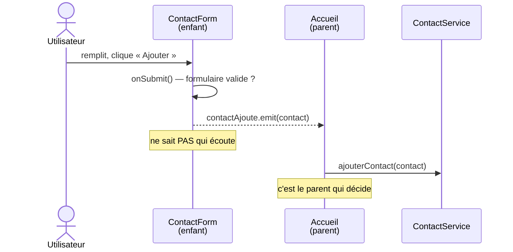

### Le sens de circulation

C'est le point à graver :

| Sens | Outil | Étape |
|---|---|---|
| Parent → enfant | `input()` | Étape 17 |
| Enfant → parent | `output()` | Celle-ci |
| Entre composants quelconques | Un **service** partagé | Étape 5 |

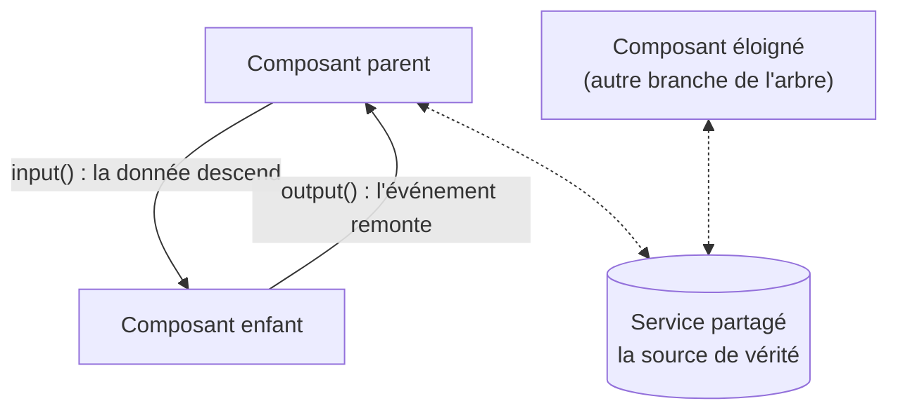

La troisième ligne est la plus importante en pratique. `input` et `output` conviennent quand les composants sont **voisins directs**. Dès qu'il faut traverser trois niveaux, ou communiquer entre deux branches éloignées de l'arbre, faire remonter puis redescendre l'information devient un cauchemar — chaque composant intermédiaire devrait relayer une donnée qui ne le concerne pas.

C'est exactement pour ça que le service existe. Et c'est la raison pour laquelle, à l'étape 10, l'événement `contactAjoute` **cessera de transporter la donnée jusqu'à la liste** : le service deviendra la source de vérité, et la liste n'aura plus besoin d'être prévenue.

### Dans le projet

**[ÉTAPE]** — au commit `b66a87a`, la chaîne complète était : `ContactForm` émet → `App` reçoit → `App` appelle le service → et, faute de mieux, **rechargeait toute la page**.

```typescript
// app.ts, version initiale — le reload qu'on va supprimer a l'etape 10
ajouterContact(contact: Contact): void {
  this.contactService.addContact(contact).subscribe(() => {
    window.location.reload();
  });
}
```

**[DÉFINITIF]** — [`components/contact-form/contact-form.ts`](../carnet-contact_frontend/src/app/components/contact-form/contact-form.ts) et [`pages/accueil/accueil.ts`](../carnet-contact_frontend/src/app/pages/accueil/accueil.ts). L'`output` est toujours là, mais le parent se contente désormais de passer la main au service :

```typescript
// accueil.ts
ajouterContact(contact: Contact): void {
  this.contactService.addContact(contact);
}
```

### Ce que cette étape a introduit

| Notion | Rôle |
|---|---|
| `output<T>()` | Déclarer un événement personnalisé, qui transporte un `T` |
| `.emit(valeur)` | Émettre — sans savoir qui écoute |
| `(monEvenement)="..."` | Écouter côté parent, comme un événement natif |
| Découplage | L'enfant annonce, le parent décide : l'enfant reste réutilisable |

> Détail complet : section 8 du [support](support-apprentissage-angular-spring.md#8-communication-entre-composants).

---

### Bilan de la Partie I

À ce stade, l'application sait afficher une liste de contacts, en ajouter et en supprimer. Tout fonctionne — et tout disparaît au moindre rafraîchissement de la page, puisque les données ne vivent que dans la mémoire du navigateur.

Les briques acquises :

```
Composant  -> une portion d'ecran autonome (@Component, selector, imports)
Modele     -> la forme des donnees (interface)
Signal     -> une valeur qui previent de ses changements
Service    -> la source de verite unique, obtenue par inject()
Template   -> @for, @if, {{ }}, [x], (y)
Formulaire -> decrit dans la classe, branche sur le HTML
output()   -> l'enfant annonce, le parent decide
```

La Partie II ajoute le serveur. Et la première chose qu'elle va faire, c'est **casser l'architecture propre** qu'on vient de construire — avant de la reconstruire en mieux.

---

# Partie II — Parler à un serveur

Les deux étapes qui suivent sont le vrai passage à niveau du cours. Tout ce qui précède se passait dans une seule mémoire, où les choses sont instantanées et certaines. À partir d'ici, les données vivent ailleurs, arrivent avec du retard, et peuvent ne pas arriver du tout.

---

## Étape 9 — HttpClient et les Observables

### Le problème

Les contacts disparaissent à chaque rafraîchissement de la page. Il faut les ranger dans une base de données — donc les confier à un serveur, et les lui redemander.

### Côté serveur : une API REST en trois routes

> **Encadré backend.** Ce cours porte sur Angular, mais certaines étapes n'ont aucun sens sans leur contrepartie serveur. Ces encadrés donnent le minimum pour comprendre ce à quoi Angular parle. Le détail Spring Boot est dans la [section 37 du support](support-apprentissage-angular-spring.md#37-backend-spring-boot).

Une **API REST** est une convention : on expose des **ressources** (ici, des contacts) à des **URL**, et on agit dessus avec les **verbes** HTTP.

| Verbe | URL | Signification |
|---|---|---|
| `GET` | `/api/contacts` | Donne-moi tous les contacts |
| `POST` | `/api/contacts` | Crée un contact (envoyé dans le corps de la requête) |
| `PUT` | `/api/contacts/5` | Remplace le contact 5 |
| `DELETE` | `/api/contacts/5` | Supprime le contact 5 |

Côté Spring Boot, cela tient en une classe :

```java
@RestController                                    // « cette classe repond a des requetes HTTP »
@RequestMapping("/api/contacts")                   // prefixe commun a toutes ses routes
@CrossOrigin(origins = "http://localhost:4200")    // autorise le navigateur Angular (voir plus bas)
public class ContactController {

    private final ContactRepository contactRepository;

    public ContactController(ContactRepository contactRepository) {
        this.contactRepository = contactRepository;
    }

    @GetMapping
    public List<Contact> getAllContacts() {
        return contactRepository.findAll();
    }

    @PostMapping
    public Contact createContact(@RequestBody Contact contact) {
        // save() renvoie le contact ENRICHI de l'id genere par la base.
        // Cette valeur de retour va devenir importante a l'etape 10.
        return contactRepository.save(contact);
    }

    @DeleteMapping("/{id}")
    public void deleteContact(@PathVariable Long id) {
        contactRepository.deleteById(id);
    }
}
```

Une précision qui évite une perte de temps classique : `@CrossOrigin`. Par sécurité, un navigateur interdit à une page servie par `localhost:4200` d'appeler `localhost:8080` — deux ports différents sont considérés comme deux **origines** différentes. Cette règle s'appelle la *same-origin policy*, et `@CrossOrigin` est la façon dont le serveur déclare qu'il accepte cet appel. Sans elle, toutes les requêtes échouent avec une erreur « CORS » dans la console du navigateur.

### La notion : `HttpClient`

Angular fournit un service pour parler au réseau. Comme tout service, il s'obtient par `inject()` — mais il faut d'abord l'avoir activé dans la configuration :

```typescript
// app.config.ts
providers: [
  provideHttpClient()     // sans cette ligne, inject(HttpClient) echoue
]
```

```typescript
import { HttpClient } from '@angular/common/http';

export class ContactService {
  private http = inject(HttpClient);
  private apiUrl = 'http://localhost:8080/api/contacts';

  // Le <Contact[]> dit a TypeScript ce que la reponse contiendra. C'est une
  // PROMESSE qu'on lui fait, pas une verification : Angular ne controle pas
  // que le serveur renvoie vraiment ca.
  getContacts(): Observable<Contact[]> {
    return this.http.get<Contact[]>(this.apiUrl);
  }

  addContact(contact: Contact): Observable<Contact> {
    return this.http.post<Contact>(this.apiUrl, contact);
  }

  deleteContact(id: number): Observable<void> {
    return this.http.delete<void>(`${this.apiUrl}/${id}`);
  }
}
```

### La notion : l'Observable

Voici le concept qui demande le plus d'effort, et le seul vraiment nouveau de cette étape.

`this.http.get(...)` ne renvoie **pas** les contacts. Il ne peut pas : la réponse mettra quelques dizaines de millisecondes à arriver, et le programme ne va pas s'arrêter en attendant (revoir la section « synchrone et asynchrone » du vocabulaire).

Il renvoie un **Observable** : la promesse qu'une valeur arrivera, plus tard.

La comparaison qui éclaire le mieux :

| | Signal | Observable |
|---|---|---|
| Contient | Une valeur, **maintenant** | Une valeur qui arrivera **plus tard** |
| Se lit | `monSignal()` | `.subscribe(v => ...)` |
| Analogie | Le contenu d'un tiroir | Un colis commandé |
| Sert à | L'état de l'interface | Une opération asynchrone |

Un point capital : **un Observable ne fait rien tant que personne ne s'y abonne.**

```typescript
// Ceci n'envoie AUCUNE requete. On a juste decrit ce qu'il faudrait faire.
const requete = this.http.get<Contact[]>(this.apiUrl);

// C'est CECI qui declenche l'appel reseau.
requete.subscribe(contacts => {
  console.log('arrives :', contacts);
});
```

C'est déroutant au début — on s'attend à ce qu'appeler une fonction fasse quelque chose — mais c'est très utile : on peut construire une requête, la transformer, la passer à d'autres fonctions, et ne déclencher l'appel qu'au dernier moment. On s'en servira massivement à partir de l'étape 19.

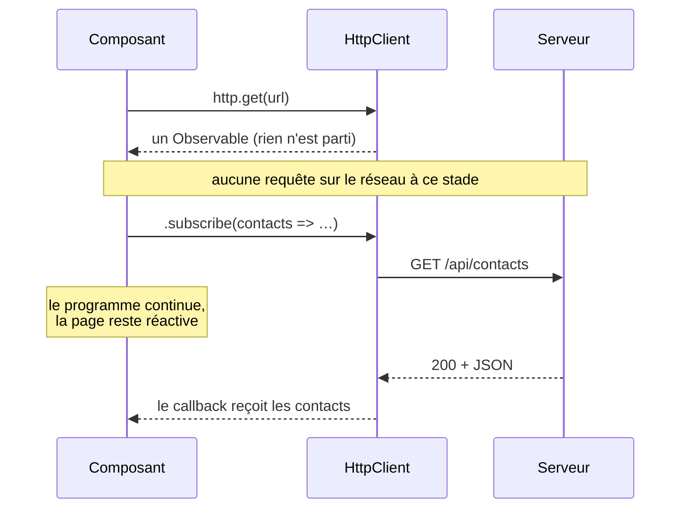

Le corollaire, tout aussi important : **un Observable oublié ne s'exécute jamais**. Une requête dont personne ne fait `.subscribe()` ne part pas. C'est une cause fréquente de « mais pourquoi mon appel ne se fait pas ? ».

### `ngOnInit` : le bon moment pour charger

Où appeler `.subscribe()` ? Pas n'importe où.

Un composant Angular traverse un **cycle de vie** : il est construit, puis affiché, puis un jour retiré de l'écran. Angular propose des méthodes qu'on peut implémenter pour être prévenu à chaque étape.

```typescript
import { Component, OnInit, inject } from '@angular/core';

export class ContactList implements OnInit {
  private contactService = inject(ContactService);
  contacts = signal<Contact[]>([]);

  // ngOnInit est appelee UNE FOIS, apres la construction du composant et une
  // fois ses entrees disponibles. C'est l'endroit ou l'on declenche ce qui
  // demande du temps.
  ngOnInit(): void {
    this.contactService.getContacts().subscribe(data => {
      this.contacts.set(data);
    });
  }
}
```

`implements OnInit` est une aide de TypeScript : il vérifie que la méthode existe bien et qu'elle est correctement orthographiée. Angular, lui, appellerait `ngOnInit` de toute façon. Mais une faute de frappe — `ngOninit` — produirait une méthode jamais appelée, sans le moindre avertissement. L'`implements` évite ça.

**Pourquoi pas dans le constructeur ?** Le `constructor` sert à recevoir les dépendances et rien d'autre. Il s'exécute avant qu'Angular ait fini de préparer le composant, et y lancer un appel réseau rend le composant très difficile à tester. La règle : *construire* dans le constructeur, *démarrer* dans `ngOnInit`.

| Méthode | Quand | Usage typique |
|---|---|---|
| `constructor` | À la création de l'objet | Recevoir les dépendances |
| `ngOnInit` | Une fois, après l'initialisation | Charger des données |
| `ngOnDestroy` | Au retrait de l'écran | Arrêter ce qu'on a démarré (étape 21) |

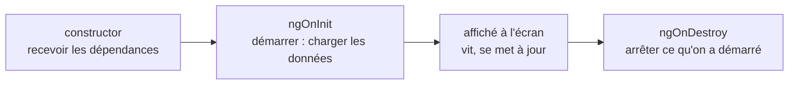

### Dans le projet : le code réel, avec ses défauts

**[ÉTAPE]** — commit `b66a87a`. Voici ce que donnait l'arrivée du serveur. Lis-le en cherchant ce qui cloche : trois choses vont être corrigées à l'étape suivante.

```typescript
// components/contact-list/contact-list.ts
export class ContactList implements OnInit {
  private contactService = inject(ContactService);

  // (1) Un signal LOCAL au composant. Le service ne detient plus rien.
  contacts = signal<Contact[]>([]);

  ngOnInit(): void {
    this.chargerContacts();
  }

  chargerContacts(): void {
    this.contactService.getContacts().subscribe(data => {
      this.contacts.set(data);
    });
  }

  supprimer(id: number): void {
    this.contactService.deleteContact(id).subscribe(() => {
      // (2) On redemande TOUTE la liste au serveur apres une suppression,
      //     alors qu'on sait deja a quoi elle doit ressembler.
      this.chargerContacts();
    });
  }
}
```

```typescript
// app.ts
ajouterContact(contact: Contact): void {
  this.contactService.addContact(contact).subscribe(() => {
    // (3) Le formulaire vit dans App, la liste dans ContactList. Aucun moyen
    //     de prevenir la seconde... alors on recharge la PAGE ENTIERE.
    window.location.reload();
  });
}
```

Ce `window.location.reload()` est le genre de ligne qu'on n'ose pas montrer dans un tutoriel. Il est pourtant précieux : il rend **visible** un problème d'architecture qui, sinon, resterait abstrait.

Ce qui s'est passé, c'est que l'arrivée d'`HttpClient` a fait **régresser** la conception. À la Partie I, le service détenait la liste et tous les composants la voyaient. Ici, le service s'est transformé en simple passe-plat : il fabrique des Observables et les rend, sans rien retenir. Chaque composant s'est donc remis à gérer sa propre copie — et le formulaire, qui ne peut plus prévenir la liste, n'a d'autre recours que de tout recharger.

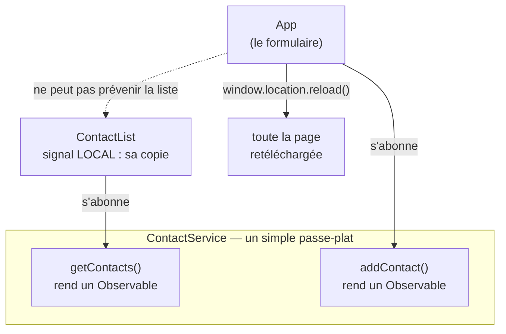

Le rechargement de page a un coût bien réel : tout le JavaScript est retéléchargé et réexécuté, la page blanchit pendant un instant, la position de défilement est perdue. Pour l'utilisateur, c'est un clignotement à chaque ajout.

### Ce que cette étape a introduit

| Notion | Rôle |
|---|---|
| API REST | Ressources aux URL, actions par verbes HTTP |
| `provideHttpClient()` | Activer les appels réseau dans `app.config.ts` |
| `http.get<T>(url)` | Construire une requête — **sans l'envoyer** |
| `Observable<T>` | Une valeur qui arrivera plus tard |
| `.subscribe(v => ...)` | S'abonner, et **déclencher** la requête |
| `ngOnInit` | Le moment où l'on charge |
| `implements OnInit` | Protection contre la faute de frappe |
| `@CrossOrigin` (serveur) | Autoriser le navigateur d'une autre origine |

> Détail complet : sections 10 et 11 du [support](support-apprentissage-angular-spring.md#10-httpclient-et-observables).

---

## Étape 10 — Le signal partagé alimenté par HttpClient

### Le problème

Celui qu'on vient de constater : trois symptômes d'une seule cause.

1. Chaque composant garde sa propre copie de la liste.
2. Une suppression provoque un rechargement complet depuis le serveur.
3. Un ajout recharge la page entière.

### L'idée

Aucune notion nouvelle dans cette étape. C'est une **recomposition** : on reprend le signal partagé de la Partie I et l'Observable de l'étape 9, et on les articule.

La règle à retenir tient en une phrase : **le service détient la donnée, et c'est lui qui s'abonne.**

Avant, le composant s'abonnait et rangeait le résultat chez lui. Désormais le service s'abonne et range le résultat dans son propre signal ; les composants se contentent de lire ce signal. Comme il n'y en a qu'un pour toute l'application, tout le monde voit la même chose, immédiatement.

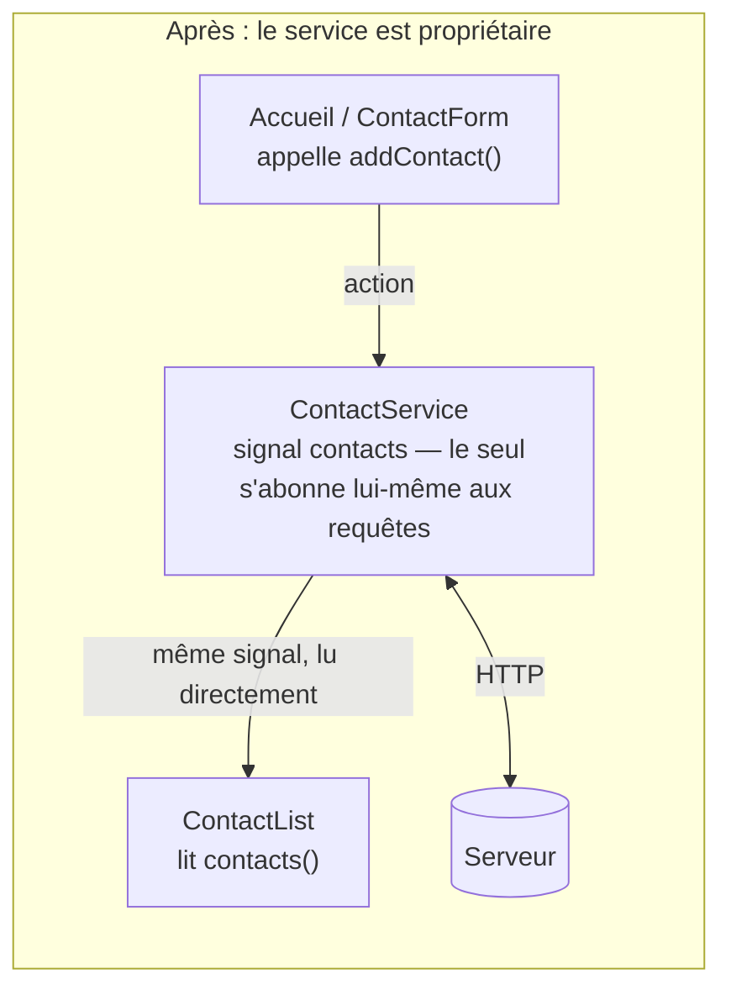

Comparer avec le schéma de l'étape 9 : la flèche « ne peut pas prévenir la liste » a disparu. Personne n'a besoin de prévenir la liste — elle lit le signal que le service vient d'écrire.

Une conséquence de forme : les méthodes du service ne renvoient plus d'`Observable`, mais `void`. Elles ne rendent plus rien à l'appelant — elles **agissent** sur l'état partagé.

### La migration, en quatre temps

Elle a réellement été menée en quatre paliers, chacun laissant l'application fonctionnelle. Cette façon de procéder mérite d'être retenue pour elle-même : on ne réécrit pas tout d'un bloc en espérant que ça remarche à la fin.

#### Temps 1 — Le service devient propriétaire

On pose la nouvelle plomberie **à côté** de l'ancienne. Rien ne change à l'écran.

```typescript
private contactsSignal = signal<Contact[]>([]);
readonly contacts = this.contactsSignal.asReadonly();

// Ne renvoie plus rien : s'abonne elle-meme et remplit le signal.
chargerContacts(): void {
  this.http.get<Contact[]>(this.apiUrl).subscribe(data => {
    this.contactsSignal.set(data);
  });
}
```

#### Temps 2 — Le composant abandonne sa copie

```typescript
export class ContactList implements OnInit {
  private contactService = inject(ContactService);

  // Une REFERENCE vers le signal du service, plus un signal local.
  contacts = this.contactService.contacts;

  ngOnInit(): void {
    this.contactService.chargerContacts();
  }
}
```

Le template n'a **pas changé d'un caractère** : il écrivait déjà `contacts()`. C'est un bénéfice discret mais réel des signaux — l'affichage ne sait pas d'où vient la donnée qu'il lit.

#### Temps 3 — L'ajout alimente le signal, et le `reload` disparaît

```typescript
addContact(contact: Contact): void {
  this.http.post<Contact>(this.apiUrl, contact).subscribe(contactCree => {
    // On ajoute la reponse du SERVEUR, pas l'objet qu'on a envoye.
    this.contactsSignal.update(liste => [...liste, contactCree]);
  });
}
```

Le détail à ne pas rater : on ajoute `contactCree`, **la réponse du serveur**, et non le `contact` qu'on lui a transmis. Les deux ne sont pas identiques — c'est la base de données qui attribue l'`id`, et l'objet envoyé ne l'a donc pas encore. Ajouter l'objet envoyé mettrait dans la liste un contact sans identifiant, qu'on ne pourrait ni supprimer ni ouvrir.

C'est un principe général : **après une écriture, la réponse du serveur fait autorité sur ce qu'on a envoyé.** Il peut avoir complété, normalisé ou corrigé la donnée.

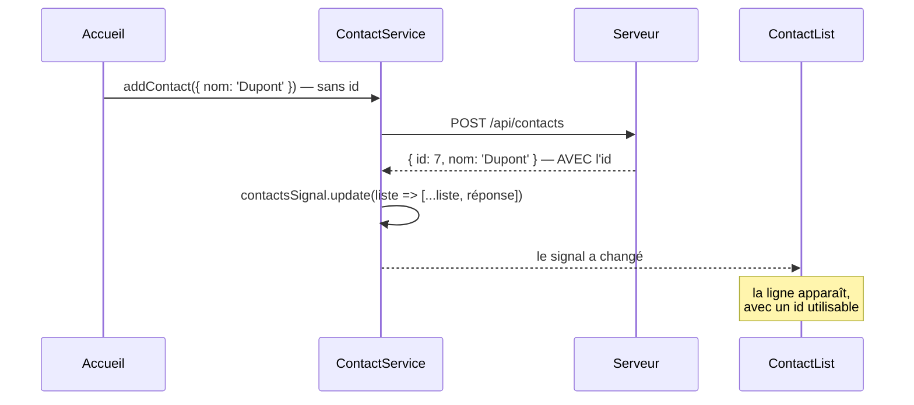

Côté `App`, le `reload` peut alors disparaître :

```typescript
ajouterContact(contact: Contact): void {
  // Plus de .subscribe(), plus de window.location.reload() :
  // le service met a jour le signal partage, ContactList suit toute seule.
  this.contactService.addContact(contact);
}
```

#### Temps 4 — La suppression se met à jour localement

```typescript
deleteContact(id: number): void {
  this.http.delete<void>(`${this.apiUrl}/${id}`).subscribe(() => {
    // Inutile de redemander la liste : on sait deja a quoi elle ressemble.
    this.contactsSignal.update(liste => liste.filter(c => c.id !== id));
  });
}
```

L'asymétrie entre l'ajout et la suppression est instructive. Pour un ajout, on a **besoin** de la réponse du serveur (l'`id`). Pour une suppression, on n'a besoin de rien : savoir que ça a réussi suffit à déduire la nouvelle liste. Redemander l'ensemble serait une requête entière pour une information qu'on possède déjà.

### Le code complet obtenu

**[DÉFINITIF]** — commit `85aae2e`. Ce fichier est encore, dans les grandes lignes, celui d'aujourd'hui.

```typescript
@Injectable({ providedIn: 'root' })
export class ContactService {
  private http = inject(HttpClient);
  private apiUrl = 'http://localhost:8080/api/contacts';

  // La liste vit ICI, dans le service singleton : c'est la source de
  // verite cote client. Privee : seul le service a le droit de l'ecrire.
  private contactsSignal = signal<Contact[]>([]);

  // Version exposee aux composants : lisible, mais pas modifiable.
  readonly contacts = this.contactsSignal.asReadonly();

  chargerContacts(): void {
    this.http.get<Contact[]>(this.apiUrl).subscribe(data => {
      this.contactsSignal.set(data);
    });
  }

  addContact(contact: Contact): void {
    this.http.post<Contact>(this.apiUrl, contact).subscribe(contactCree => {
      this.contactsSignal.update(liste => [...liste, contactCree]);
    });
  }

  deleteContact(id: number): void {
    this.http.delete<void>(`${this.apiUrl}/${id}`).subscribe(() => {
      this.contactsSignal.update(liste => liste.filter(c => c.id !== id));
    });
  }
}
```

### Ce qu'il faut retenir de cette étape

C'est le patron d'architecture le plus important du cours, et il resservira pour chaque service du projet :

```
Le SERVICE detient le signal, s'abonne aux requetes, et met a jour l'etat.
Le COMPOSANT lit le signal et declenche des actions.
Le TEMPLATE affiche le signal, sans savoir d'ou il vient.
```

Il faut aussi noter ce qui vient de se produire : **l'étape 9 a dégradé la conception, l'étape 10 l'a réparée.** C'est une trajectoire normale. Une notion nouvelle s'installe d'abord maladroitement, en cassant ce qui marchait, puis trouve sa place. Le même mouvement se reproduira presque à l'identique aux étapes 13 à 15, puis à l'étape 19.

### Ce que cette étape a introduit

| Notion | Rôle |
|---|---|
| Service propriétaire de l'état | Le service s'abonne, le composant lit |
| Méthodes qui renvoient `void` | Elles agissent sur l'état, elles ne rendent rien |
| `update(liste => [...liste, reponse])` | Ajouter **la réponse du serveur** |
| `update(liste => liste.filter(...))` | Déduire localement, sans nouvelle requête |
| Migration par paliers | Poser le neuf à côté, basculer, retirer l'ancien |

> Détail complet : section 12 du [support](support-apprentissage-angular-spring.md#12-signal-partagé-alimenté-par-httpclient).

---

### Bilan de la Partie II

Les contacts vivent maintenant dans une vraie base de données. L'application sait les lire, en ajouter et en supprimer, et l'écran suit sans jamais recharger la page.

```
HttpClient      -> construit des requetes, rend des Observables
Observable      -> une valeur future ; rien ne part sans .subscribe()
ngOnInit        -> le bon moment pour charger
Service         -> detient le signal ET s'abonne lui-meme
Reponse serveur -> fait autorite apres une ecriture
```

Mais l'application reste fragile. Elle n'a qu'une seule page, ne sait pas modifier un contact, ne dit rien quand le serveur est éteint, et laisse l'utilisateur cliquer deux fois sur « Ajouter » pendant une requête lente. La Partie III règle ces quatre problèmes — et découvre en chemin que les corriger un par un finit par encombrer le service.

---

# Partie III — Une vraie application

Les cinq étapes qui suivent transforment une démonstration en application. Aucune n'est spectaculaire prise seule ; ensemble, elles couvrent ce qui sépare « ça marche quand tout va bien » de « ça se comporte correctement quand quelque chose va mal ».

Le fil conducteur de la partie mérite d'être annoncé dès maintenant : les étapes 13 et 14 vont ajouter au service des lignes **recopiées à l'identique** dans chaque méthode. L'étape 15 les en retirera toutes d'un coup. Ce détour est volontaire : on ne comprend vraiment un intercepteur qu'après avoir écrit ce qu'il remplace.

---

## Étape 11 — Le routing

### Le problème

Tout le carnet tient sur une seule page. Impossible d'afficher la fiche d'un contact **seule**, de l'envoyer à quelqu'un sous forme de lien, ou de la retrouver dans ses favoris. Et le bouton « Précédent » du navigateur ne sert à rien : il n'y a pas de page précédente, il n'y en a qu'une.

On voudrait que chaque écran ait son adresse : `/` pour la liste, `/contact/5` pour la fiche du contact 5.

### La notion

Le **routeur** est le service d'Angular qui fait correspondre une **URL** (l'adresse affichée dans la barre du navigateur) à un **composant**. Quand l'URL change, il retire la page affichée et installe celle qui correspond.

Le point essentiel : **la page HTML, elle, ne change jamais.** On reste dans la même application à page unique (SPA, étape 1). Le routeur modifie l'adresse et remplace un morceau de l'écran, sans rien retélécharger — et donc sans rien perdre de ce qui vit en mémoire, comme le signal partagé de l'étape 10.

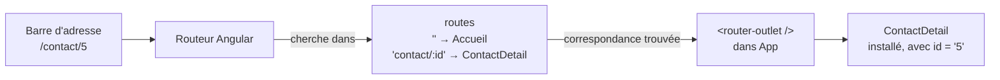

### La syntaxe

Trois pièces, qui fonctionnent ensemble.

**1. La table des routes**, dans `app.routes.ts` :

```typescript
import { Routes } from '@angular/router';

export const routes: Routes = [
  // '' : l'adresse racine. pathMatch 'full' : seulement si l'URL est
  // ENTIEREMENT vide (sinon '' correspondrait au debut de toutes les URL).
  { path: '', component: Accueil, pathMatch: 'full' },

  // ':id' est un segment VARIABLE : il capture n'importe quelle valeur
  // (5, 12, 42...) et la range sous le nom « id ».
  { path: 'contact/:id', component: ContactDetail }
];
```

Elle est activée dans `app.config.ts` par `provideRouter(routes)` — le premier provider du tableau de l'étape 1.

**2. L'emplacement**, dans le gabarit du composant racine :

```html
<!-- Le routeur insere ICI le composant qui correspond a l'URL. Tout ce qui
     est autour (en-tete, navigation) reste en place d'une page a l'autre. -->
<router-outlet />
```

**3. Les liens**, dans n'importe quel gabarit :

```html
<!-- Forme simple : une adresse fixe -->
<a routerLink="/">Retour à la liste</a>

<!-- Forme tableau : chaque element est un segment. ['/contact', 5] -> /contact/5 -->
<a [routerLink]="['/contact', contact.id]">{{ contact.nom }}</a>
```

`RouterLink` est une directive : elle doit figurer dans les `imports` du composant qui l'utilise (le réflexe de l'étape 2).

### Pourquoi `routerLink` et pas `href`

La question est légitime : `<a href="/contact/5">` fonctionne aussi, en apparence. La différence est invisible à l'œil et considérable en pratique.

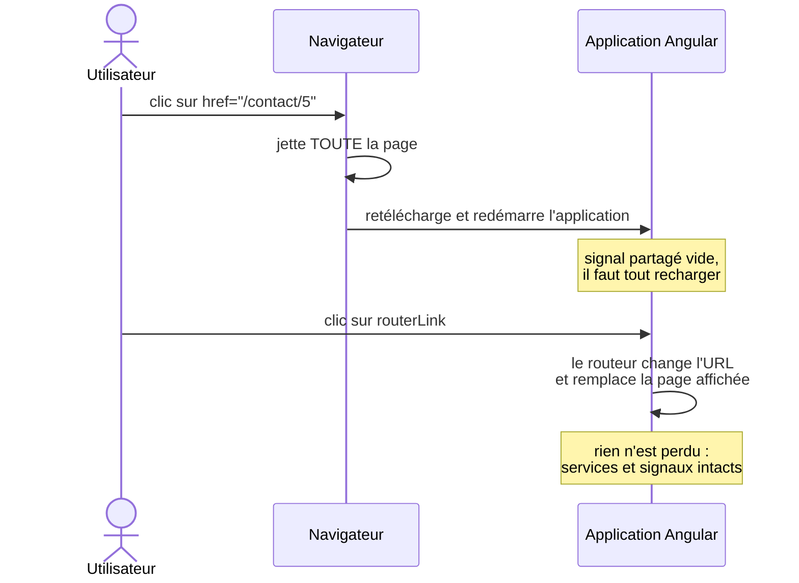

Un `href` provoque exactement le rechargement complet que l'étape 10 venait de supprimer. `routerLink` intercepte le clic et laisse le routeur travailler.

### Lire le paramètre de l'URL

La page de détail doit savoir **quel** contact afficher. L'information est dans l'URL, et `ActivatedRoute` (« la route activée ») permet de la lire :

```typescript
import { ActivatedRoute } from '@angular/router';

export class ContactDetail {
  private route = inject(ActivatedRoute);

  // paramMap.get('id') renvoie TOUJOURS une chaine : une URL n'a pas de type.
  // Number() la convertit pour la comparer a l'id numerique d'un contact.
  private contactId = Number(this.route.snapshot.paramMap.get('id'));
}
```

`snapshot` veut dire « une photo, prise une fois, à la création du composant ». C'est suffisant tant qu'aucun lien ne mène directement d'une fiche à une autre : dans ce cas, Angular réutiliserait le même composant et la photo resterait celle du premier contact.

### Dans le projet

**[ÉTAPE]** — commit `a50da82`. La première table de routes, et une coquille `App` réduite à son strict minimum :

```typescript
// app.routes.ts
export const routes: Routes = [
  { path: '', component: Accueil, pathMatch: 'full' },
  { path: 'contact/:id', component: ContactDetail }
];
```

```html
<!-- app.html -->
<h1>{{ title() }}</h1>
<router-outlet />
```

Ce commit a aussi introduit la séparation `pages/` et `components/` de l'étape 2 : le contenu de l'ancienne page unique est parti dans un nouveau composant `pages/accueil`.

**[REMPLACÉ]** — commit `a50da82`, [`pages/contact-detail/contact-detail.ts`](../carnet-contact_frontend/src/app/pages/contact-detail/contact-detail.ts). Le contact était retrouvé **dans le signal partagé**, avec un `computed()` :

```typescript
contact = computed(() =>
  this.contactService.contacts().find(c => c.id === this.contactId)
);

ngOnInit(): void {
  // Accès direct à l'URL (lien partagé, F5) : le signal serait encore vide.
  this.contactService.chargerContacts();
}
```

Cette version est élégante, et elle montre bien la force du `computed()` : au premier affichage la liste est vide et `contact()` vaut `undefined`, puis la réponse du serveur remplit le signal et la fiche apparaît toute seule. Elle repose pourtant sur une hypothèse — « le signal contient **tous** les contacts » — que l'étape 19 va faire tomber.

**[DÉFINITIF]** — [`app.routes.ts`](../carnet-contact_frontend/src/app/app.routes.ts). La table a grossi, mais sa forme n'a pas changé :

```typescript
{ path: '', component: Accueil, pathMatch: 'full', canActivate: [authGuard] },
{ path: 'fil', component: Fil, canActivate: [authGuard] },
{ path: 'contact/:id', component: ContactDetail, canActivate: [authGuard] },
{ path: 'contact/:id/modifier', component: ContactEdit, canActivate: [authGuard] },
```

Les `canActivate` sont l'objet de l'étape 16.

### Une contrainte du rendu côté serveur

Le projet a été créé avec le **rendu côté serveur** (SSR, *Server-Side Rendering*) : pour la première visite, un serveur Node exécute Angular et envoie un HTML déjà rempli, plus rapide à afficher qu'une page vide. Certaines pages sont même **prérendues** au moment du build.

Une route paramétrée ne peut pas l'être : au build, personne ne sait quels `id` existeront. `ng build` échoue en réclamant la liste des paramètres. La réponse est de laisser le navigateur construire ces pages :

```typescript
// app.routes.server.ts
{ path: '**', renderMode: RenderMode.Client }
```

### Ce que cette étape a introduit

| Notion | Rôle |
|---|---|
| `Routes` + `provideRouter(routes)` | Associer des URL à des composants |
| `path: 'contact/:id'` | Un segment variable, capturé sous un nom |
| `<router-outlet />` | L'emplacement où s'installe la page courante |
| `routerLink` / `[routerLink]` | Naviguer **sans** recharger l'application |
| `ActivatedRoute.snapshot.paramMap` | Lire un paramètre de l'URL (toujours une chaîne) |
| `RenderMode.Client` | Laisser le navigateur rendre une route impossible à prérendre |

> Détail complet : section 13 du [support](support-apprentissage-angular-spring.md#13-routing-angular).

---

## Étape 12 — Modifier une ressource : `PUT` et `effect()`

### Le problème

On sait créer, lire et supprimer un contact. Pas le **modifier**. Il faut une page `/contact/5/modifier` avec un formulaire **déjà rempli** des valeurs actuelles, et un bouton « Enregistrer ».

La difficulté n'est pas le formulaire — l'étape 7 l'a réglée. Elle est dans le mot « déjà » : au moment où le composant se construit, les données du contact ne sont peut-être pas encore arrivées du serveur.

### Côté serveur : `PUT` et deux sources d'information

> **Encadré backend.** Modifier, en REST, s'écrit `PUT /api/contacts/5`, avec le contact complet dans le corps de la requête.

```java
@PutMapping("/{id}")
public Contact updateContact(
        @PathVariable Long id,           // l'id lu dans l'URL
        @RequestBody Contact contact) {  // les nouvelles valeurs lues dans le corps
    Contact existant = contactRepository.findById(id).orElseThrow();
    existant.setNom(contact.getNom());
    // ... un champ apres l'autre
    return contactRepository.save(existant);
}
```

L'identifiant arrive deux fois : dans l'URL et, peut-être, dans le corps. **C'est celui de l'URL qui fait autorité** : le corps pourrait prétendre modifier le contact 5 tout en visant l'adresse du contact 8.

Côté service, rien de neuf — la même mécanique que l'ajout de l'étape 10, avec `map` pour **remplacer** l'élément modifié par la réponse du serveur :

```typescript
modifierContact(contact: Contact): void {
  this.http.put<Contact>(`${this.apiUrl}/${contact.id}`, contact).subscribe(contactMaj => {
    this.contactsSignal.update(liste =>
      liste.map(c => (c.id === contactMaj.id ? contactMaj : c))
    );
  });
}
```

### Pré-remplir : le problème du « trop tôt »

Remplir un formulaire existant s'écrit avec `patchValue` (étape 7). La tentation est de l'appeler dans le constructeur :

```typescript
constructor() {
  // CE QUI NE MARCHE PAS : au moment ou cette ligne s'execute, la reponse du
  // serveur n'est pas arrivee. contact() vaut undefined, le formulaire reste vide.
  this.contactForm.patchValue(this.contact()!);
}
```

C'est le décalage de l'asynchrone (vocabulaire, en tête du cours) qui ressurgit sous une nouvelle forme. Il faut exécuter `patchValue` **au moment où les données arrivent**, et pas avant.

### La notion : `effect()` au service d'un formulaire

L'étape 4 a présenté `effect()` : un bloc qui s'exécute une première fois, puis à chaque changement d'un signal qu'il lit. C'est exactement l'outil qu'il faut.

```mermaid
sequenceDiagram
    participant P as ContactEdit
    participant E as effect()
    participant S as ContactService
    participant B as Serveur
    P->>S: ngOnInit : chargerContacts()
    E->>E: 1er passage : contact() = undefined → ne fait rien
    S->>B: GET /api/contacts
    B-->>S: la liste
    S->>S: contactsSignal.set(liste)
    Note over E: contact() a changé → l'effect se réexécute
    E->>P: patchValue(contact) — formulaire rempli
    E->>E: formulaireRempli = true
    Note over E: passages suivants : ne touche plus au formulaire
```

```typescript
private formulaireRempli = false;

constructor() {
  effect(() => {
    const c = this.contact();
    // Deux conditions : les donnees sont la, ET on n'a pas deja rempli.
    if (c && !this.formulaireRempli) {
      this.contactForm.patchValue(c);
      this.formulaireRempli = true;
    }
  });
}
```

Le drapeau `formulaireRempli` n'est pas une précaution de style. Sans lui, **chaque** mise à jour du signal — un rechargement de la liste, une réponse arrivée en retard — réexécuterait `patchValue` et **écraserait ce que l'utilisateur est en train de taper**.

### Revenir à la fiche : `Router.navigate()`

Après l'envoi, on veut retourner sur la fiche. Il n'y a pas de lien sur lequel cliquer : la navigation est déclenchée **par le code**. Le routeur l'offre avec la même syntaxe en tableau que `[routerLink]` :

```typescript
private router = inject(Router);

onSubmit(): void {
  this.contactService.modifierContact({ id: this.id, ...this.contactForm.value } as Contact);
  this.router.navigate(['/contact', this.id]);
}
```

### Dans le projet

**[ÉTAPE]** — commit `3a39b53`, [`pages/contact-edit/contact-edit.ts`](../carnet-contact_frontend/src/app/pages/contact-edit/contact-edit.ts). Le contact était retrouvé dans la liste partagée, comme à l'étape 11 :

```typescript
contact = computed(() =>
  this.contactService.contacts().find(c => c.id === this.id)
);

constructor() {
  effect(() => {
    const c = this.contact();
    if (c && !this.formulaireRempli) {
      this.contactForm.patchValue(c);
      this.formulaireRempli = true;
    }
  });
}
```

**[DÉFINITIF]** — le même `effect()`, avec deux différences. Le contact vient d'un signal dédié (`contactCourant`, étape 19), et les champs facultatifs sont convertis : le serveur renvoie `null` pour un champ vide, et un champ de formulaire afficherait littéralement « null ».

```typescript
contact = this.contactService.contactCourant;

effect(() => {
  const c = this.contact();
  if (c && !this.formulaireRempli) {
    this.contactForm.patchValue({
      nom: c.nom,
      prenom: c.prenom,
      email: c.email,
      telephone: c.telephone ?? '',
      emailPro: c.emailPro ?? '',
      // ... les autres champs facultatifs
    });
    this.formulaireRempli = true;
  }
});
```

> **Un défaut à connaître.** `onSubmit()` navigue **sans attendre** la réponse du `PUT`. Si l'enregistrement échoue, l'utilisateur est déjà reparti vers la fiche et sa saisie est perdue. La revue du projet l'a relevé ; l'étape 27 montre le patron qui l'évite — faire renvoyer l'Observable par le service, et ne quitter la page qu'en cas de succès.

### Ce que cette étape a introduit

| Notion | Rôle |
|---|---|
| `@PutMapping("/{id}")` (serveur) | Modifier une ressource ; l'id de l'URL fait autorité |
| `liste.map(c => c.id === x.id ? x : c)` | Remplacer un élément dans un signal, sans muter |
| `patchValue()` | Remplir un formulaire existant |
| `effect()` + drapeau | Pré-remplir **à l'arrivée** des données, **une seule fois** |
| `Router.navigate([...])` | Naviguer depuis le code |

> Détail complet : section 14 du [support](support-apprentissage-angular-spring.md#14-modification-dune-ressource-put-formulaire-pré-rempli).

---

## Étape 13 — Quand le serveur ne répond pas : `catchError`

### Le problème

Éteins le backend et recharge l'application. La liste est vide — sans explication. Ajoute un contact : le bouton ne fait rien, aucun message. Seule la console du navigateur (`F12`) montre une erreur rouge, que l'utilisateur ne verra jamais.

Pour lui, l'application est simplement cassée. Il ne peut pas savoir que le problème vient du serveur, ni qu'il suffit peut-être de réessayer dans une minute.

### La notion : un Observable peut échouer

À l'étape 9, on n'a regardé qu'une seule issue d'un Observable : la valeur arrive. Il en existe en réalité trois.

```mermaid
flowchart LR
    O["Un Observable<br/>(une requête HTTP)"] --> V["émet une VALEUR<br/>la réponse arrive"]
    O --> E["émet une ERREUR<br/>serveur éteint, 500, 404…"]
    O --> C["se TERMINE<br/>plus rien ne viendra"]
    V --> C
```

`.subscribe(data => ...)` avec un seul callback ne traite **que** la première flèche. Une erreur traverse le flux, ne trouve personne pour la traiter, et finit en message rouge dans la console. C'est l'échec **silencieux**.

### La syntaxe : `.pipe()` et `catchError`

Un Observable peut être transformé **avant** qu'on s'y abonne, en insérant des **opérateurs** dans un `.pipe()`. L'image utile est celle d'un tuyau : la donnée entre d'un côté, traverse une série de filtres, et sort de l'autre vers le `subscribe`.

`catchError` est le filtre qui attrape une erreur au passage. Il doit **renvoyer un Observable de remplacement** : c'est lui qui continuera le flux à la place de celui qui a échoué.

```typescript
import { EMPTY, catchError, of } from 'rxjs';

this.http.get<Contact[]>(url).pipe(
  catchError(erreur => {
    // On fait ce qu'on veut de l'erreur (la noter, prevenir l'utilisateur)...
    // ...puis on DOIT rendre un Observable qui prend le relais.
    return of([]);
  })
).subscribe(data => this.contactsSignal.set(data));
```

Le choix de l'Observable de remplacement est **la** décision de cette étape :

| Remplacement | Ce qui se passe ensuite | Quand l'utiliser |
|---|---|---|
| `of(valeur)` | Le `subscribe` reçoit cette valeur de repli | Une **lecture** : une liste vide reste affichable |
| `EMPTY` | Le flux se termine **sans rien émettre** : le `subscribe` ne s'exécute pas | Une **écriture** : surtout ne pas toucher à l'état local |
| `throwError(() => erreur)` | L'erreur continue son chemin vers la suite | Quand quelqu'un d'autre doit encore la traiter (étape 15) |

```mermaid
flowchart LR
    R["http.post(...)"] -- "erreur 500" --> C{"catchError"}
    C -- "return of([])" --> S1["subscribe(next)<br/>reçoit [ ]"]
    C -- "return EMPTY" --> S2["subscribe(next)<br/>n'est PAS appelé<br/>le signal reste intact"]
```

Pourquoi `EMPTY` pour une écriture ? Imagine un `of(null)` à la place : le `subscribe` de l'ajout recevrait `null` et exécuterait `[...liste, null]`. L'écran afficherait une ligne vide qui n'existe nulle part en base. **Sur une écriture en échec, l'écran ne doit pas mentir sur ce que contient le serveur.**

> `subscribe` accepte aussi une **forme objet**, avec un callback par issue : `subscribe({ next: v => ..., error: e => ... })`. Elle servira quand la suite dépend du résultat — naviguer en cas de succès, afficher un message sous le formulaire sinon (connexion, étape 16).

### Montrer l'erreur : un second signal

Attraper l'erreur ne suffit pas : il faut la **montrer**. Le service gagne un second signal, qui porte le dernier message (ou `null` quand tout va bien), et la coquille `App` l'affiche en bannière au-dessus de toutes les pages :

```html
@if (contactService.erreur(); as message) {
  <p class="erreur">{{ message }}</p>
}
```

### Dans le projet

**[ÉTAPE]** — commit `41b9bcf`, [`services/contact.ts`](../carnet-contact_frontend/src/app/services/contact.ts). Deux méthodes sur quatre, suffisantes pour voir la forme :

```typescript
private erreurSignal = signal<string | null>(null);
readonly erreur = this.erreurSignal.asReadonly();

chargerContacts(): void {
  this.erreurSignal.set(null); // on repart d'un état sain avant chaque appel

  this.http.get<Contact[]>(this.apiUrl).pipe(
    catchError(() => {
      this.erreurSignal.set('Impossible de charger les contacts. Le serveur est-il démarré ?');
      return of([]);
    })
  ).subscribe(data => this.contactsSignal.set(data));
}

addContact(contact: Contact): void {
  this.erreurSignal.set(null);

  this.http.post<Contact>(this.apiUrl, contact).pipe(
    catchError(() => {
      this.erreurSignal.set("Impossible d'ajouter le contact.");
      // EMPTY : le flux se termine SANS émettre — le .subscribe() ne
      // s'exécute pas, donc le signal des contacts n'est pas touché.
      return EMPTY;
    })
  ).subscribe(contactCree => {
    this.contactsSignal.update(liste => [...liste, contactCree]);
  });
}
```

Regarde bien la structure de ces deux méthodes, et imagine les deux autres (`modifierContact`, `deleteContact`) : elles ont exactement la même. Un `erreurSignal.set(null)` au début, un `catchError` qui écrit un message. **Quatre fois.** Retiens cette observation, elle va compter.

**[REMPLACÉ]** — le signal `erreur` a quitté ce service à l'étape 15.

### Ce que cette étape a introduit

| Notion | Rôle |
|---|---|
| Les trois issues d'un Observable | Valeur, erreur, fin |
| `.pipe(op1, op2…)` | Insérer des opérateurs avant l'abonnement |
| `catchError(e => obs)` | Attraper une erreur et fournir un flux de remplacement |
| `of(valeur)` / `EMPTY` / `throwError` | Continuer avec une valeur, s'arrêter en silence, relancer |
| `subscribe({ next, error })` | Réagir séparément au succès et à l'échec |
| Signal d'erreur + bannière | Rendre l'échec visible à l'utilisateur |

> Détail complet : section 15 du [support](support-apprentissage-angular-spring.md#15-gestion-des-erreurs-http-catcherror).

---

## Étape 14 — L'indicateur de chargement : `finalize`

### Le problème

Deux symptômes, une même cause. Sur une connexion lente, cliquer sur « Ajouter » ne produit **rien de visible** pendant une ou deux secondes — l'utilisateur doute, et clique à nouveau. Résultat : **deux** requêtes `POST`, et le même contact enregistré deux fois.

L'application ne dit pas qu'elle travaille, et elle laisse agir pendant qu'elle travaille.

### La notion

Il faut un état « une requête est en cours », allumé avant l'appel et éteint après. Un troisième signal booléen, `chargement`, fait l'affaire. Toute la question est : **où l'éteindre ?**

- Dans le callback `next` du `subscribe` ? Il ne s'exécute pas en cas d'erreur — ni après un `EMPTY`. L'indicateur resterait allumé pour toujours.
- Dans le `catchError` **et** dans le `next` ? Ça marche, mais la même ligne est écrite deux fois dans chaque méthode, et il suffit d'en oublier une.

`finalize` est l'opérateur fait pour ça : il s'exécute **quand le flux se termine, quelle qu'en soit la raison** — valeur reçue, erreur, ou désabonnement.

```mermaid
sequenceDiagram
    participant S as Service
    participant B as Serveur
    S->>S: chargement.set(true)
    S->>B: POST /api/contacts
    alt la réponse arrive
        B-->>S: 200 + contact
        S->>S: next : ajout au signal
    else le serveur échoue
        B-->>S: 500
        S->>S: catchError : message, EMPTY
    end
    S->>S: finalize : chargement.set(false)
    Note over S: exécuté dans les deux cas
```

### La syntaxe

```typescript
import { finalize } from 'rxjs';

this.chargementSignal.set(true);

this.http.post<Contact>(url, contact).pipe(
  catchError(() => EMPTY),
  // Place apres catchError : le flux de remplacement se termine a son tour,
  // et finalize s'execute. Une seule ligne couvre le succes ET l'echec.
  finalize(() => this.chargementSignal.set(false))
).subscribe(contactCree => { /* ... */ });
```

### Afficher l'indicateur, bloquer les boutons

L'indicateur lui-même est une bannière de plus dans la coquille `App`. Mais c'est le second usage qui règle le vrai problème :

```html
<button type="submit" [disabled]="contactForm.invalid || chargement()">Ajouter</button>
```

Pendant la requête, le bouton est désactivé : le double clic ne peut plus produire un double envoi. C'est aussi pour cela que l'état désactivé doit **se voir** (étape 18) : un bouton grisé explique pourquoi le clic ne fait rien.

Détail d'architecture : pour lire `chargement()`, `ContactForm` doit désormais injecter le service. Une dépendance de plus, pour une information qui n'a rien à voir avec les contacts — un signe, parmi d'autres, que cet état n'est pas à sa place.

> Au premier affichage de la page, l'indicateur n'apparaît jamais, même avec un serveur lent. Ce n'est pas un bug : le premier `GET` part côté serveur, pendant le rendu SSR (étape 11). Il n'est visible que sur les requêtes déclenchées par un clic.

### Dans le projet

**[ÉTAPE]** — commit `47eea88`, [`services/contact.ts`](../carnet-contact_frontend/src/app/services/contact.ts). Voici la méthode d'ajout à ce moment-là :

```typescript
addContact(contact: Contact): void {
  this.erreurSignal.set(null);          // (1) depuis l'étape 13
  this.chargementSignal.set(true);      // (2) nouveau

  this.http.post<Contact>(this.apiUrl, contact).pipe(
    catchError(() => {
      this.erreurSignal.set("Impossible d'ajouter le contact.");   // (3)
      return EMPTY;
    }),
    finalize(() => this.chargementSignal.set(false))               // (4) nouveau
  ).subscribe(contactCree => {
    this.contactsSignal.update(liste => [...liste, contactCree]);
  });
}
```

Sur les onze lignes utiles de cette méthode, **quatre** ne parlent pas de contacts : elles gèrent l'erreur et le chargement. Et ces quatre lignes sont recopiées, à l'identique, dans les quatre méthodes du service.

| Méthode | Remise à zéro de l'erreur | Allumage | Message d'erreur | Extinction |
|---|---|---|---|---|
| `chargerContacts` | oui | oui | oui | oui |
| `addContact` | oui | oui | oui | oui |
| `modifierContact` | oui | oui | oui | oui |
| `deleteContact` | oui | oui | oui | oui |

Le problème n'est pas le volume. C'est que **rien n'oblige une cinquième méthode à recopier ces lignes**. Le jour où quelqu'un ajoutera `exporterContacts()` sans son `finalize`, l'indicateur restera allumé pour toujours et tous les boutons de l'application resteront grisés.

**[REMPLACÉ]** — les signaux `erreur` et `chargement` ont quitté ce service à l'étape suivante.

### Ce que cette étape a introduit

| Notion | Rôle |
|---|---|
| Signal `chargement` | Savoir qu'une requête est en cours |
| `finalize(fn)` | S'exécuter à la fin du flux, quelle qu'en soit l'issue |
| `[disabled]="chargement()"` | Empêcher le double envoi |
| Code transverse recopié | Le symptôme qui motive l'étape 15 |

> Détail complet : section 16 du [support](support-apprentissage-angular-spring.md#16-indicateur-de-chargement-finalize).

---

## Étape 15 — Les intercepteurs : dégraisser le service

### Le problème

Celui que le tableau de l'étape 14 a mis en évidence. Le service des contacts contient, dans chacune de ses méthodes, des lignes qui ne parlent pas de contacts : remettre l'erreur à zéro, allumer l'indicateur, écrire un message, éteindre l'indicateur. Et ce qui vaut pour les contacts vaudra demain pour les messages, puis pour l'administration : chaque nouveau service devra recopier les mêmes quatre lignes dans chaque nouvelle méthode, sans que rien ne rappelle de le faire.

Ce code est **transverse** : il concerne *toutes* les requêtes, quel que soit leur sujet. Sa place n'est pas dans un service métier.

### La notion

Un **intercepteur** est une fonction par laquelle passe **chaque** requête HTTP de l'application : à l'aller, avant de partir sur le réseau ; au retour, avant d'arriver au service qui l'a émise. On l'écrit une fois ; il s'applique à toutes les requêtes, y compris celles qui n'existent pas encore.

L'image la plus juste est celle d'une chaîne de postes de contrôle sur une route. Chaque requête les traverse dans l'ordre à l'aller, et la réponse les retraverse **dans l'ordre inverse** au retour.

```mermaid
sequenceDiagram
    participant S as ContactService
    participant U as baseUrlInterceptor
    participant C as chargementInterceptor
    participant E as erreurInterceptor
    participant R as Réseau
    S->>U: GET /api/contacts
    U->>C: GET http://localhost:8080/api/contacts
    Note over C: compteur + 1
    C->>E: requête inchangée
    E->>R: requête inchangée
    R-->>E: réponse (ou erreur)
    Note over E: erreur ? message affiché,<br/>erreur relancée
    E-->>C: réponse
    Note over C: finalize : compteur − 1
    C-->>U: réponse
    U-->>S: réponse
```

### La syntaxe : `(req, next)`

Un intercepteur est une simple fonction, qui reçoit deux choses :

```typescript
import { HttpInterceptorFn } from '@angular/common/http';

export const monInterceptor: HttpInterceptorFn = (req, next) => {
  // req  : la requete, telle qu'elle arrive a ce poste de controle.
  // next : « transmettre au poste suivant » (ou au reseau s'il n'y en a plus).

  // next(req) rend l'Observable de la REPONSE : on peut le .pipe() comme
  // n'importe quel flux (etapes 13 et 14).
  return next(req);
};
```

Et on les enregistre, **dans l'ordre**, là où `HttpClient` est activé :

```typescript
// app.config.ts
provideHttpClient(
  withInterceptors([baseUrlInterceptor, chargementInterceptor, erreurInterceptor])
)
```

Un intercepteur fait l'une de trois choses, et le projet en contient un exemple de chaque.

**1. Observer sans rien modifier** — l'indicateur de chargement :

```typescript
export const chargementInterceptor: HttpInterceptorFn = (req, next) => {
  const etatHttp = inject(EtatHttpService);   // inject() fonctionne ici
  etatHttp.debutRequete();
  return next(req).pipe(
    finalize(() => etatHttp.finRequete())      // le finalize de l'etape 14, ecrit UNE fois
  );
};
```

**2. Intercepter une erreur sans l'avaler** — le message d'erreur :

```typescript
export const erreurInterceptor: HttpInterceptorFn = (req, next) => {
  const etatHttp = inject(EtatHttpService);
  etatHttp.effacerErreur();
  return next(req).pipe(
    catchError((erreur: HttpErrorResponse) => {
      etatHttp.signalerErreur(messagePour(erreur));
      // PAS de valeur de repli : on RELANCE l'erreur, pour que le service
      // appelant puisse encore choisir la sienne.
      return throwError(() => erreur);
    })
  );
};
```

**3. Modifier la requête** — l'adresse du serveur :

```typescript
export const baseUrlInterceptor: HttpInterceptorFn = (req, next) => {
  if (!req.url.startsWith('/api')) {
    return next(req);
  }
  // Une requete est IMMUABLE : `req.url = ...` est interdit. clone() rend une
  // copie modifiee, et c'est la copie qu'on transmet.
  return next(req.clone({ url: 'http://localhost:8080' + req.url }));
};
```

L'immuabilité de `HttpRequest` n'est pas une contrainte gratuite : elle garantit qu'un intercepteur ne peut pas modifier en douce une requête qu'un autre a déjà vue. Chacun reçoit un objet figé, et transmet le sien.

### Qui décide quoi

L'erreur est maintenant attrapée **deux fois** : par l'intercepteur, puis par le `catchError` du service. Ce n'est pas un doublon, c'est un partage des rôles, et c'est le point le plus important de l'étape.

| Décision | Qui la prend | Pourquoi lui |
|---|---|---|
| Le **message** à afficher | L'intercepteur | Il voit toutes les requêtes et connaît leur code de statut |
| La **valeur de repli** (`of([])` ou `EMPTY`) | Le service | Lui seul sait s'il lisait ou s'il écrivait |

C'est pour cette raison que l'intercepteur **relance** l'erreur avec `throwError` au lieu de la transformer en valeur : s'il l'avalait, le `catchError` du service ne verrait jamais rien passer.

### Où ranger l'état transverse

L'indicateur et le message n'appartiennent plus à `ContactService`. Ils déménagent dans un petit service sans aucun métier, `EtatHttpService`, alimenté par les intercepteurs et lu par la coquille `App`.

Pourquoi ne pas simplement laisser l'intercepteur écrire dans `ContactService` ? Parce que cela fermerait une boucle :

```mermaid
flowchart LR
    I["erreurInterceptor"] -- "injecterait" --> CS["ContactService"]
    CS -- "injecte" --> H["HttpClient"]
    H -- "appelle" --> I
```

Chaque maillon a besoin du suivant pour exister. `EtatHttpService`, lui, ne dépend de rien : il peut être injecté partout sans risque. Cette règle — **ce qu'un intercepteur injecte ne doit pas dépendre de `HttpClient`** — reviendra à l'étape 16 avec la session.

Un détail change aussi de nature : l'indicateur devient un **compteur**. L'intercepteur voit désormais toutes les requêtes, et deux d'entre elles peuvent être en vol en même temps. Avec un booléen, la première terminée éteindrait l'indicateur alors que la seconde tourne encore. Le booléen attendu par les gabarits est simplement **dérivé** du compteur (étape 4 : si tu peux le calculer, ne le stocke pas).

```typescript
private requetesEnCours = signal(0);
readonly chargement = computed(() => this.requetesEnCours() > 0);
```

### Dans le projet

**[ÉTAPE]** — commit `fe1aaf3`, [`services/contact.ts`](../carnet-contact_frontend/src/app/services/contact.ts). Le service, **après** l'arrivée des intercepteurs : il est passé de 90 à 59 lignes, et chaque méthode ne contient plus que son métier et sa valeur de repli.

```typescript
// URL RELATIVE : baseUrlInterceptor y ajoute l'adresse du backend au
// passage. Le service ne connaît plus le nom du serveur.
private apiUrl = '/api/contacts';

chargerContacts(): void {
  this.http.get<Contact[]>(this.apiUrl).pipe(
    // Lecture en échec : une liste vide reste une valeur exploitable.
    catchError(() => of([]))
  ).subscribe(data => this.contactsSignal.set(data));
}

addContact(contact: Contact): void {
  this.http.post<Contact>(this.apiUrl, contact).pipe(
    // Écriture en échec : EMPTY, pour ne surtout pas toucher l'état local.
    catchError(() => EMPTY)
  ).subscribe(contactCree => {
    this.contactsSignal.update(liste => [...liste, contactCree]);
  });
}
```

Compare avec la méthode d'ajout de l'étape 14 : les lignes (1) à (4) ont disparu, et une cinquième méthode écrite demain en bénéficiera sans rien faire.

**[ÉTAPE]** — commit `fe1aaf3`, le premier `erreurInterceptor`. Son message ne connaît que le code de statut :

```typescript
function messagePour(erreur: HttpErrorResponse): string {
  switch (erreur.status) {
    // status 0 : la réponse n'est jamais arrivée (serveur éteint, réseau
    // coupé, CORS refusé). Ce n'est pas un code renvoyé par le serveur.
    case 0:
      return 'Serveur injoignable. Est-il bien démarré ?';
    case 404:
      return 'Ressource introuvable (404).';
    case 500:
      return 'Erreur interne du serveur (500).';
    default:
      return `Erreur inattendue (${erreur.status}).`;
  }
}
```

Cette version a un prix, assumé à l'époque : « Erreur interne du serveur (500) » a remplacé « Impossible d'ajouter le contact ». On a gagné en duplication, perdu en clarté. L'étape 21 rendra au message son sens métier sans réintroduire la duplication.

**[DÉFINITIF]** — [`app.config.ts`](../carnet-contact_frontend/src/app/app.config.ts). La chaîne compte aujourd'hui cinq maillons. Les deux nouveaux arrivent aux étapes 16 et 20.

```typescript
// L'ORDRE compte : à l'aller, la requête traverse le tableau de haut en
// bas ; au retour, la réponse le remonte de bas en haut.
provideHttpClient(
  withInterceptors([
    baseUrlInterceptor,
    authInterceptor,              // étape 16
    chargementInterceptor,
    erreurInterceptor,
    rafraichissementInterceptor   // étape 20
  ])
)
```

### Ce que cette étape a introduit

| Notion | Rôle |
|---|---|
| `HttpInterceptorFn` `(req, next)` | Une fonction traversée par chaque requête |
| `withInterceptors([...])` | Enregistrer la chaîne ; l'ordre est aller haut → bas, retour bas → haut |
| `req.clone({ ... })` | Modifier une requête immuable en transmettant une copie |
| `throwError(() => erreur)` | Relancer l'erreur au lieu de l'avaler |
| Service transverse sans dépendance | Éviter la boucle intercepteur → service → `HttpClient` |
| Compteur + `computed` | Un indicateur juste quand les requêtes se chevauchent |

> Détail complet : section 17 du [support](support-apprentissage-angular-spring.md#17-intercepteurs-http).

---

### Bilan de la Partie III

L'application a maintenant plusieurs pages, sait modifier, montre ses erreurs et son attente, et empêche le double envoi. Le service des contacts, lui, n'a jamais été aussi court.

```
Routeur          -> une URL par ecran, sans recharger l'application
effect()         -> agir quand une donnee asynchrone arrive, une seule fois
catchError       -> of() pour une lecture, EMPTY pour une ecriture
finalize         -> s'executer quelle que soit l'issue
Intercepteurs    -> le code transverse ecrit une fois pour toutes les requetes
```

La trajectoire de cette partie est celle qu'on retrouvera souvent : **ajouter, constater la répétition, factoriser**. Les étapes 13 et 14 ont volontairement laissé le service s'alourdir ; l'étape 15 n'aurait eu aucun sens sans elles.

Il reste un problème de taille : n'importe qui peut ouvrir l'application et voir tous les contacts de tout le monde. La Partie IV ajoute des comptes — et avec eux, tout ce qu'un vrai service en ligne doit gérer.

---

# Partie IV — Sécuriser et monter en charge

Jusqu'ici, l'application n'avait qu'un seul utilisateur implicite : celui qui l'ouvrait. Cette partie en fait un service multi-comptes. Chacun se connecte, ne voit que ses propres contacts, écrit aux autres comptes, et reste connecté sans retaper son mot de passe toutes les quinze minutes.

Chaque étape résout un problème que la précédente a fait apparaître : des comptes demandent une connexion (16), une interface plus riche demande des composants réutilisables et un style cohérent (17, 18), des carnets qui grossissent demandent une pagination (19), des jetons à courte durée de vie demandent un renouvellement (20), et une messagerie demande de se mettre à jour toute seule (21).

---

## Étape 16 — L'authentification côté Angular

### Le problème

N'importe qui ouvrant l'application voit tous les contacts, de tout le monde. Il faut des **comptes** : chacun s'inscrit, se connecte, et ne voit que les siens. Et l'API doit refuser une requête qui ne dit pas qui l'envoie.

### Côté serveur : ce qu'il faut savoir pour comprendre Angular

> **Encadré backend.** Trois idées suffisent pour suivre la partie Angular.

**1. Le mot de passe n'est jamais stocké.** Le serveur en garde un **haché** (BCrypt) : une empreinte calculée à sens unique, dont on ne peut pas retrouver le mot de passe. À la connexion, il hache ce qui a été tapé et compare les deux empreintes.

**2. Une connexion réussie rend un jeton.** Un **JWT** (*JSON Web Token*) est une chaîne en trois parties : un en-tête, une charge utile lisible (« ce jeton appartient à alice@exemple.fr, il expire à 14 h 15 »), et une **signature** que seul le serveur sait produire. Modifier la charge utile invaliderait la signature.

**3. Le client renvoie ce jeton à chaque requête**, dans un en-tête `Authorization: Bearer <jeton>`. Le serveur n'a rien mémorisé : il vérifie la signature, lit l'email, et sait qui parle. C'est ce qu'on appelle une authentification **sans état**.

```mermaid
sequenceDiagram
    participant A as Angular
    participant S as Spring Boot
    A->>S: POST /api/auth/connexion { email, motDePasse }
    S->>S: compare les hachés (BCrypt)
    S-->>A: { jeton, utilisateur }
    Note over A: range le jeton
    A->>S: GET /api/contacts<br/>Authorization: Bearer eyJhbGci…
    S->>S: filtre JWT : signature valide ?<br/>→ c'est alice@exemple.fr
    S-->>A: les contacts D'ALICE seulement
```

Le dernier point est capital : c'est le **serveur** qui décide à qui appartiennent les contacts, en lisant le jeton. Il ne fait jamais confiance à un identifiant envoyé par le client.

### Côté Angular : quatre pièces

```mermaid
flowchart TB
    C["page Connexion<br/>le formulaire"] --> A["AuthService<br/>les appels HTTP d'authentification"]
    A --> S["SessionService<br/>le jeton et le compte<br/>(signaux + localStorage)"]
    I["authInterceptor<br/>ajoute le jeton à chaque requête"] --> S
    G["authGuard<br/>garde l'entrée des routes"] --> S
    App["App<br/>affiche le nom, la déconnexion"] --> A
```

Toutes les flèches finissent sur `SessionService` : c'est la source de vérité de la connexion, comme `ContactService` l'est des contacts.

### `SessionService` : un état qui survit au rechargement

La session est un état comme un autre — deux signaux, et un `computed` :

```typescript
private jetonSignal = signal<string | null>(null);
private utilisateurSignal = signal<Utilisateur | null>(null);

readonly utilisateur = this.utilisateurSignal.asReadonly();

// « Connecté » n'est pas une donnée à stocker : c'est une conséquence de la
// présence d'un jeton (étape 4).
readonly connecte = computed(() => this.jetonSignal() !== null);
```

Une difficulté nouvelle : un signal vit en mémoire, et la mémoire se vide à chaque rafraîchissement (`F5`). Sans précaution, recharger la page déconnecterait l'utilisateur. Le navigateur offre un petit espace de stockage persistant, **`localStorage`** : des paires clé / valeur, conservées d'une visite à l'autre. Le service y écrit à la connexion, et y relit au démarrage.

Mais `localStorage` n'existe **que dans le navigateur**. Pendant le rendu côté serveur (étape 11), Angular s'exécute dans Node, où cet objet n'existe pas : y toucher ferait planter le rendu. D'où une garde qu'on retrouvera souvent :

```typescript
private navigateur = isPlatformBrowser(inject(PLATFORM_ID));

constructor() {
  if (this.navigateur) {
    const jeton = localStorage.getItem('carnet.jeton');
    // ... restaurer la session
  }
}
```

Pourquoi un `SessionService` séparé d'`AuthService`, au lieu d'un seul service ? Pour la raison de l'étape 15 : l'intercepteur doit lire le jeton. S'il injectait `AuthService`, qui injecte `HttpClient`, qui appelle l'intercepteur, la boucle se refermerait. `SessionService` ne dépend de rien.

### `AuthService` : un service qui rend l'Observable

Jusqu'ici, les services s'abonnaient eux-mêmes et ne rendaient rien (étape 10). `AuthService` fait l'inverse, et pour une bonne raison : **l'appelant a besoin de savoir comment ça s'est terminé.** En cas de succès, la page de connexion navigue vers l'accueil ; en cas d'échec, elle affiche « mot de passe incorrect » sous le formulaire.

```typescript
connexion(email: string, motDePasse: string): Observable<ReponseAuth> {
  return this.http.post<ReponseAuth>('/api/auth/connexion', { email, motDePasse }).pipe(
    // tap : OBSERVER la valeur au passage, sans la modifier. Parfait pour un
    // effet de bord (mémoriser la session) — la réponse continue son chemin
    // jusqu'au subscribe de l'appelant.
    tap(reponse => this.session.ouvrir(reponse.jeton, reponse.utilisateur))
  );
}
```

```typescript
// Dans la page de connexion : la forme objet du subscribe (étape 13).
this.auth.connexion(email, motDePasse).subscribe({
  next: () => this.router.navigate(['/']),
  error: (erreur: HttpErrorResponse) => this.messageErreur.set(this.messagePour(erreur))
});
```

La règle de choix, à retenir pour tout le reste du cours : **le service s'abonne lui-même quand personne n'attend le résultat ; il rend l'Observable quand l'appelant doit réagir au succès ou à l'échec.**

### L'intercepteur d'authentification

Le cas d'usage le plus célèbre des intercepteurs, et le prolongement direct de l'étape 15 :

```typescript
export const authInterceptor: HttpInterceptorFn = (req, next) => {
  const jeton = inject(SessionService).jetonActuel();

  // Pas de jeton (visiteur, ou page de connexion) : on laisse passer tel quel.
  // Envoyer "Bearer null" ferait échouer la requête.
  if (!jeton) {
    return next(req);
  }

  return next(req.clone({ setHeaders: { Authorization: `Bearer ${jeton}` } }));
};
```

Sans lui, chaque méthode de chaque service devrait ajouter l'en-tête à la main — la duplication de l'étape 14, en pire.

### La garde de route

Taper `/contact/3` dans la barre d'adresse sans être connecté afficherait une page vide et une bannière « 401 ». Techniquement correct, humainement incompréhensible. Une **garde** est une fonction qu'Angular appelle **avant** d'activer une route, et qui répond oui ou non.

```typescript
export const authGuard: CanActivateFn = () => {
  const session = inject(SessionService);
  const router = inject(Router);

  if (session.connecte()) {
    return true;
  }
  router.navigate(['/connexion']);   // rediriger plutôt que refuser sèchement
  return false;
};
```

```typescript
{ path: '', component: Accueil, canActivate: [authGuard] }
```

> **Une garde n'est pas une sécurité.** Elle lit un état du navigateur, que n'importe qui peut modifier à la main. Elle améliore l'expérience ; la seule protection réelle est le serveur, qui refuse toute requête sans jeton valide.

### Réagir quand le jeton n'est plus valable

Un jeton expire. Quand c'est le cas, **toutes** les requêtes se mettent à échouer en `401` d'un coup. Plutôt que de traiter ce cas dans chaque service, `erreurInterceptor` gagne une seconde mission : vider la session et renvoyer vers la connexion.

### Dans le projet

**[ÉTAPE]** — commit `cf7f261`, [`interceptors/erreur-interceptor.ts`](../carnet-contact_frontend/src/app/interceptors/erreur-interceptor.ts) :

```typescript
catchError((erreur: HttpErrorResponse) => {
  // Un 401 alors qu'on AVAIT un jeton = ce jeton n'est plus valable.
  // La condition sur le jeton est essentielle : sans elle, un simple mot de
  // passe erroné sur la page de connexion (401 aussi) déclencherait une
  // redirection vers... la page de connexion.
  if (erreur.status === 401 && session.jetonActuel() !== null) {
    session.vider();
    router.navigate(['/connexion']);
  }

  if (!estAppelAuth) {
    etatHttp.signalerErreur(messagePour(erreur));
  }

  return throwError(() => erreur);
})
```

**[REMPLACÉ]** — ce 401 déconnectait immédiatement. Depuis l'étape 20, un intercepteur placé plus loin dans la chaîne tente d'abord de renouveler le jeton ; `erreurInterceptor` ne déconnecte plus qu'en dernier recours.

**[DÉFINITIF]** — [`app.routes.server.ts`](../carnet-contact_frontend/src/app/app.routes.server.ts). Une conséquence de `localStorage` sur le rendu côté serveur :

```typescript
// La page de connexion ne dépend d'aucune donnée : prérendue au build.
{ path: 'connexion', renderMode: RenderMode.Prerender },

// Toutes les autres routes sont derrière la garde, qui lit localStorage —
// inexistant côté serveur. Les prérendre produirait la page de connexion
// pour chacune. On laisse le navigateur les construire.
{ path: '**', renderMode: RenderMode.Client }
```

### Ce que cette étape a introduit

| Notion | Rôle |
|---|---|
| JWT + `Authorization: Bearer` (serveur) | Une identité signée, renvoyée à chaque requête |
| `SessionService` + `localStorage` | L'état de connexion, conservé d'une visite à l'autre |
| `isPlatformBrowser(inject(PLATFORM_ID))` | Ne toucher aux API du navigateur que dans le navigateur |
| Service qui rend l'Observable + `tap` | Laisser l'appelant réagir au succès ou à l'échec |
| `authInterceptor` | Ajouter le jeton à toutes les requêtes |
| `CanActivateFn` + `canActivate` | Rediriger avant d'afficher une page interdite |
| 401 dans `erreurInterceptor` | Réagir à un jeton qui n'est plus valable |

> Détail complet : section 18 du [support](support-apprentissage-angular-spring.md#18-authentification-spring-security-bcrypt-jwt).

---

## Étape 17 — Un composant réutilisable : `input()`

### Le problème

Un contact a maintenant six réseaux sociaux possibles (Instagram, Twitter, Facebook, Twitch, YouTube, LinkedIn). Il faut les afficher avec leur logo dans la **liste**, et encore dans la **fiche de détail**. Écrits directement dans les deux gabarits, cela ferait douze blocs presque identiques — et le jour où un logo change, deux endroits à corriger.

### La notion

L'étape 2 a posé l'idée : un composant est une portion d'écran réutilisable. L'étape 8 a montré comment un enfant **remonte** une information (`output()`). Il manquait le sens inverse : comment un parent **donne** une donnée à un enfant.

C'est le rôle d'`input()`.

```mermaid
flowchart TB
    L["ContactList<br/>pour chaque contact"] -- "[contact]=&quot;contact&quot;" --> R1["ReseauxSociaux"]
    D["ContactDetail<br/>la fiche"] -- "[contact]=&quot;c&quot;" --> R2["ReseauxSociaux"]
    R1 --> O1["les logos de CE contact"]
    R2 --> O2["les logos de CE contact"]
```

Un seul composant, écrit une fois, utilisé à deux endroits avec des données différentes.

### La syntaxe

```typescript
import { Component, computed, input } from '@angular/core';

@Component({ selector: 'app-reseaux-sociaux', /* ... */ })
export class ReseauxSociaux {
  // input.required : impossible d'utiliser ce composant sans lui donner un
  // contact — et TypeScript le sait (pas de « | undefined » à gérer).
  contact = input.required<Contact>();

  // Un input() est un SIGNAL en lecture seule : il se lit avec (), et un
  // computed() qui le lit se recalcule quand le parent passe un autre contact.
  nombre = computed(() => this.contact().nom.length);
}
```

```html
<!-- Côté parent : un property binding (étape 7), vers l'entrée de l'enfant -->
<app-reseaux-sociaux [contact]="contact" />
```

La symétrie avec `output()` est complète : `[entrée]` fait descendre une donnée, `(sortie)` fait remonter un événement — les crochets et parenthèses de l'étape 7, appliqués à nos propres composants.

| Forme | Signification |
|---|---|
| `input<T>()` | Entrée facultative : la valeur peut être `undefined` |
| `input<T>(valeurParDefaut)` | Entrée facultative, avec une valeur si le parent ne donne rien |
| `input.required<T>()` | Entrée obligatoire : erreur de compilation si le parent l'oublie |

### Une boucle plutôt que six blocs

À l'intérieur du composant, le même raisonnement s'applique encore : plutôt que six blocs, **une** description des réseaux, parcourue par une boucle.

```typescript
export const RESEAUX = [
  { cle: 'instagram', nom: 'Instagram', couleur: '#E1306C' },
  { cle: 'twitter',   nom: 'Twitter / X', couleur: '#1DA1F2' },
  // ...
] as const;

// Le type « une des six clés », DÉDUIT du tableau : toujours à jour.
export type CleReseau = typeof RESEAUX[number]['cle'];
```

`as const` dit à TypeScript que le tableau est figé : il en déduit alors le type exact de chaque clé (`'instagram' | 'twitter' | ...`) au lieu du vague `string`. Ajouter un septième réseau devient une ligne dans ce tableau.

Le même tableau sert **aussi** au formulaire de contact, où les six champs sont générés par un `@for` avec un `[formControlName]` dynamique. Une seule description, deux usages, aucune chance qu'ils divergent. On retrouvera ce patron tel quel à l'étape 27, avec les catégories du fil d'actualité.

### Piloter une couleur depuis le composant

Chaque logo a sa couleur de marque. Plutôt que d'écrire six règles CSS, le composant pose une **variable CSS** sur l'élément, et une seule règle s'en sert :

```html
<a [href]="lien.url" [style.--couleur-reseau]="lien.couleur">…</a>
```

```css
a:hover { color: var(--couleur-reseau); }
```

L'étape 18 explique les variables CSS elles-mêmes.

### Dans le projet

**[DÉFINITIF]** — [`components/reseaux-sociaux/reseaux-sociaux.ts`](../carnet-contact_frontend/src/app/components/reseaux-sociaux/reseaux-sociaux.ts). Le `computed` construit la liste des liens à afficher à partir de l'entrée et de `RESEAUX` :

```typescript
contact = input.required<Contact>();

liens = computed<LienReseau[]>(() => {
  const c = this.contact();

  return RESEAUX
    .map(reseau => ({
      cle: reseau.cle,
      nom: reseau.nom,
      couleur: reseau.couleur,
      url: this.versUrl(c[reseau.cle], reseau.cle)
    }))
    // On écarte les réseaux vides : le gabarit n'a plus de @if à faire.
    .filter(lien => lien.url !== '');
});
```

Et son usage, dans [`contact-list.html`](../carnet-contact_frontend/src/app/components/contact-list/contact-list.html) :

```html
<app-reseaux-sociaux [contact]="contact" />
```

### Ce que cette étape a introduit

| Notion | Rôle |
|---|---|
| `input()` / `input.required()` | Recevoir une donnée du parent, sous forme de signal |
| `[entree]="valeur"` côté parent | Passer la donnée |
| `computed` sur un `input` | Une valeur dérivée qui suit les changements du parent |
| Tableau de configuration `as const` | Décrire une fois, parcourir partout, déduire le type |
| `[style.--variable]` | Donner une valeur à une variable CSS depuis le composant |

> Détail complet : section 20 du [support](support-apprentissage-angular-spring.md#20-composants-réutilisables--input-et-boucles-de-configuration).

---

## Étape 18 — La mise en forme : les variables CSS

### Le problème

Le carnet a maintenant une page de connexion, une messagerie, une fiche de détail, un profil. Chaque feuille de style a écrit ses couleurs au fil de l'eau : `#0b5fff` ici, `#0a5cf5` là (presque le même bleu, pas tout à fait), un rouge pour « Supprimer » dans un fichier, un autre rouge pour une erreur dans un deuxième.

Changer la teinte de bleu de l'application devient une chasse dans vingt fichiers. Et rien ne garantit que « le bouton principal » a la même couleur partout.

### La notion

Une **variable CSS** (le nom officiel est *custom property*) est une valeur nommée, déclarée une fois et réutilisée partout. Son nom commence par deux tirets ; on la lit avec `var()`.

```css
/* :root designe la racine du document : une variable declaree ici est
   visible dans TOUTE la page. */
:root {
  --bleu: #0b5fff;
  --rouge: #ff1f3d;
  --rayon: 12px;
}

button {
  background: var(--bleu);
  border-radius: var(--rayon);
}
```

Deux propriétés la rendent bien plus puissante qu'un simple copier-coller :

- **Elle se transmet aux éléments descendants.** Une variable posée sur `:root` est lisible partout ; posée sur une carte, elle n'est lisible que dans cette carte. C'est ce qui a permis à l'étape 17 de poser `--couleur-reseau` sur un seul lien.
- **Elle peut être redéfinie.** Changer la valeur derrière le nom change instantanément tout ce qui l'utilise — sans toucher à une seule règle.

```mermaid
flowchart TB
    R[":root<br/>--bleu, --rouge, --carte, --texte…"] --> B["button<br/>background: var(--bleu)"]
    R --> C[".carte<br/>background: var(--carte)"]
    R --> M["messages.css<br/>(styles d'un composant)"]
    R --> P["contact-list.css<br/>(styles d'un composant)"]
    T["[data-theme='sombre']<br/>redéfinit les MÊMES noms"] -. "nouvelles valeurs" .-> R
```

La flèche en pointillés annonce l'étape 25 : le mode sombre ne réécrira **aucune** règle, il redéfinira seulement les valeurs derrière ces noms.

> Les styles d'un composant sont isolés (étape 2) : une règle de `messages.css` ne peut pas toucher un autre composant. Les **variables**, elles, traversent cette isolation, parce qu'elles se transmettent par héritage. C'est exactement ce qu'on veut : chaque composant garde ses règles pour lui, mais tous parlent la même palette.

### Nommer un rôle, pas une teinte

Nommer une variable `--bleu` dit à quoi elle ressemble. Le projet va un cran plus loin et attribue à chaque couleur un **rôle** :

| Variable | Rôle |
|---|---|
| `--bleu` | L'action principale : boutons, liens, élément sélectionné |
| `--rouge` | Ce qui détruit ou alerte : supprimer, se déconnecter, erreurs — **volontairement rare** |
| `--texte` / `--texte-doux` | Le texte principal, et le texte secondaire |
| `--carte` / `--fond` / `--bordure` | Les surfaces et leurs limites |
| `--desactive` | L'état « on ne peut pas cliquer maintenant » |

La rareté du rouge est un choix de conception : un rouge partout ne signale plus rien ; un rouge rare attire l'œil exactement là où il faut.

### Rendre les états visibles

Un bouton a plusieurs états, et chacun doit **se voir** : au survol, pendant l'appui, et surtout désactivé. L'étape 14 a désactivé les boutons pendant les requêtes — encore faut-il que l'utilisateur comprenne pourquoi son clic ne fait rien.

```css
button:hover:not(:disabled) { background: var(--bleu-fonce); }
button:active:not(:disabled) { transform: translateY(1px); }
button:disabled { background: var(--desactive); cursor: not-allowed; }
```

### Une grille qui s'adapte sans règle d'écran

```css
/* Autant de colonnes de 220 px minimum que la largeur en permet :
   quatre sur un grand écran, une seule sur un téléphone. */
.grille {
  display: grid;
  grid-template-columns: repeat(auto-fit, minmax(220px, 1fr));
  gap: 0.85rem;
}
```

### Dans le projet

**[DÉFINITIF]** — [`styles.css`](../carnet-contact_frontend/src/styles.css). Le haut du fichier est devenu un petit système de conception :

```css
:root {
  /* Bleu : couleur PRINCIPALE. Actions courantes, liens, en-tetes. */
  --bleu: var(--p-primary-600);
  --bleu-fonce: var(--p-primary-700);

  /* Rouge : couleur d'ACCENT, volontairement rare. Reservee a ce qui
     detruit (supprimer, se deconnecter) et a ce qui alerte (erreurs). */
  --rouge: var(--p-red-500);

  --carte: #ffffff;
  --texte: #131c2b;
  --texte-doux: #5d6b83;
  --bordure: #dce2ed;

  --rayon: 12px;
  --ombre: 0 1px 2px rgb(19 28 43 / 0.06), 0 4px 12px rgb(19 28 43 / 0.05);
}
```

Tu remarques que `--bleu` ne contient plus une couleur mais… une autre variable, `--p-primary-600`. C'est le fruit de l'étape 25 : la palette vient désormais de PrimeNG, et le projet s'y branche. Les feuilles de composants, elles, n'ont pas changé d'un caractère — elles parlent toujours de `var(--bleu)`.

### Ce que cette étape a introduit

| Notion | Rôle |
|---|---|
| `--nom: valeur` / `var(--nom)` | Déclarer une valeur une fois, la réutiliser partout |
| Déclaration sur `:root` | Une variable visible dans toute la page |
| Héritage des variables | Elles traversent l'isolation des styles de composants |
| Un rôle par couleur | Des noms qui disent l'intention, pas la teinte |
| `:hover`, `:active`, `:disabled` | Rendre chaque état d'un bouton visible |
| `repeat(auto-fit, minmax(...))` | Une grille qui s'adapte à la largeur |

> Détail complet : section 21 du [support](support-apprentissage-angular-spring.md#21-mise-en-forme--variables-css-et-cohérence-visuelle).

---

## Étape 19 — Pagination et recherche : quand une hypothèse s'écroule

### Le problème

Un carnet réel compte des centaines de contacts. Tout charger à chaque visite coûte cher, et retrouver quelqu'un dans une liste de cinq cents noms est pénible. Il faut deux choses : **découper** la liste en pages, et **chercher**.

Et cette étape a une particularité : en résolvant ce problème, on va découvrir qu'une page écrite à l'étape 11 était fausse depuis le début — sans que rien ne l'ait montré.

### Côté serveur : ne renvoyer qu'une page

> **Encadré backend.** C'est le serveur qui découpe et qui filtre, pas le navigateur : télécharger cinq cents contacts pour en afficher six n'aurait aucun sens.

```java
@GetMapping
public PageContacts getMesContacts(
        @RequestParam(defaultValue = "") String recherche,   // ?recherche=dupont
        @RequestParam(defaultValue = "0") int page,          // &page=2
        @RequestParam(defaultValue = "6") int taille,        // &taille=6
        @AuthenticationPrincipal String email) {
    // La taille vient du client : on la BORNE. Sans cela, ?taille=1000000
    // ferait charger toute la table d'un coup.
    int tailleBornee = Math.clamp(taille, 1, 50);
    Page<Contact> resultat = repository.rechercher(/* ... */, PageRequest.of(page, tailleBornee));
    return new PageContacts(resultat.getContent(), page, tailleBornee,
                            resultat.getTotalElements(), resultat.getTotalPages());
}
```

La réponse n'est plus un simple tableau : elle porte aussi le **total** et le **nombre de pages**, sans lesquels le client ne pourrait ni afficher « page 2 sur 7 », ni savoir s'il faut griser le bouton « suivant ».

### Côté Angular : trois problèmes de la saisie au clavier

Brancher un champ de recherche sur une requête paraît simple. Trois problèmes surgissent pourtant, et chacun a son opérateur.

**Une requête par touche.** Taper « dupont » lance six requêtes, dont cinq déjà périmées à leur arrivée. `debounceTime(300)` n'émet qu'après 300 ms de silence : une seule requête part, quand l'utilisateur marque une pause.

**Une requête pour rien.** Taper une lettre puis l'effacer pendant le délai ramène à la même valeur. `distinctUntilChanged()` ignore une valeur identique à la précédente.

**Des réponses dans le désordre.** C'est le plus sournois. Rien ne garantit que les réponses reviennent dans l'ordre où les requêtes sont parties.

```mermaid
sequenceDiagram
    participant C as Champ de recherche
    participant S as ContactService
    participant B as Serveur
    C->>S: « dup »
    S->>B: GET ?recherche=dup
    Note over B: requête lente…
    C->>S: « dupont »
    S->>B: GET ?recherche=dupont
    B-->>S: résultats « dupont » (rapides)
    B-->>S: résultats « dup » (en retard)
    Note over S: sans switchMap : « dup » ÉCRASE « dupont »<br/>l'écran montre un résultat périmé
```

`switchMap` règle ce problème à la racine : chaque nouvelle demande **annule** la précédente, réponse comprise. La réponse en retard n'arrive jamais jusqu'au signal.

### La syntaxe : un `Subject` et un `switchMap`

Pour que `switchMap` puisse annuler la requête précédente, il faut que toutes les demandes passent par **un seul flux**. Un **`Subject`** est un Observable qu'on alimente à la main avec `next()` : il sert de point de rendez-vous entre des appels ponctuels et ce flux unique.

```typescript
private demandes = new Subject<void>();

constructor() {
  this.demandes.pipe(
    switchMap(() => this.http.get<PageContacts>(this.apiUrl, {
      // Angular assemble ET échappe la query string : ?recherche=x&page=0&taille=6
      params: { recherche: this.rechercheSignal(), page: this.pageSignal(), taille: 6 }
    }).pipe(
      catchError(() => EMPTY)   // À L'INTÉRIEUR du switchMap : voir plus bas
    ))
  ).subscribe(page => { /* remplir les signaux */ });
}

rechercher(terme: string): void {
  this.rechercheSignal.set(terme);
  this.pageSignal.set(0);       // une nouvelle recherche repart de la page 1
  this.demandes.next();
}
```

La position du `catchError` est capitale, et c'est un piège classique :

```mermaid
flowchart LR
    subgraph Dehors["catchError à l'EXTÉRIEUR"]
        D1["flux des demandes"] --> D2["switchMap → requête"] --> D3["catchError"]
        D3 --> D4["la 1re erreur TERMINE le flux des demandes<br/>plus aucune recherche ne repartira"]
    end
    subgraph Dedans["catchError à l'INTÉRIEUR"]
        E1["flux des demandes"] --> E2["switchMap → requête + catchError"]
        E2 --> E3["seule la requête fautive est neutralisée<br/>le flux reste ouvert"]
    end
```

Côté composant, deux opérateurs filtrent la frappe avant qu'elle n'atteigne le service, et un troisième fait le ménage :

```typescript
champRecherche = new FormControl('', { nonNullable: true });

constructor() {
  this.champRecherche.valueChanges.pipe(
    debounceTime(300),
    distinctUntilChanged(),
    // Se désabonner à la destruction du composant. Sans lui, l'abonnement
    // survivrait à la navigation et continuerait d'écrire dans le service.
    takeUntilDestroyed()
  ).subscribe(terme => this.contactService.rechercher(terme));
}
```

### L'hypothèse qui s'écroule

Voici la découverte de cette étape. À l'étape 11, la fiche de détail retrouvait son contact **dans la liste partagée** :

**[REMPLACÉ]** — commit `a50da82` :

```typescript
contact = computed(() =>
  this.contactService.contacts().find(c => c.id === this.contactId)
);
```

Ce code reposait sur une hypothèse jamais écrite : « le signal `contacts` contient **tous** les contacts ». La pagination la rend fausse. Le signal ne contient plus que **six** contacts — la page affichée. Après une recherche « zoé », ouvrir `/contact/42` affiche « contact introuvable »… alors que le contact 42 existe.

Aucun test, aucune erreur, aucun avertissement : juste une page qui ment. C'est la leçon la plus importante de l'étape — **découper une collection oblige à offrir un accès unitaire.**

**[DÉFINITIF]** — [`pages/contact-detail/contact-detail.ts`](../carnet-contact_frontend/src/app/pages/contact-detail/contact-detail.ts) et [`services/contact.ts`](../carnet-contact_frontend/src/app/services/contact.ts). Un `GET /api/contacts/{id}` côté serveur, et un signal dédié côté service :

```typescript
// services/contact.ts
private contactCourantSignal = signal<Contact | null>(null);
readonly contactCourant = this.contactCourantSignal.asReadonly();

chargerContact(id: number): void {
  this.contactCourantSignal.set(null);
  this.http.get<Contact>(`${this.apiUrl}/${id}`).pipe(
    catchError(() => EMPTY)
  ).subscribe(contact => this.contactCourantSignal.set(contact));
}
```

```typescript
// pages/contact-detail/contact-detail.ts
contact = this.contactService.contactCourant;

ngOnInit(): void {
  this.contactService.chargerContact(this.contactId);
}
```

Le principe de l'étape 11 n'a pas changé — le gabarit lit un signal et se réaffiche quand la réponse arrive. Seule la source a changé.

Une seconde conséquence touche les écritures. À l'étape 10, un ajout insérait la réponse du serveur dans la liste, et une suppression retirait l'élément localement. Avec des pages calculées par le serveur, c'est devenu faux : selon son nom, le nouveau contact appartient peut-être à une autre page, et supprimer une ligne fait remonter un contact de la page suivante, que seul le serveur connaît. Après chaque écriture, le service **recharge la page courante**. L'étape 27 montrera une autre pagination, où ce rechargement redevient inutile.

### Ce que cette étape a introduit

| Notion | Rôle |
|---|---|
| `Pageable`, `Page<T>`, DTO de page (serveur) | Découper côté serveur, renvoyer le total |
| `params: { ... }` | Construire une query string échappée |
| `debounceTime(ms)` | Une requête après la pause, pas à chaque touche |
| `distinctUntilChanged()` | Ignorer une valeur inchangée |
| `Subject` + `switchMap` | Un flux unique, où la dernière demande annule les précédentes |
| `catchError` dans le `switchMap` | Neutraliser une requête sans fermer le flux |
| `takeUntilDestroyed()` | Se désabonner à la destruction du composant |
| Accès unitaire `GET /{id}` | La conséquence obligatoire du découpage |

> Détail complet : section 22 du [support](support-apprentissage-angular-spring.md#22-pagination-et-recherche-côté-serveur).

---

## Étape 20 — Renouveler le jeton sans déconnecter personne

### Le problème

Un JWT a une faiblesse de naissance : **une fois émis, il ne s'annule pas.** Le serveur ne garde aucune liste des jetons valides (c'est tout l'intérêt du « sans état », étape 16) ; il vérifie seulement la signature et la date d'expiration. Un jeton volé ouvre donc la porte jusqu'à son expiration, quoi qu'on fasse.

La parade est de lui donner une vie courte : quinze minutes. Mais alors, l'utilisateur serait éjecté vers la page de connexion toutes les quinze minutes, en perdant ce qu'il était en train de saisir. Il faut renouveler le jeton **sans qu'il s'en aperçoive**.

### Côté serveur : deux jetons, deux rôles

> **Encadré backend.** La connexion rend désormais deux jetons.

| Jeton | Durée | Forme | Sert à |
|---|---|---|---|
| **D'accès** | 15 minutes | JWT, vérifié par signature | Accompagner chaque requête |
| **De rafraîchissement** | 7 jours | Valeur aléatoire **stockée en base** | Obtenir un nouveau jeton d'accès, et rien d'autre |

Le second n'est pas un JWT, et c'est délibéré : un second JWT serait tout aussi impossible à annuler. C'est le **stockage en base** qui rend la révocation possible — à la déconnexion, ou quand un administrateur coupe un compte.

À chaque usage, le jeton de rafraîchissement est **remplacé** par un neuf, et l'ancien est révoqué (on parle de *rotation*). Un jeton volé devient ainsi détectable : dès que le voleur ou le vrai propriétaire s'en sert, l'autre se retrouve avec une valeur révoquée.

### Côté Angular : rattraper le 401 et rejouer

L'idée tient en une phrase : **quand une requête échoue en 401, demander un nouveau jeton, puis rejouer la requête.** Du point de vue de l'appelant, la requête a simplement mis un peu plus longtemps.

C'est un travail d'intercepteur — le cinquième :

```typescript
export const rafraichissementInterceptor: HttpInterceptorFn = (req, next) => {
  // Les appels d'authentification ne se rejouent pas. /rafraichir surtout :
  // il se rappellerait lui-même à l'infini sur un 401.
  if (req.url.includes('/api/auth/')) {
    return next(req);
  }

  return next(req).pipe(
    catchError((erreur: HttpErrorResponse) => {
      if (erreur.status !== 401) {
        return throwError(() => erreur);
      }

      return rafraichissement.obtenirNouveauJeton().pipe(
        // switchMap : « quand le nouveau jeton arrive, abandonne ce flux-ci et
        // continue avec celui de la requête REJOUÉE ». L'appelant reçoit la
        // vraie réponse sans savoir qu'un détour a eu lieu.
        switchMap(nouveauJeton => next(req.clone({
          setHeaders: { Authorization: `Bearer ${nouveauJeton}` }
        }))),
        // Le rafraîchissement a échoué : on relance le 401 D'ORIGINE, pour
        // que erreurInterceptor fasse son travail de déconnexion.
        catchError(() => throwError(() => erreur))
      );
    })
  );
};
```

### Sa place dans la chaîne fait partie du comportement

Cet intercepteur est enregistré **en dernier**. Ce n'est pas un détail d'ordre alphabétique : au retour, l'erreur remonte la chaîne de bas en haut (étape 15), donc le dernier maillon est le **premier** à la voir.

```mermaid
flowchart TB
    S["Service"] --> E["erreurInterceptor<br/>401 → déconnexion"]
    E --> R["rafraichissementInterceptor<br/>401 → renouvelle et rejoue"]
    R --> N["Réseau"]
    N -. "401 remonte" .-> R
    R -. "rattrapé ici en PREMIER<br/>la requête rejouée réussit" .-> E
    E -. "rien à voir passer :<br/>pas de déconnexion" .-> S
```

Inversé, `erreurInterceptor` verrait le 401 en premier et déconnecterait l'utilisateur avant que la moindre tentative de renouvellement ait eu lieu.

### La vraie difficulté : trois 401 en même temps

Quand un jeton expire, ce n'est presque jamais **une** requête qui échoue : c'est la page entière. La liste des contacts, la pastille des messages non lus et le profil partent ensemble, et reviennent ensemble en 401.

Sans précaution, chacun lancerait son propre rafraîchissement. Le premier fait tourner le jeton ; les deux suivants présentent l'ancien, **que le premier vient de révoquer**. Réponse : 401, déconnexion — alors que tout allait bien.

```mermaid
sequenceDiagram
    participant A as Requête A
    participant B as Requête B
    participant C as Requête C
    participant R as RafraichissementService
    participant S as Serveur
    A->>R: obtenirNouveauJeton()
    R->>S: POST /api/auth/rafraichir (une seule fois)
    B->>R: obtenirNouveauJeton()
    Note over R: un appel est déjà en cours :<br/>on rend le MÊME Observable
    C->>R: obtenirNouveauJeton()
    S-->>R: nouveaux jetons
    R-->>A: nouveau jeton → rejoue A
    R-->>B: le même → rejoue B
    R-->>C: le même → rejoue C
```

Le service garde en mémoire l'appel en cours et le **partage** :

```typescript
private enCours: Observable<string> | null = null;

obtenirNouveauJeton(): Observable<string> {
  if (this.enCours) {
    return this.enCours;              // se greffer sur l'appel déjà parti
  }

  this.enCours = this.http.post<ReponseAuth>('/api/auth/rafraichir', { /* ... */ }).pipe(
    tap(reponse => this.session.ouvrir(/* les DEUX nouveaux jetons */)),
    map(reponse => reponse.jeton),
    finalize(() => { this.enCours = null; }),   // oublier l'appel une fois terminé
    // shareReplay(1) : UNE requête réseau pour tous les abonnés, et sa valeur
    // rejouée pour ceux qui arrivent juste après la réponse.
    shareReplay(1)
  );

  return this.enCours;
}
```

`shareReplay(1)` mérite une explication. Un Observable de `HttpClient` est **froid** : chaque `subscribe` relance une requête. Trois abonnés, trois requêtes — exactement ce qu'on veut éviter. `shareReplay` le rend **partagé** : la requête part une fois, et tous les abonnés reçoivent la même réponse.

### Dans le projet

**[DÉFINITIF]** — [`interceptors/rafraichissement-interceptor.ts`](../carnet-contact_frontend/src/app/interceptors/rafraichissement-interceptor.ts) et [`services/rafraichissement.ts`](../carnet-contact_frontend/src/app/services/rafraichissement.ts), dont les extraits ci-dessus sont tirés presque mot pour mot.

Deux détails du code réel, qui ne se voient qu'en le lisant :

- La rotation a émis un **nouveau** jeton de rafraîchissement : il faut mémoriser les **deux** jetons à chaque réponse. Ne garder que le jeton d'accès ferait présenter, à la prochaine expiration, une valeur déjà révoquée.
- La déconnexion devient réelle : `AuthService.deconnexion()` envoie le jeton de rafraîchissement au serveur pour qu'il le révoque. Jusque-là, se déconnecter ne faisait qu'oublier le jeton dans le navigateur.

Le comportement concurrent est vérifié par un test, dans [`rafraichissement-interceptor.spec.ts`](../carnet-contact_frontend/src/app/interceptors/rafraichissement-interceptor.spec.ts) : trois requêtes en 401 ne produisent qu'**un** appel à `/rafraichir`.

### Ce que cette étape a introduit

| Notion | Rôle |
|---|---|
| Jeton d'accès court + jeton de rafraîchissement stocké | Limiter la fenêtre d'un vol, tout en restant révocable |
| Rotation | Un jeton de rafraîchissement ne sert qu'une fois |
| Rattraper le 401 et rejouer (`switchMap` + `clone`) | Renouveler sans que l'appelant s'en aperçoive |
| Intercepteur placé en dernier | Voir l'erreur avant celui qui déconnecte |
| Observable partagé + `shareReplay(1)` + `finalize` | Un seul rafraîchissement pour plusieurs 401 simultanés |

> Détail complet : section 24 du [support](support-apprentissage-angular-spring.md#24-renouvellement-du-jeton-daccès).

---

## Étape 21 — Le temps réel par sondage

### Le problème

La messagerie a un défaut évident : un message reçu n'apparaît pas tant qu'on ne recharge pas le fil. La pastille de non-lus dans l'en-tête, elle, n'est calculée qu'à l'ouverture de l'application. Une messagerie qui ne se met pas à jour toute seule n'en est pas vraiment une.

### La notion : le sondage

La solution la plus simple est de **redemander régulièrement** au serveur : c'est le **sondage** (*polling*). Ce n'est pas la technique la plus élégante — un WebSocket permettrait au serveur de *pousser* les nouveautés au lieu de les attendre — mais elle ne demande aucune infrastructure nouvelle, réutilise l'authentification existante, et tient en deux opérateurs RxJS.

```typescript
import { switchMap, timer } from 'rxjs';

// timer(0, 5000) : émet tout de suite (0), puis toutes les 5 secondes.
// Le 0 initial compte : sans lui, ouvrir le fil laisserait l'écran vide 5 s.
this.suivi = timer(0, 5000).pipe(
  // À chaque tick, une requête. switchMap : si la précédente n'est pas revenue,
  // elle est annulée — deux réponses ne se croisent jamais.
  switchMap(() => this.http.get<Message[]>(url).pipe(catchError(() => EMPTY)))
).subscribe(messages => this.filSignal.set(messages));
```

Le `catchError` est à l'intérieur du `switchMap`, pour la raison de l'étape 19 : dehors, la première coupure réseau arrêterait le sondage pour de bon.

### Le vrai sujet : savoir s'arrêter

Écrire le sondage prend trois lignes. Le difficile est ailleurs : un `timer` **ne s'arrête jamais tout seul**. Et le service qui le lance vit aussi longtemps que l'application. Un sondage oublié continue donc d'interroger le serveur après avoir quitté la page, puis après la déconnexion — avec un jeton devenu invalide, donc un 401 toutes les quinze secondes.

```mermaid
stateDiagram-v2
    [*] --> Arrete
    Arrete --> Actif: connexion (effect sur connecte())
    Actif --> Actif: tick toutes les 15 s
    Actif --> Arrete: déconnexion (unsubscribe)
    note right of Actif
        garde-fou : si déjà actif,
        ne pas empiler un second timer
    end note
```

Quatre règles, chacune née d'un problème réel :

| Règle | Sans elle |
|---|---|
| Garder la `Subscription`, et `unsubscribe()` à l'arrêt | Le sondage survit à la déconnexion |
| Arrêter le suivi du fil dans `ngOnDestroy` | Quitter la page Messages laisse une requête partir toutes les 5 s |
| Refuser de démarrer si un suivi existe déjà | Chaque déclenchement empile un nouveau timer |
| Ne rien démarrer côté serveur (`isPlatformBrowser`) | Le rendu SSR ne se termine jamais (voir ci-dessous) |

La dernière règle est la plus inattendue. Pour envoyer le HTML, le rendu côté serveur attend que l'application soit « stable » — que plus rien ne soit en cours. Un `timer` infini ne le devient jamais : la page n'arrive pas, la requête expire.

### Le contexte d'une requête : dire à l'intercepteur ce qu'il intercepte

Le sondage pose un problème nouveau aux intercepteurs de l'étape 15 : toutes les cinq secondes, `chargementInterceptor` fait clignoter « Chargement… », et à la moindre coupure passagère, `erreurInterceptor` affiche « Serveur injoignable » — pour une requête que personne n'a demandée.

L'intercepteur ne peut pas deviner qu'une requête est « de fond ». Il faut le lui **dire**. Angular prévoit pour cela un **contexte** attaché à la requête : une petite valise d'informations, lue par les intercepteurs, qui ne part jamais sur le réseau.

```typescript
// Déclarer une information possible, avec sa valeur par défaut.
export const DISCRET = new HttpContextToken<boolean>(() => false);
export const LIBELLE_ACTION = new HttpContextToken<string | null>(() => null);

// Le service l'attache à SA requête...
this.http.get(url, { context: new HttpContext().set(DISCRET, true) });

// ...et l'intercepteur la lit.
if (req.context.get(DISCRET)) {
  return next(req);   // requête de fond : pas d'indicateur
}
```

Le même mécanisme règle au passage un regret de l'étape 15 : les messages d'erreur avaient perdu leur sens métier. Le service déclare ce qu'il faisait (`LIBELLE_ACTION`), l'intercepteur connaît le statut, et le message recolle les deux : « Impossible d'ajouter le contact : le serveur est injoignable. » Chacun fournit la moitié qu'il est seul à connaître.

```mermaid
flowchart LR
    S["Service<br/>libellé : « Impossible d'ajouter le contact »<br/>discret : false"] -- "context" --> R["requête"]
    R --> C["chargementInterceptor<br/>lit DISCRET"]
    R --> E["erreurInterceptor<br/>lit LIBELLE_ACTION + statut"]
    E --> M["« Impossible d'ajouter le contact :<br/>le serveur est injoignable. »"]
```

### Dans le projet

**[ÉTAPE]** — commit `cf7f261`, [`services/message.ts`](../carnet-contact_frontend/src/app/services/message.ts). Le fil se chargeait **une fois**, à l'ouverture :

```typescript
/** Ouvre le fil avec un interlocuteur (et le marque lu cote serveur). */
chargerFil(autreId: number): void {
  this.http.get<Message[]>(`${this.apiUrl}/${autreId}`).pipe(
    catchError(() => of([]))
  ).subscribe(messages => {
    this.filSignal.set(messages);
    this.chargerNonLus();
  });
}
```

**[DÉFINITIF]** — le même service aujourd'hui. Le premier tick vient d'un clic (l'utilisateur attend, il mérite l'indicateur) ; les suivants sont discrets :

```typescript
suivreFil(autreId: number): void {
  // Changer d'interlocuteur doit arrêter le suivi précédent, sinon deux
  // timers écriraient tour à tour dans le même signal.
  this.arreterSuiviFil();

  if (!this.navigateur) {
    return;
  }

  this.suiviFil = timer(0, INTERVALLE_FIL_MS).pipe(
    // timer émet un compteur : 0, 1, 2… On s'en sert pour ne rendre discrètes
    // que les requêtes à partir de la deuxième.
    switchMap(tour => this.http.get<Message[]>(`${this.apiUrl}/${autreId}`, {
      context: contexte({
        discret: tour > 0,
        libelle: 'Impossible de charger la conversation'
      })
    }).pipe(
      catchError(() => EMPTY)
    ))
  ).subscribe(messages => { /* ... */ });
}
```

Et le démarrage lié à la connexion, dans [`app.ts`](../carnet-contact_frontend/src/app/app.ts) — un `effect()` (étape 4) qui démarre **et arrête** :

```typescript
effect(() => {
  if (this.auth.connecte()) {
    this.messages.demarrerSuiviNonLus();
  } else {
    this.messages.arreterSuiviNonLus();
  }
});
```

> **Un défaut relevé par la revue.** Le suivi du fil continue quand l'onglet est en arrière-plan. Or chaque `GET` du fil marque les messages reçus comme lus : l'expéditeur voit « Lu » alors que personne ne regarde, et le message sort des non-lus avant que la notification (étape 23) ait pu partir. La correction — suspendre le suivi quand `document.hidden` — fait partie des pistes listées dans la progression.

### Ce que cette étape a introduit

| Notion | Rôle |
|---|---|
| `timer(0, n)` + `switchMap` | Redemander périodiquement, sans réponses croisées |
| `Subscription` + `unsubscribe()` | Arrêter ce qu'on a démarré |
| `ngOnDestroy` | Le moment d'arrêter, pour un composant |
| `effect()` qui démarre et arrête | Lier un suivi à l'état de connexion |
| `isPlatformBrowser` avant un `timer` | Ne pas bloquer le rendu côté serveur |
| `HttpContextToken` / `HttpContext` | Transmettre une information aux intercepteurs, sans rien envoyer au serveur |

> Détail complet : sections 23 et 25 du [support](support-apprentissage-angular-spring.md#25-rafraîchissement-automatique-sondage-périodique).

---

### Bilan de la Partie IV

L'application est devenue un service en ligne : des comptes, des données privées, une session qui tient des jours sans compromettre la sécurité, une messagerie qui vit toute seule.

```
Session + intercepteur + garde -> l'authentification, de bout en bout
input()                        -> la donnee descend, output() remonte
Variables CSS                  -> une palette, des roles, des etats visibles
switchMap                      -> la derniere demande gagne, les autres sont annulees
Jeton court + rafraichissement -> securite ET confort
timer + cycle de vie           -> demarrer, c'est facile ; s'arreter, c'est le sujet
HttpContext                    -> dire aux intercepteurs ce qu'ils interceptent
```

Mais l'application a grossi vite, et plus personne ne peut vérifier à la main que tout marche encore après chaque modification. La Partie V s'en occupe d'abord — puis profite de ce filet de sécurité pour ajouter ce qui manque encore.

---

# Partie V — Fiabiliser et finir

Les cinq étapes de cette partie ont un point commun : aucune n'ajoute de fonctionnalité spectaculaire au carnet lui-même. Elles rendent l'application **digne de confiance** — vérifiable, sûre, administrable, agréable à regarder dans les deux thèmes.

La première est la plus importante, et c'est pour cela qu'elle vient en tête : une fois les tests en place, chaque modification suivante peut être vérifiée en quelques secondes au lieu d'un quart d'heure de clics.

---

## Étape 22 — Les tests automatisés

### Le problème

L'application compte maintenant une connexion, un renouvellement de jeton, une recherche paginée, une messagerie qui se rafraîchit toute seule. Vérifier à la main que tout marche encore après **chaque** modification demanderait un quart d'heure de clics — et certains cas ne se provoquent tout simplement pas à la main : un jeton qui expire pile au bon moment, deux réponses qui reviennent dans le désordre, trois 401 simultanés.

Et l'étape 19 a montré pire : une page peut être fausse pendant des semaines **sans que rien ne le signale**.

### La notion : du code qui vérifie le code

Un **test automatisé** est un petit programme qui met le code dans une situation précise et vérifie ce qu'il produit. On les lance tous d'une commande ; ils disent en quelques secondes ce qui marche encore et ce qui ne marche plus.

Deux formes coexistent, et chacune a son rôle :

| Forme | Ce qu'elle démarre | Vitesse | Ce qu'elle prouve |
|---|---|---|---|
| **Test unitaire** | Une classe seule, fabriquée à la main | Millisecondes | Que cette pièce fait ce qu'elle doit, isolément |
| **Test d'intégration** | Plusieurs pièces assemblées (contrôleur, sécurité, base) | Secondes | Que les pièces fonctionnent **ensemble** |

### Côté Java : un test unitaire

`JwtService` ne dépend de rien : il fait des calculs. Inutile de démarrer toute une application pour le tester — on le construit avec `new`, et on vérifie.

```java
class JwtServiceTest {

    @Test
    @DisplayName("Un jeton expiré est refusé")
    void jetonExpire_rendNull() {
        // Durée NÉGATIVE : le jeton naît déjà périmé. Impossible à obtenir en
        // conditions réelles sans attendre quinze minutes — c'est exactement ce
        // qu'un test unitaire permet de faire.
        JwtService service = new JwtService(SECRET, -1_000);

        String jetonPerime = service.genererJeton("alice@exemple.fr", Role.UTILISATEUR);

        assertThat(service.emailDuJeton(jetonPerime)).isNull();
    }
}
```

Tout test suit la même forme en trois temps : **préparer** (fabriquer le service), **agir** (générer un jeton), **vérifier** (`assertThat`).

### Côté Java : un test d'intégration

Pour vérifier qu'un compte ne peut pas réagir au message privé de deux autres, il faut la chaîne complète : filtre JWT, contrôleur, base. `@SpringBootTest` démarre l'application, `MockMvc` lui envoie de fausses requêtes HTTP sans ouvrir de port.

```java
@SpringBootTest
@AutoConfigureMockMvc
@Transactional   // chaque test est annulé à la fin : la base repart propre
class MessageControllerTest {

    @Test
    @DisplayName("On ne peut pas réagir au message d'une conversation qui n'est pas la sienne")
    void reagirAuMessageDesAutres_renvoie404() throws Exception {
        Long id = envoyer(jetonAlice, bob.getId(), "Secret");

        mockMvc.perform(put("/api/messages/" + id + "/reaction")
                        .header("Authorization", "Bearer " + jetonCarol)
                        .contentType(MediaType.APPLICATION_JSON)
                        .content("{\"emoji\":\"👍\"}"))
                .andExpect(status().isNotFound());
    }
}
```

### Côté Angular : un faux serveur

Un test de service Angular ne doit dépendre ni du réseau ni d'un backend démarré : s'il échoue, on veut savoir que c'est le code qui est faux, pas que le serveur était éteint. Angular remplace la couche réseau par un **faux serveur** qu'on pilote depuis le test.

```mermaid
sequenceDiagram
    participant T as Le test
    participant S as ContactService
    participant H as HttpClient
    participant F as HttpTestingController<br/>(faux serveur)
    T->>S: service.rechercher('dup')
    S->>H: GET /api/contacts?recherche=dup
    H->>F: la requête est RETENUE
    T->>F: expectOne(...) — « une requête attend-elle ? »
    T->>F: flush({ contenu: [...] }) — « réponds ceci »
    F-->>S: la réponse arrive
    T->>S: expect(service.contacts()).toEqual([...])
```

Le service ne sait pas qu'il est testé : il utilise `HttpClient` exactement comme en vrai. Seul le bout du tuyau a changé.

```typescript
beforeEach(() => {
  TestBed.configureTestingModule({
    providers: [provideHttpClient(), provideHttpClientTesting()]
  });
  service = TestBed.inject(ContactService);
  backend = TestBed.inject(HttpTestingController);
});

// Le garde-fou : échoue s'il reste une requête à laquelle personne n'a répondu.
afterEach(() => backend.verify());
```

| Méthode du faux serveur | Rôle |
|---|---|
| `expectOne(critère)` | Affirme qu'**une** requête attend, et la rend |
| `match(critère)` | Rend **toutes** les requêtes qui attendent |
| `req.flush(corps)` | Répond avec succès |
| `req.flush(corps, { status: 500 })` | Répond avec une erreur |
| `req.cancelled` | Vrai si la requête a été annulée (par un `switchMap`, par exemple) |
| `verify()` | Échoue s'il reste une requête sans réponse |

Et voici ce qu'un test permet de vérifier, et qu'aucun clic ne montrerait — le `switchMap` de l'étape 19 :

```typescript
it('annule la requête précédente quand une nouvelle recherche part', () => {
  service.rechercher('dup');
  service.rechercher('dupont');

  const requetes = backend.match(r => r.url === '/api/contacts');
  expect(requetes.length).toBe(2);
  expect(requetes[0].cancelled).toBe(true);    // « dup » a bien été annulée
  expect(requetes[1].cancelled).toBe(false);
});
```

### Tester le temps

Le sondage de l'étape 21 repose sur un `timer` de quinze secondes. Attendre quinze vraies secondes par test serait absurde. Les **minuteurs simulés** de vitest remplacent l'horloge : le test « avance le temps » à la demande.

```typescript
beforeEach(() => vi.useFakeTimers());
afterEach(() => vi.useRealTimers());   // toujours rendre la vraie horloge

it('annonce uniquement les messages arrivés depuis le tour précédent', async () => {
  service.demarrerSuiviNonLus();
  await vi.advanceTimersByTimeAsync(0);        // premier tour, instantané
  backend.expectOne('/api/messages/non-lus').flush([message(1, 'Bonjour')]);

  await vi.advanceTimersByTimeAsync(15000);    // quinze secondes, en un instant
  backend.expectOne('/api/messages/non-lus').flush([message(1, 'Bonjour'), message(2, 'Toujours là ?')]);

  expect(espion).toHaveBeenCalledTimes(1);
});
```

### Ce qu'il vaut la peine de tester

Tout tester n'a pas de sens : un test qui vérifie qu'un `signal.set(5)` met bien 5 ne protège de rien. Le projet a suivi trois critères.

| On teste ce qui est… | Exemple |
|---|---|
| **Invisible** à l'écran | L'isolation entre comptes ; l'absence du mot de passe dans le JSON |
| **Impossible à provoquer à la main** | Un jeton expiré ; des réponses dans le désordre ; trois 401 simultanés |
| **Justifié par un commentaire** | La position du `catchError` ; l'ordre des intercepteurs |

Le troisième critère est le plus subtil. Quand un commentaire explique « ce `catchError` doit être à l'intérieur du `switchMap`, sinon… », c'est qu'un lecteur pressé pourrait le déplacer. Un test qui échoue dans ce cas protège la décision mieux que le commentaire.

### Une leçon de maintenance : les fabriques

Quand `Utilisateur` a gagné deux champs, quatre fichiers de test ont cessé de compiler d'un coup : chacun contenait **sa propre copie** d'un utilisateur. La correction a été de centraliser la fabrication :

```typescript
// Partial<T> : toutes les propriétés deviennent facultatives. Le test ne
// précise QUE ce qui compte pour lui ; le reste prend une valeur par défaut.
export function unUtilisateur(modifications: Partial<Utilisateur> = {}): Utilisateur {
  return { id: 1, email: 'alice@exemple.fr', nomAffichage: 'Alice',
           role: 'UTILISATEUR', actif: true, ...modifications };
}

const admin = unUtilisateur({ role: 'ADMIN' });
```

Un champ ajouté au modèle ne se corrige plus qu'à un seul endroit.

### Dans le projet

**[DÉFINITIF]** — les tests vivent à côté du code qu'ils vérifient : `contact.ts` et `contact.spec.ts` dans le même dossier côté Angular ; `src/test/java` en miroir de `src/main/java` côté Spring.

À leur introduction, le projet comptait 28 tests backend et 32 tests frontend. Il en compte aujourd'hui **91** et **88**, qui tournent en moins d'une minute à eux deux :

```powershell
cd carnet-contact-backend; .\mvnw.cmd test
cd carnet-contact_frontend; npx ng test --watch=false
```

Les six fichiers `.spec.ts` générés à la création des composants étaient tous obsolètes (l'un cherchait encore le texte « Hello, carnet-contact ») : ils ont été **remplacés**, pas rafistolés. Un test qui ne vérifie plus rien de vrai est pire qu'une absence de test — il donne une fausse assurance.

### Ce que cette étape a introduit

| Notion | Rôle |
|---|---|
| Test unitaire / d'intégration | Une pièce isolée / des pièces assemblées |
| Préparer, agir, vérifier | La forme de tout test |
| `@SpringBootTest` + `MockMvc` + `@Transactional` | Tester l'API complète, base propre à chaque test |
| `provideHttpClientTesting` + `HttpTestingController` | Un faux serveur piloté par le test |
| `vi.useFakeTimers` + `advanceTimersByTimeAsync` | Faire avancer le temps à la demande |
| Fabriques + `Partial<T>` | Une seule définition des objets de test |

> Détail complet : section 26 du [support](support-apprentissage-angular-spring.md#26-tests-automatisés).

---

## Étape 23 — Mot de passe solide et notifications

Deux sujets indépendants, réunis parce qu'ils ont été demandés ensemble. Le premier touche la saisie d'un formulaire, le second les API du navigateur.

### 23.1 — Un mot de passe solide

#### Le problème

L'inscription accepte « 1234 » comme mot de passe. Et le champ masqué empêche de voir ce qu'on tape : on se trompe trois fois de suite sans comprendre pourquoi.

#### La règle des deux côtés

La politique (10 caractères, une minuscule, une majuscule, un chiffre, un caractère spécial) doit être vérifiée **deux fois**, pour deux raisons différentes :

```mermaid
flowchart LR
    U["Utilisateur tape<br/>son mot de passe"] --> A["Angular<br/>validateur"]
    A -- "coche les critères en direct<br/>désactive le bouton" --> U
    A -- "envoie" --> S["Spring Boot<br/>PolitiqueMotDePasse"]
    P["Quelqu'un qui appelle<br/>l'API directement"] -- "contourne Angular" --> S
    S -- "400 si non conforme" --> A
```

Côté Angular, c'est un **confort** : l'utilisateur voit la règle pendant qu'il tape. Côté serveur, c'est une **sécurité** : n'importe qui peut envoyer une requête sans passer par le formulaire. L'un sans l'autre est incomplet.

#### Un validateur personnalisé

`Validators.required` et `Validators.email` (étape 7) sont de simples fonctions fournies par Angular. On peut écrire les siennes :

```typescript
import { AbstractControl, ValidationErrors, ValidatorFn } from '@angular/forms';

export const monValidateur: ValidatorFn = (control: AbstractControl): ValidationErrors | null => {
  const valeur: string = control.value ?? '';

  if (valeur === '') {
    return null;   // le champ vide est l'affaire de Validators.required
  }

  // CONVENTION CONTRE-INTUITIVE : null veut dire VALIDE.
  // Un objet décrit l'erreur — et peut transporter de quoi l'expliquer.
  return valeur.length >= 10 ? null : { tropCourt: { minimum: 10 } };
};
```

La convention se comprend en lisant l'objet renvoyé comme « la liste des erreurs » : aucune erreur, rien à renvoyer.

#### Une seule liste pour valider ET afficher

Les critères sont décrits une fois, dans un tableau — le patron de `RESEAUX` (étape 17). Chaque critère porte sa propre fonction de vérification. Le validateur les parcourt ; le gabarit les parcourt aussi, pour afficher la liste à cocher.

Pourquoi c'est important : si la liste affichée et le validateur avaient chacun leur logique, on finirait par voir cinq coches vertes à côté d'un bouton désactivé. Avec une seule source, c'est impossible.

Et une limite à connaître : les règles de composition mesurent la **forme**, pas la solidité. « Motdepasse1! » coche les cinq critères et reste l'un des mots de passe les plus devinés au monde. D'où un sixième critère, une petite liste de mots de passe trop courants.

#### Changer la règle en cours de route

Le formulaire sert à la connexion **et** à l'inscription. La règle de solidité ne doit s'appliquer qu'à l'inscription : un compte créé avant son introduction doit pouvoir entrer, et on ne peut pas revalider un mot de passe dont on ne stocke que le haché.

```typescript
basculer(): void {
  const champ = this.formulaire.controls.motDePasse;

  if (this.mode() === 'inscription') {
    champ.setValidators([Validators.required, motDePasseSolide]);
  } else {
    champ.setValidators([Validators.required]);
  }

  // setValidators() change la règle mais NE REJOUE PAS la validation : sans
  // cette ligne, le champ garderait son verdict précédent jusqu'à la prochaine frappe.
  champ.updateValueAndValidity();
}
```

#### Afficher ce qu'on tape

```html
<input [type]="motDePasseVisible() ? 'text' : 'password'" formControlName="motDePasse" />

<!-- type="button" OBLIGATOIRE : dans un <form>, un bouton sans type vaut
     type="submit", et cliquer sur « Afficher » enverrait le formulaire. -->
<button type="button"
        [attr.aria-pressed]="motDePasseVisible()"
        (click)="basculerVisibiliteMotDePasse()">
  Afficher
</button>
```

`[attr.aria-pressed]` et non `[aria-pressed]` : les attributs d'accessibilité n'ont pas de propriété correspondante sur l'élément (étape 7).

### 23.2 — Prévenir quelqu'un qui ne regarde pas

#### Le problème

Le sondage de l'étape 21 met la pastille à jour. Mais si l'onglet est en arrière-plan — l'utilisateur lit ses emails dans un autre onglet — un message arrive et personne ne le sait.

#### Deux canaux, parce qu'aucun ne suffit

Le navigateur sait afficher une **notification système**, dans un coin de l'écran, même quand l'onglet est caché. Mais elle exige une **permission**, que l'utilisateur peut refuser — définitivement. Un **bandeau** dans la page marche toujours, sans rien demander, mais seulement si la page est regardée.

```mermaid
flowchart TD
    N["Nouveau message détecté"] --> Q1{"Onglet caché ?<br/>document.hidden"}
    Q1 -- "non : l'utilisateur regarde" --> B["Bandeau dans la page"]
    Q1 -- "oui" --> Q2{"Permission accordée ?"}
    Q2 -- "oui" --> S["Notification système"]
    Q2 -- "non" --> B
```

La permission se demande **depuis un clic** (un bouton dans la page Profil) : les navigateurs ignorent une demande qui ne suit pas un geste de l'utilisateur, précisément pour empêcher les sites de la réclamer dès l'ouverture.

#### Savoir ce qui est vraiment nouveau

Le vrai piège n'est pas l'affichage, c'est la **détection**. Le sondage renvoie à chaque tour la liste **complète** des non-lus. Sans mémoire, un message non ouvert déclencherait une notification toutes les quinze secondes, indéfiniment.

Le service garde donc l'ensemble des identifiants déjà vus (un `Set`), et ne notifie que ceux qui n'y sont pas. Deux détails comptent : l'ensemble est **remplacé** à chaque réponse (sinon il grossirait sans fin), et le premier tour après la connexion **observe sans annoncer** — les messages en attente ne sont pas « nouveaux », ils étaient déjà là.

### Dans le projet

**[DÉFINITIF]** — [`validateurs/mot-de-passe.ts`](../carnet-contact_frontend/src/app/validateurs/mot-de-passe.ts). Le validateur transporte la **liste** des critères manquants :

```typescript
export const motDePasseSolide: ValidatorFn = (control: AbstractControl): ValidationErrors | null => {
  const valeur: string = control.value ?? '';

  if (valeur === '') {
    return null;
  }

  const manquants = CRITERES_MOT_DE_PASSE
    .filter(critere => !critere.verifie(valeur))
    .map(critere => critere.cle);

  return manquants.length === 0 ? null : { motDePasseFaible: { manquants } };
};
```

**[DÉFINITIF]** — [`services/notification.ts`](../carnet-contact_frontend/src/app/services/notification.ts) :

```typescript
notifier(titre: string, corps: string): void {
  if (!this.navigateur) {
    return;
  }

  if (this.permissionSignal() === 'granted' && document.hidden) {
    this.notificationSysteme(titre, corps);
  } else {
    this.ajouterBandeau(titre, corps);
  }
}
```

**[DÉFINITIF]** — [`services/message.ts`](../carnet-contact_frontend/src/app/services/message.ts), la détection :

```typescript
private signalerLesNouveaux(messages: Message[]): void {
  if (!this.premierTourNonLus) {
    for (const message of messages) {
      if (!this.nonLusDejaVus.has(message.id)) {
        this.notifications.notifier(`Message de ${message.expediteur.nomAffichage}`, message.contenu);
      }
    }
  }

  // Remplacer, pas compléter : un message lu sort de la mémoire.
  this.nonLusDejaVus = new Set(messages.map(m => m.id));
  this.premierTourNonLus = false;
}
```

### Ce que cette étape a introduit

| Notion | Rôle |
|---|---|
| Validation client **et** serveur | Un confort d'un côté, une sécurité de l'autre |
| `ValidatorFn` (`null` = valide) | Écrire sa propre règle de formulaire |
| Une liste de critères partagée | Valider et afficher sans jamais diverger |
| `setValidators` + `updateValueAndValidity` | Changer la règle d'un champ à l'exécution |
| `[type]` + `type="button"` + `[attr.aria-pressed]` | Afficher le mot de passe, sans soumettre, de façon accessible |
| API `Notification` + `document.hidden` | Choisir le canal qui a une chance d'être vu |
| `Set` d'identifiants + premier tour silencieux | Ne notifier que ce qui est vraiment nouveau |

> Détail complet : sections 27 et 28 du [support](support-apprentissage-angular-spring.md#27-saisie-et-validation-dun-mot-de-passe).

---

## Étape 24 — Rôles, administration et chargement différé

### Le problème

L'application a des comptes, mais personne pour les gérer. Un compte qui envoie des messages abusifs ne peut pas être coupé ; un second responsable ne peut pas être désigné. Il faut un **panneau d'administration** — et donc des comptes qui ont plus de droits que les autres.

### La notion : authentification et autorisation

Ce sont deux questions différentes, que l'on confond souvent :

| Question | Nom | Réponse dans le projet |
|---|---|---|
| « Qui es-tu ? » | **Authentification** | Le jeton (étape 16) |
| « As-tu le droit de faire ça ? » | **Autorisation** | Le **rôle** du compte |

Un utilisateur parfaitement authentifié peut ne pas être autorisé à ouvrir l'administration. D'où deux codes de refus distincts : `401` (« je ne sais pas qui tu es ») et `403` (« je sais qui tu es, et c'est non »).

### Côté serveur : un rôle, et des garde-fous

> **Encadré backend.**

Le rôle est une énumération (`UTILISATEUR`, `ADMIN`), stockée par son **nom** en base. Il voyage **dans le jeton**, sous forme d'une information signée : le serveur n'a pas besoin d'interroger la base pour savoir si une requête vient d'un administrateur. Une seule règle, centralisée, ferme toute l'administration :

```java
.requestMatchers("/api/admin/**").hasRole("ADMIN")
```

Ce choix a une contrepartie, qu'il faut connaître : un compte **rétrogradé** garde un jeton qui dit « ADMIN » jusqu'à son expiration — quinze minutes au pire. C'est tolérable pour consulter ; pour les actions destructrices, le serveur relit l'état réel en base.

Et un administrateur a le droit d'agir, pas de se tirer une balle dans le pied. Trois garde-fous vivent dans le contrôleur : on ne se désactive pas soi-même, on ne se retire pas son propre rôle, et on ne touche jamais au **dernier** administrateur actif — sinon plus personne ne pourrait administrer l'application.

Reste une question d'amorçage : si seul un administrateur peut en nommer un autre, qui nomme le premier ? Réponse retenue : **le premier compte inscrit**. Simple et testable, avec une limite assumée — sur une base vide exposée publiquement, le premier venu deviendrait administrateur.

### Côté Angular : une garde de rôle

Le rôle est lu dans le compte en session, et « est administrateur » est — encore — une conséquence, pas une donnée :

```typescript
readonly estAdmin = computed(() => this.utilisateurSignal()?.role === 'ADMIN');
```

Une seconde garde s'enchaîne à la première :

```typescript
export const adminGuard: CanActivateFn = () => {
  if (inject(SessionService).estAdmin()) {
    return true;
  }
  // Vers l'accueil, pas vers la connexion : la personne EST connectée, elle
  // n'a simplement pas ce droit. La renvoyer vers la connexion laisserait
  // croire à un problème d'identité.
  inject(Router).navigate(['/']);
  return false;
};
```

```mermaid
flowchart LR
    N["Navigation vers /admin"] --> G1{"authGuard<br/>connecté ?"}
    G1 -- "non" --> C["/connexion"]
    G1 -- "oui" --> G2{"adminGuard<br/>administrateur ?"}
    G2 -- "non" --> A["/ (accueil)"]
    G2 -- "oui" --> P["page Administration"]
    P -- "chaque requête" --> S{"Serveur<br/>hasRole('ADMIN')"}
    S -- "rôle absent du jeton" --> F["403"]
```

L'ordre des gardes compte : `canActivate: [authGuard, adminGuard]`. Un visiteur anonyme doit atterrir sur la connexion, pas sur l'accueil.

Et le lien « Administration » de l'en-tête n'apparaît que pour les administrateurs (`@if (auth.estAdmin())`). Ce n'est **pas** une protection — le lien caché, la garde et l'API font chacun leur part — c'est seulement qu'on ne montre pas une porte à qui n'a pas la clé.

### Le chargement différé

Le panneau d'administration utilise un tableau riche (tri, filtre) fourni par une bibliothèque, qui pèse plus de 300 kB. Or seule une poignée de comptes ouvrira jamais cette page.

Jusqu'ici, toutes les pages sont importées en haut de `app.routes.ts`, donc empaquetées dans le fichier JavaScript principal : **tout le monde les télécharge** au premier affichage. Pour l'administration, ce serait faire payer à tous le poids d'une page que presque personne ne visite.

```typescript
{
  path: 'admin',
  canActivate: [authGuard, adminGuard],
  // loadComponent au lieu de component : import() rend une PROMESSE. Le
  // morceau de code n'est téléchargé qu'au moment où quelqu'un navigue ici.
  loadComponent: () => import('./pages/admin/admin').then(m => m.Admin)
}
```

```mermaid
flowchart LR
    subgraph Initial["Téléchargé par tout le monde"]
        M["main.js<br/>contacts, messages, profil, fil…"]
    end
    subgraph Differe["Téléchargé à la demande"]
        A["admin.js — 336 kB<br/>la page + le tableau"]
    end
    M -- "navigation vers /admin<br/>(administrateurs seulement)" --> A
```

La règle retenue : **différer ce qui est lourd ET rare.** Différer une page que tout le monde visite n'apporterait rien — seulement une attente supplémentaire au moment du clic.

### Dans le projet

**[DÉFINITIF]** — [`pages/admin/admin.ts`](../carnet-contact_frontend/src/app/pages/admin/admin.ts). Deux notions de plus y apparaissent.

Le filtre des comptes se fait **en mémoire**, par un `computed`, et non côté serveur comme pour les contacts (étape 19). La différence tient au volume : les comptes se comptent en dizaines, les contacts en milliers. La même solution n'est pas la bonne à toutes les échelles.

```typescript
comptesFiltres = computed(() => {
  const recherche = this.terme().trim().toLowerCase();
  return recherche === ''
    ? this.comptes()
    : this.comptes().filter(c => c.email.toLowerCase().includes(recherche));
});
```

Et un service est fourni **au niveau du composant**, et non de l'application :

```typescript
@Component({
  // ConfirmationService (la boîte « Supprimer ce compte ? ») ne sert qu'à
  // cette page. Déclaré ici, il naît et meurt avec elle — au lieu de vivre
  // toute la session comme un service providedIn: 'root'.
  providers: [ConfirmationService],
  // ...
})
```

### Ce que cette étape a introduit

| Notion | Rôle |
|---|---|
| Authentification ≠ autorisation | « Qui es-tu ? » et « as-tu le droit ? » ; 401 et 403 |
| Rôle dans le jeton + `hasRole` (serveur) | Autoriser sans interroger la base |
| Garde-fous métier | Jamais sur soi-même, jamais le dernier administrateur |
| `adminGuard` enchaîné à `authGuard` | Des gardes qui se suivent, dans l'ordre |
| `loadComponent` + `import()` | Ne télécharger une page lourde et rare qu'à la demande |
| `providers` d'un composant | Un service qui vit le temps d'une page |

> Détail complet : sections 29 et 30 du [support](support-apprentissage-angular-spring.md#29-rôles-et-autorisations).

---

## Étape 25 — PrimeNG, les couches CSS et le mode sombre

### Le problème

Deux demandes arrivent ensemble. D'abord, l'interface grandit : un tableau triable, un paginateur utilisable au clavier et par un lecteur d'écran, une boîte de confirmation. Chacun de ces composants est long et délicat à écrire correctement. Ensuite, un **mode sombre**.

### Une bibliothèque de composants : ce qu'elle apporte, ce qu'elle coûte

**PrimeNG** est une bibliothèque de composants Angular prêts à l'emploi : `p-table`, `p-paginator`, `p-button`, `p-confirmDialog`… Elle apporte des comportements attendus (tri, navigation au clavier, libellés d'accessibilité) qu'on n'aurait pas le temps d'écrire aussi bien.

Elle coûte aussi : du poids téléchargé (étape 24), une dépendance dont les versions doivent suivre celles d'Angular, et des choix de conception qu'on n'a pas faits. La règle appliquée dans le projet :

> **Prendre la bibliothèque pour ce qui est générique et coûteux ; garder son propre code pour ce qui est spécifique, ou déjà bien résolu.**

Cette règle a produit une exception assumée. Le champ mot de passe de PrimeNG propose un bouton « afficher », mais sous la forme d'une icône ni focalisable au clavier, ni annoncée comme un interrupteur. Le bouton écrit à l'étape 23 est meilleur : il a été gardé. Adopter une bibliothèque n'oblige pas à accepter chacun de ses choix.

### Le piège des couches CSS

À l'installation, une surprise : **tous** les `p-button` sortaient en bleu uni, et leur attribut `severity="danger"` était ignoré. La cause est une règle CSS peu connue.

PrimeNG range tous ses styles dans une **couche** nommée (`@layer primeng`). Or le projet avait des règles globales **hors de toute couche** — `button { background: var(--bleu); }`, écrite à l'étape 18. Et la règle du navigateur est sans appel : **une règle hors couche l'emporte sur n'importe quelle règle placée dans une couche**, quelle que soit sa précision.

La tentation serait de surenchérir en précision (`.p-button.p-button-danger { ... !important }`). C'est une course sans fin. La vraie solution est de déclarer un **ordre** :

```css
/* La DERNIÈRE couche nommée l'emporte. */
@layer theme, base, primeng;

@layer base {
  button { background: var(--bleu); }   /* devient une valeur PAR DÉFAUT */
}
```

```mermaid
flowchart LR
    T["couche theme"] --> B["couche base<br/>nos styles de balises :<br/>button, input"] --> P["couche primeng<br/>habillage des composants"] --> H["hors couche<br/>nos classes : .carte, .muet"]
    H -. "priorité croissante →" .- T
```

Nos styles de balises deviennent ce qu'ils auraient toujours dû être : des **valeurs par défaut**, qu'un composant habillé peut remplacer. Nos classes utilitaires, restées hors couche, gardent le dernier mot.

### Le mode sombre : le travail était déjà fait

L'étape 18 avait nommé chaque couleur par son rôle, et interdit les couleurs écrites en dur. Le mode sombre en récolte les fruits : **aucune règle existante n'a eu à changer.** Seules les **valeurs** changent, derrière les mêmes noms.

```css
:root {
  --carte: #ffffff;
  --texte: #131c2b;
}

[data-theme="sombre"] {
  --carte: #172033;
  --texte: #e6ebf5;
  /* Le navigateur dessine lui-même les ascenseurs et les menus natifs :
     color-scheme les passe en sombre aussi, hors de portée du CSS. */
  color-scheme: dark;
}
```

Et le partage des rôles entre TypeScript et CSS est net : **le CSS sait peindre, le TypeScript sait décider.** `ThemeService` ne connaît aucune couleur ; il décide seulement de la valeur de l'attribut `data-theme`, et s'en souvient.

```typescript
private themeSignal = signal<Theme>('clair');

constructor() {
  if (this.navigateur) {
    this.themeSignal.set(this.themeInitial());   // localStorage, sinon préférence système
    // L'attribut SUIT le signal, quelle que soit la cause du changement.
    effect(() => document.documentElement.setAttribute('data-theme', this.themeSignal()));
  }
}

basculer(): void {
  this.themeSignal.update(t => (t === 'clair' ? 'sombre' : 'clair'));
}
```

PrimeNG suit le même attribut, déclaré une fois dans sa configuration (`darkModeSelector: '[data-theme="sombre"]'`) : un seul interrupteur fait basculer nos couleurs et les siennes.

### Le clignotement au chargement

Dernier détail, et le plus visible. Angular met un instant à démarrer. Pendant cet instant, la page s'affiche avec les valeurs par défaut du CSS — le thème **clair** — puis bascule en sombre. Ce flash blanc porte un nom, le **FOUC** (*flash of unstyled content*), et il est particulièrement pénible quand on a justement choisi le sombre.

```mermaid
sequenceDiagram
    participant N as Navigateur
    participant H as Script dans le head
    participant A as Angular
    N->>H: lit le head
    H->>N: data-theme = 'sombre' (lu dans localStorage)
    N->>N: première peinture : DÉJÀ sombre
    N->>A: démarre l'application
    A->>A: ThemeService relit la même préférence
    Note over N,A: aucun flash blanc
```

La parade est un petit script **en ligne**, dans le `<head>` de `index.html`, qui pose l'attribut avant toute peinture. Il duplique volontairement la logique de `ThemeService` : c'est l'un des rares cas où la duplication se justifie, parce que les deux s'exécutent à des moments où l'autre n'existe pas encore.

### Dans le projet

**[DÉFINITIF]** — [`app.config.ts`](../carnet-contact_frontend/src/app/app.config.ts) :

```typescript
providePrimeNG({
  theme: {
    preset: themeCarnet,
    options: {
      darkModeSelector: '[data-theme="sombre"]',
      cssLayer: {
        name: 'primeng',
        order: 'theme, base, primeng'
      }
    }
  }
})
```

**[DÉFINITIF]** — [`index.html`](../carnet-contact_frontend/src/index.html) :

```html
<script>
  (function () {
    try {
      var memorise = localStorage.getItem('carnet.theme');
      var theme = (memorise === 'clair' || memorise === 'sombre')
        ? memorise
        : (window.matchMedia('(prefers-color-scheme: dark)').matches ? 'sombre' : 'clair');
      document.documentElement.setAttribute('data-theme', theme);
    } catch (e) {
      document.documentElement.setAttribute('data-theme', 'clair');
    }
  })();
</script>
```

Une dernière nuance, trouvée par un test : `isPlatformBrowser` était vrai dans les tests, mais le navigateur simulé ne fournit pas `window.matchMedia`. **Savoir sur quelle plateforme on tourne ne dit rien des fonctionnalités disponibles.** D'où, dans `ThemeService`, un `typeof window.matchMedia !== 'function'` en plus de la garde de plateforme.

### Ce que cette étape a introduit

| Notion | Rôle |
|---|---|
| Bibliothèque de composants | Le générique et coûteux, pas le spécifique |
| `@layer` et leur ordre | Laisser une bibliothèque habiller ses composants sans course à la précision |
| Mêmes noms, autres valeurs | Un thème sombre sans réécrire une règle |
| `data-theme` + service + `effect` | Le TypeScript décide, le CSS peint |
| `color-scheme` | Passer en sombre ce que le navigateur dessine lui-même |
| Script en ligne dans le `<head>` | Éviter le flash du thème par défaut (FOUC) |

> Détail complet : sections 30 et 31 du [support](support-apprentissage-angular-spring.md#30-primeng-couches-css-et-chargement-différé).

---

## Étape 26 — Réactions et accusés de lecture

### Le problème

La messagerie fonctionne, mais elle est brute. On ne sait pas si son message a été lu. On ne peut pas répondre d'un simple 👍 sans écrire une phrase. Et dans un long fil, impossible de savoir si un message date de ce matin ou de la semaine dernière.

Sous leur air anodin, ces trois ajouts posent chacun une vraie question de conception.

### Où ranger une réaction

Une réaction n'appartient ni au message seul, ni à la personne seule : elle appartient au **couple** (ce message, cette personne). Une colonne « réactions » sur le message ne conviendrait pas — il faudrait y stocker une liste, impossible à compter ou à modifier sans tout relire. La bonne forme est une **table de liaison**.

```mermaid
erDiagram
    UTILISATEUR ||--o{ MESSAGE : "envoie"
    MESSAGE ||--o{ REACTION : "reçoit"
    UTILISATEUR ||--o{ REACTION : "pose"
    REACTION {
        long id
        string emoji
    }
```

La règle « une seule réaction par personne et par message » est écrite **dans le schéma de la base**, par une contrainte d'unicité sur le couple (message, utilisateur). La vérifier en Java aurait suffi dans le cas normal — mais une contrainte en base ne peut être contournée ni par un bug, ni par deux requêtes simultanées.

### Une seule route pour trois gestes

Poser une réaction, en changer, la retirer : trois gestes. La tentation serait trois routes (`POST`, `PUT`, `DELETE`) et un client qui choisit laquelle appeler. C'est une erreur : le client déciderait à partir de ce qu'il **affiche**, peut-être périmé de quelques secondes. Deux clics rapides, et les deux appels se contredisent.

Le projet laisse le **serveur** décider, avec une seule route :

```mermaid
flowchart TD
    R["PUT /api/messages/12/reaction<br/>{ emoji: '👍' }"] --> Q{"Cette personne a-t-elle<br/>déjà réagi à ce message ?"}
    Q -- "non" --> C["on crée la réaction 👍"]
    Q -- "oui, avec 👍" --> D["même emoji : on la retire"]
    Q -- "oui, avec ❤️" --> M["autre emoji : on la remplace par 👍"]
```

Le client dit seulement « j'ai cliqué sur 👍 » ; le serveur, seul à connaître l'état réel, en déduit le geste. L'opération devient sûre à rejouer, quel que soit ce que le client croyait savoir.

### Une réponse qui dépend de qui regarde

À l'écran, un compteur « 👍 3 » doit apparaître **mis en évidence** si l'une des trois réactions est la mienne. Cette information, `parMoi`, n'existe nulle part en base : elle dépend de **qui** demande. Le serveur la calcule pour chaque requête et l'ajoute à la réponse, qui devient un objet dédié (`ReactionResume { emoji, nombre, parMoi }`) plutôt que l'entité brute.

Il le fait en **une seule requête** pour tout le fil : charger les réactions message par message ferait cinquante allers-retours pour cinquante messages. Ce piège a un nom — le problème **N+1** — et un réflexe pour l'éviter : dès qu'une requête apparaît dans une boucle, il faut la sortir de la boucle.

### L'accusé de lecture : une information là où elle veut dire quelque chose

Ouvrir un fil marque comme lus les messages reçus de cette personne. Côté affichage, une subtilité : « Lu » ne s'affiche que sous **ses propres** messages. Sous un message reçu, il ne voudrait rien dire — on sait forcément qu'on l'a lu, puisqu'on le regarde.

```html
@if (estDeMoi(message.expediteur.id)) {
  <span class="accuse" [class.accuse-lu]="message.lu">
    {{ message.lu ? 'Lu' : 'Envoyé' }}
  </span>
}
```

La date suit la même logique : sous chaque bulle, seulement l'heure ; la date, elle, n'apparaît qu'une fois par journée, en séparateur (« Aujourd'hui », « Hier », « lundi 8 septembre »). **L'information rare doit apparaître rarement.** Le découpage en journées est un `computed` : il se refait tout seul à chaque tour de sondage, mais seulement si le fil a changé.

### Côté Angular : une seule palette ouverte

Chaque bulle a un bouton qui ouvre une palette de cinq emojis. Naïvement, on donnerait à chaque message son propre booléen « palette ouverte ». Il faudrait alors penser à refermer toutes les autres à chaque ouverture — et l'oubli finit toujours par arriver.

Le projet utilise **un seul** signal pour tout le fil : l'identifiant du message dont la palette est ouverte, ou `null`.

```typescript
paletteOuverte = signal<number | null>(null);

basculerPalette(messageId: number): void {
  // Recliquer sur la même bulle referme ; cliquer ailleurs déplace la palette.
  this.paletteOuverte.update(ouvert => (ouvert === messageId ? null : messageId));
}
```

« Une seule palette à la fois » n'est plus une règle qu'on applique : c'est une propriété de la donnée. Il est impossible d'en avoir deux ouvertes, puisqu'un signal ne contient qu'une valeur.

### Dans le projet

**[DÉFINITIF]** — [`services/message.ts`](../carnet-contact_frontend/src/app/services/message.ts). La réponse du serveur remplace le message **dans le fil**, sans recharger tout le fil — sa propre réaction doit apparaître au clic, pas cinq secondes plus tard au prochain tour de sondage :

```typescript
reagir(messageId: number, emoji: string): void {
  this.http.put<Message>(`${this.apiUrl}/${messageId}/reaction`, { emoji }, {
    context: contexte({ discret: true, libelle: 'Impossible d\'enregistrer la réaction' })
  }).pipe(
    catchError(() => EMPTY)
  ).subscribe(message => this.remplacerDansLeFil(message));
}

private remplacerDansLeFil(message: Message): void {
  this.filSignal.update(fil => fil.map(m => (m.id === message.id ? message : m)));
}
```

**[DÉFINITIF]** — [`pages/messages/messages.html`](../carnet-contact_frontend/src/app/pages/messages/messages.html). Un compteur existant est lui-même un bouton : le geste le plus courant (« moi aussi ») ne demande pas d'ouvrir la palette.

```html
@for (reaction of message.reactions; track reaction.emoji) {
  <button
    type="button"
    class="compteur-reaction"
    [class.par-moi]="reaction.parMoi"
    [attr.aria-pressed]="reaction.parMoi"
    (click)="reagir(message, reaction.emoji)">
    <span class="emoji">{{ reaction.emoji }}</span>
    <span class="nombre">{{ reaction.nombre }}</span>
  </button>
}
```

Le mécanisme des réactions a depuis été **extrait** pour servir aussi au fil d'actualité : une interface commune et une classe partagée côté serveur, un fichier `reaction.model.ts` côté Angular. C'est l'objet de l'étape 27.

### Ce que cette étape a introduit

| Notion | Rôle |
|---|---|
| Table de liaison + contrainte d'unicité | Une donnée qui appartient à un couple, et une règle impossible à contourner |
| Une route, trois gestes | Laisser le serveur décider, à partir de l'état réel |
| Réponse calculée pour le demandeur (`parMoi`) | Une information qui dépend de qui regarde |
| Problème N+1 | Sortir la requête de la boucle |
| Un signal pour « lequel est ouvert » | Une règle d'interface garantie par la forme de la donnée |
| `computed` de regroupement | Découper l'affichage sans stocker une seconde fois |

> Détail complet : section 32 du [support](support-apprentissage-angular-spring.md#32-réactions-et-accusés-de-lecture).

---

### Bilan de la Partie V

L'application est testée, sûre, administrable, et agréable à regarder de jour comme de nuit.

```
Tests            -> verifier en secondes ce qu'un quart d'heure de clics ne montrerait pas
ValidatorFn      -> ses propres regles ; null = valide
Notifications    -> le canal qui a une chance d'etre vu
Roles + gardes   -> authentification != autorisation
loadComponent    -> ne faire payer une page lourde qu'a ceux qui l'ouvrent
@layer           -> un ordre explicite plutot qu'une course a la precision
Mode sombre      -> memes noms, autres valeurs ; le TS decide, le CSS peint
Table de liaison -> une donnee qui appartient a un couple
```

Il reste une limite de fond : chaque compte vit dans son coin. Les contacts sont privés, les messages aussi. La dernière partie ouvre l'application — et découvre que des données **visibles par tous** posent des questions qu'on n'avait jamais eu à se poser.

---

# Partie VI — Ouvrir l'application aux autres

Jusqu'ici, chaque donnée avait un propriétaire clair : mes contacts sont à moi, un message est à ses deux interlocuteurs. Le fil d'actualité change la nature du jeu : une publication est **visible par tous les comptes**. Cette seule différence remet en question des réponses qu'on croyait acquises — ce qu'on renvoie d'un compte, comment on refuse un accès, comment on découpe une liste.

C'est aussi l'étape qui réutilise le plus : presque chaque notion des vingt-six précédentes y trouve un emploi. La lire est une bonne façon de vérifier qu'on les a comprises.

---

## Étape 27 — Le fil d'actualité : curseur, formulaire partagé et données publiques

### Le problème

Les comptes veulent partager leurs hobbies avec les autres : une sortie à vélo, une recette, un jeu du moment. Chacun publie un texte (et éventuellement une image), dans une **catégorie** — Sport, Culture, Jeu vidéo, Informatique, Actualité, Musique, Cuisine, Voyage, Nature & plein air, Créations, Autre. Tout le monde lit le fil, du plus récent au plus ancien, peut le filtrer par catégorie et réagir d'un emoji. L'auteur modifie ou supprime ses publications ; un administrateur peut retirer celle de n'importe qui.

### Ce qui change quand une donnée devient publique

```mermaid
flowchart LR
    subgraph Prive["Privé : un compte"]
        C["Contacts"]
    end
    subgraph Partage["Partagé : deux comptes"]
        M["Messages"]
    end
    subgraph Public["Public : tous les comptes"]
        P["Publications"]
    end
    C --> RC["accès refusé → 404<br/>l'existence est un secret"]
    M --> RM["accès refusé → 404<br/>l'existence est un secret"]
    P --> RP["action refusée → 403<br/>tout le monde la voit déjà"]
```

Trois conséquences, chacune développée plus bas :

- **Ce qu'on montre d'un compte.** Chaque publication affiche son auteur. Renvoyer l'entité `Utilisateur` telle quelle publierait son email et son rôle à tous les inscrits. En vérifiant ce point, on a découvert que la **messagerie** faisait déjà cette erreur depuis l'étape 16.
- **Comment on refuse.** Pour une ressource privée, « introuvable » (404) protège un secret. Pour une ressource publique, ce serait un mensonge qui ne protège rien : « interdit » (403) est la réponse honnête.
- **Qui a le droit de quoi.** L'auteur modifie et supprime. L'administrateur **supprime mais ne modifie pas** : il modère, il ne met pas ses mots dans la bouche de quelqu'un d'autre.

### Côté serveur : ce qu'Angular reçoit

> **Encadré backend.** Le détail est dans les sections 33 à 35 du support. Pour suivre la partie Angular, il suffit de connaître la forme des réponses.

```typescript
// Une publication, telle que le serveur l'envoie
{
  id: 42,
  auteur: { id: 2, nomAffichage: 'Bob', photoUrl: null },   // ni email, ni rôle
  categorie: 'SPORT',
  contenu: 'Sortie vélo dimanche',
  imageUrl: null,
  datePublication: '2026-09-14T10:00:00Z',
  dateModification: null,
  reactions: [{ emoji: '👍', nombre: 3, parMoi: true }],
  modifiable: true,      // calculé pour CELUI QUI REGARDE
  supprimable: true
}
```

Trois points à retenir. L'auteur est un objet **public**, construit exprès avec trois champs : ce qui n'y est pas écrit ne peut pas fuir. Les règles de saisie (catégorie obligatoire, contenu non vide et de 2000 caractères au plus, image en `http` ou `https`) sont **vérifiées par le serveur**, qui répond 400 sinon. Et les droits arrivent **tout calculés** : le client n'a ni à comparer des identifiants, ni à connaître le rôle de quelqu'un.

### Une autre pagination : le curseur

À l'étape 19, les contacts ont été découpés en pages numérotées. Pour un fil, cette méthode est fausse, et d'une façon qui ne se voit pas. Un fil **grandit par le haut pendant qu'on le lit** : chaque nouvelle publication fait descendre tout le reste d'un cran.

```mermaid
flowchart TB
    subgraph Pages["Pages numérotées — « saute les 2 premières »"]
        direction LR
        A1["page 1 : p5, p4"] --> A2["quelqu'un publie p6"] --> A3["page 2 : p4, p3<br/>p4 DÉJÀ VUE"]
    end
    subgraph Curseur["Curseur — « plus anciennes que p4 »"]
        direction LR
        B1["tranche 1 : p5, p4"] --> B2["quelqu'un publie p6"] --> B3["tranche 2 : p3, p2<br/>rien de répété"]
    end
```

Au lieu d'un numéro de page, le client renvoie un **curseur** : l'identifiant de la dernière publication reçue. « Les plus anciennes que p4 » désigne toujours les mêmes publications, que p6 existe ou non. Le serveur renvoie la tranche et le curseur suivant, ou `null` quand il n'y a plus rien. L'interface naturelle n'est plus un paginateur mais un bouton **« Voir plus »**.

### Le service : une demande qui porte ses paramètres

Le patron est celui de l'étape 19 — un `Subject` et un `switchMap` — avec une précision : chaque demande **transporte** ce qu'elle veut, figé au moment du clic.

```typescript
interface DemandeTranche {
  suite: boolean;                 // prolonger la liste, ou la remplacer ?
  categorie: Categorie | null;
  avant: number | null;           // le curseur
}

private demandes = new Subject<DemandeTranche>();

constructor() {
  this.demandes.pipe(
    switchMap(demande => this.http.get<PageFil>(this.apiUrl, { params: this.parametres(demande) }).pipe(
      map(tranche => ({ tranche, suite: demande.suite })),
      catchError(() => EMPTY)
    ))
  ).subscribe(({ tranche, suite }) => {
    this.publicationsSignal.update(liste =>
      suite ? [...liste, ...tranche.publications] : tranche.publications);
    this.curseurSignal.set(tranche.curseurSuivant);
  });
}
```

Pourquoi « nouveau filtre » et « Voir plus » passent-ils par **le même** tuyau ? Parce qu'ils peuvent se croiser :

```mermaid
sequenceDiagram
    actor U as Utilisateur
    participant S as PublicationService
    participant B as Serveur
    U->>S: « Voir plus » (fil complet)
    S->>B: GET ?avant=42
    U->>S: clic sur « Cuisine »
    S--xB: switchMap annule ?avant=42
    S->>B: GET ?categorie=CUISINE
    B-->>S: publications Cuisine
    Note over S: la suite du fil complet n'arrive jamais<br/>sous les publications Cuisine
```

Et le curseur offre un bénéfice qu'on avait perdu à l'étape 19 : après une publication ou une suppression, **inutile de recharger**. Insérer en tête ne décale rien de ce qui est déjà chargé ; retirer une carte non plus. On retrouve la mise à jour locale de l'étape 10.

### Les catégories : une liste fermée des deux côtés

Le serveur connaît les onze catégories sous forme d'énumération. Angular les décrit avec ce qui ne regarde que l'affichage — le patron exact de `RESEAUX` (étape 17) :

```typescript
export const CATEGORIES = [
  { cle: 'SPORT', libelle: 'Sport', emoji: '⚽', couleur: '#16a34a' },
  { cle: 'CULTURE', libelle: 'Culture', emoji: '🎭', couleur: '#9333ea' },
  // ... neuf autres
] as const;

export type Categorie = typeof CATEGORIES[number]['cle'];
```

Le même tableau alimente les pastilles de filtre, le menu du formulaire et l'étiquette de chaque carte.

### Un seul formulaire pour créer et modifier

Le fil se découpe en trois composants, et l'un d'eux sert deux fois :

```mermaid
flowchart TD
    Fil["Fil (page)<br/>filtres, liste, « Voir plus »"] --> FC["PublicationForm<br/>mode création"]
    Fil --> Carte["PublicationCarte<br/>une par publication"]
    Carte -- "si enModification()" --> FM["PublicationForm<br/>mode modification<br/>[publication]=&quot;publication()&quot;"]
    FC --> S[("PublicationService")]
    FM --> S
    Carte --> S
    Fil --> S
```

Le formulaire reçoit la publication à modifier par un `input()` **facultatif** (étape 17). Sans valeur, il crée ; avec une valeur, il pré-remplit et modifie. Il la lit dans `ngOnInit` — pas dans le constructeur, où les entrées ne sont pas encore reçues, et pas dans un `effect()` (étape 12), puisque la donnée est déjà là : elle n'arrive pas plus tard du serveur.

Surtout, il corrige un défaut noté à l'étape 12. `publier()` et `modifier()` **renvoient l'Observable** au lieu de s'abonner eux-mêmes — la règle de l'étape 16 : l'appelant doit réagir au succès **et à l'échec**.

```typescript
appel.subscribe({
  next: publication => {
    // Le formulaire ne se vide QU'ICI, une fois la publication enregistrée.
    this.formulaire.reset({ categorie: demande.categorie, contenu: '', imageUrl: '' });
    this.termine.emit(publication);
  },
  // La bannière est déjà affichée par l'intercepteur. Ce callback vide évite
  // l'erreur « non gérée » — et laisse la saisie intacte, prête à être renvoyée.
  error: () => {}
});
```

Deux détails de gabarit complètent le tableau. Plusieurs formulaires coexistent sur la page (celui de création, et ceux ouverts dans les cartes) : chaque instance numérote ses `id`, pour que deux `<label for="contenu">` ne visent pas le même champ. Et l'option vide du menu utilise `[ngValue]="null"` : `value` transformerait `null` en chaîne `"null"`.

### Afficher ce que le serveur autorise

La carte n'affiche « Modifier » et « Supprimer » que si le serveur l'a permis :

```html
@if (publication().modifiable || publication().supprimable) {
  <div class="actions">
    @if (confirmationOuverte()) {
      <span class="question" role="alert">Supprimer cette publication ?</span>
      <p-button label="Supprimer" severity="danger" size="small" (onClick)="confirmerSuppression()" />
      <p-button label="Annuler" severity="secondary" size="small" [text]="true" (onClick)="annulerSuppression()" />
    } @else {
      <!-- ... -->
    }
  </div>
}
```

La confirmation s'affiche **dans la carte**, sans boîte de dialogue. Le paquet initial pesait 926 kB pour une alerte de budget à 1 MB ; la boîte de dialogue de PrimeNG, chargée à part avec l'administration (étape 24), aurait rejoint le paquet principal. Après l'ajout du fil, il pèse 951 kB.

Et chaque carte prend la couleur de sa catégorie grâce à trois notions déjà vues : une variable CSS posée depuis le composant (étape 17), des noms de couleurs par rôle (étape 18), et un mélange qui suit le thème (étape 25).

```html
<article class="carte publication" [style.--couleur-categorie]="categorie().couleur">
```

```css
.pastille-categorie {
  /* 16 % de la couleur, 84 % du fond de carte : pâle en clair, sombre en sombre. */
  background: color-mix(in srgb, var(--couleur-categorie) 16%, var(--carte));
}
```

### Dans le projet

**[DÉFINITIF]** — [`services/publication.ts`](../carnet-contact_frontend/src/app/services/publication.ts). `publier()` insère en tête **seulement** si la publication entre dans le filtre affiché :

```typescript
publier(demande: DemandePublication): Observable<Publication> {
  return this.http.post<Publication>(this.apiUrl, demande, {
    context: contexte({ libelle: 'Impossible de publier' })
  }).pipe(
    tap(publication => {
      if (this.correspondAuFiltre(publication)) {
        this.publicationsSignal.update(liste => [publication, ...liste]);
      }
    })
  );
}
```

**[DÉFINITIF]** — [`components/publication-form/publication-form.ts`](../carnet-contact_frontend/src/app/components/publication-form/publication-form.ts). Les validateurs sont le miroir exact des règles du serveur :

```typescript
formulaire = this.fb.group({
  categorie: this.fb.control<Categorie | null>(null, Validators.required),
  contenu: ['', [
    Validators.required,
    Validators.pattern(/\S/),                  // pas seulement des espaces
    Validators.maxLength(LONGUEUR_MAX_CONTENU)
  ]],
  imageUrl: ['', [Validators.maxLength(500), Validators.pattern(MOTIF_IMAGE)]]
});
```

**[DÉFINITIF]** — [`pages/fil/fil.html`](../carnet-contact_frontend/src/app/pages/fil/fil.html). Des filtres à bascule, puis la liste et son bouton :

```html
<div class="filtres" role="group" aria-label="Filtrer par catégorie">
  @for (c of categories; track c.cle) {
    <button type="button" class="filtre"
            [style.--couleur-categorie]="c.couleur"
            [attr.aria-pressed]="categorie() === c.cle"
            (click)="filtrer(c.cle)">
      <span aria-hidden="true">{{ c.emoji }}</span> {{ c.libelle }}
    </button>
  }
</div>

@if (aDesPlusAnciennes()) {
  <p-button label="Voir plus" icon="pi pi-angle-down" (onClick)="voirPlus()" />
}
```

Le fil est couvert par 24 tests côté serveur (curseur, publication insérée entre deux lectures, validations, droits, 403 et 404, réactions) et 18 côté Angular (paramètres, annulation par `switchMap`, insertion selon le filtre, formulaire conservé en cas d'échec), puis a été vérifié de bout en bout contre le vrai serveur.

### Ce que cette étape a introduit

| Notion | Rôle |
|---|---|
| Donnée publique | Change ce qu'on montre, comment on refuse, qui peut agir |
| DTO public de l'auteur | Ne publier d'un compte que ce qui est écrit exprès |
| 403 pour le public, 404 pour le privé | Le code de refus est lui-même une information |
| Droits calculés par le serveur | Le gabarit affiche, il ne décide pas |
| Pagination par curseur + « Voir plus » | Une liste qui grandit par le haut, sans doublon |
| Demande qui porte ses paramètres + `switchMap` unique | Un changement de filtre annule une suite en route |
| `input()` facultatif lu dans `ngOnInit` | Un formulaire pour créer et modifier |
| Service qui rend l'Observable | Ne vider la saisie qu'en cas de succès |
| `color-mix()` + variable CSS | Une couleur par catégorie, lisible dans les deux thèmes |

> Détail complet : sections 33, 34 et 35 du [support](support-apprentissage-angular-spring.md#34-pagination-par-curseur) — [Bean Validation](support-apprentissage-angular-spring.md#33-validation-côté-serveur-bean-validation), [curseur](support-apprentissage-angular-spring.md#34-pagination-par-curseur), [fil d'actualité](support-apprentissage-angular-spring.md#35-fil-dactualité--catégories-droits-et-dto-public).

---

## Bilan du parcours

Vingt-sept étapes plus tôt, l'application tenait dans un composant et une liste en mémoire. Voici ce qu'elle est devenue, vue d'en haut :

```mermaid
flowchart LR
    subgraph Navigateur["Navigateur — Angular"]
        direction TB
        Pages["Pages et composants<br/>gabarits, signaux lus, gardes"] --> Services["Services<br/>signaux propriétaires, requêtes"]
        Services --> Inter["Intercepteurs<br/>base URL · jeton · chargement ·<br/>erreurs · renouvellement"]
    end
    subgraph Serveur["Serveur — Spring Boot"]
        direction TB
        Filtre["Filtre JWT<br/>règles d'accès"] --> Ctrl["Contrôleurs<br/>validation, droits, DTO"]
        Ctrl --> Repo["Repositories"]
    end
    Inter -- "HTTP + JSON" --> Filtre
    Repo --> BD[("Base H2")]
```

Chaque boîte de ce schéma correspond à une question qu'on s'est posée en chemin :

| Couche | La question qui l'a fait naître | Étapes |
|---|---|---|
| Composants | Comment découper un écran en morceaux réutilisables ? | 2, 8, 17 |
| Signaux | Comment l'écran sait-il qu'une valeur a changé ? | 4, 10 |
| Services | Où vit une donnée partagée par plusieurs composants ? | 5, 10 |
| Routeur et gardes | Comment donner une adresse à chaque écran, et en garder l'entrée ? | 11, 16, 24 |
| Observables et opérateurs | Comment travailler avec une valeur qui n'est pas encore là ? | 9, 13, 14, 19, 21 |
| Intercepteurs | Où écrire ce qui concerne toutes les requêtes ? | 15, 16, 20, 21 |
| Tests | Comment savoir que tout marche encore ? | 22 |

Et une trajectoire s'est répétée tout au long du cours, au point d'en être la vraie leçon : **une notion arrive d'abord maladroitement, casse ou alourdit ce qui marchait, puis trouve sa place.** HttpClient a cassé le signal partagé (étapes 9, 10). La gestion d'erreur a alourdi le service (13 à 15). La pagination a rendu une page fausse (19). Les données publiques ont révélé une fuite dans la messagerie (27). Chaque fois, c'est en constatant le problème qu'on a compris la solution.

Pour aller plus loin, [`progression-pedagogique.md`](progression-pedagogique.md) liste les pistes encore ouvertes : un vrai temps réel par WebSocket, une base persistante, et les défauts relevés par la dernière revue du projet — autant de problèmes concrets, qui attendent leur étape.

